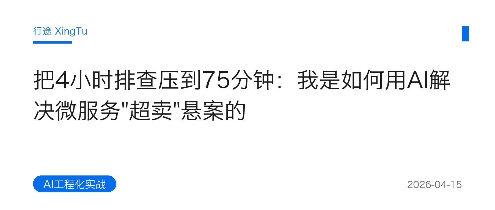
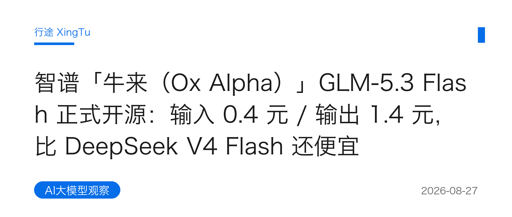
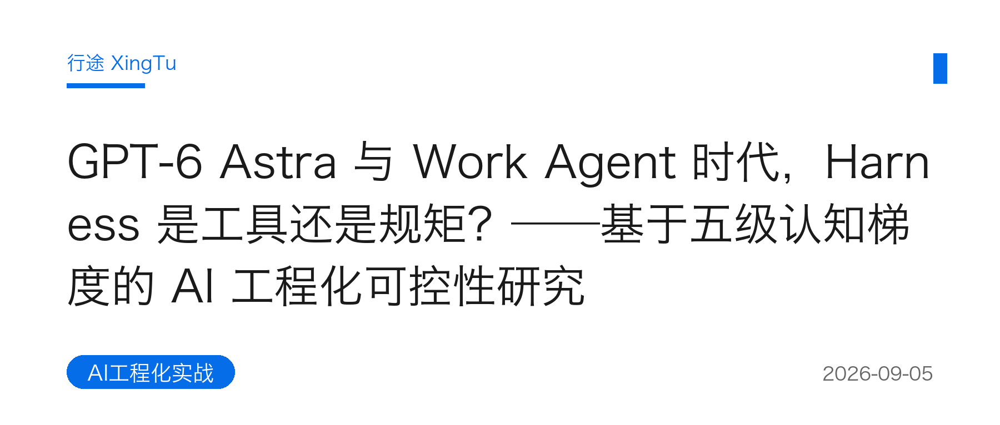
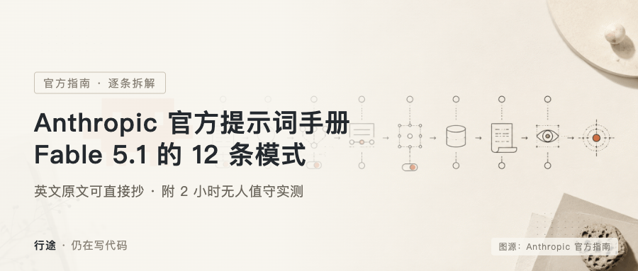
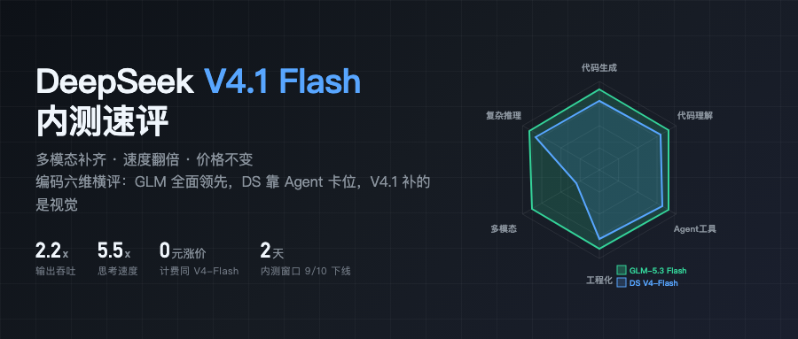
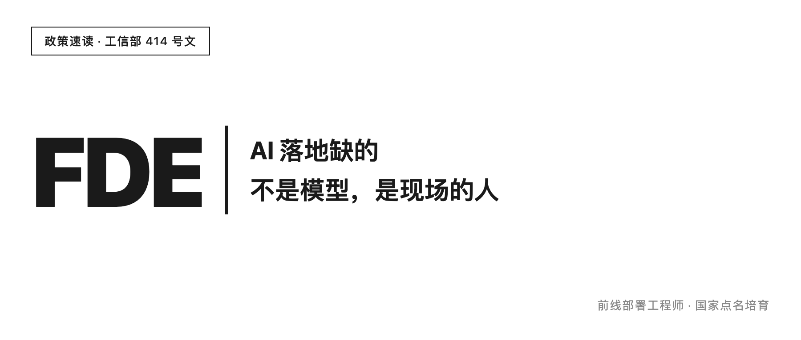
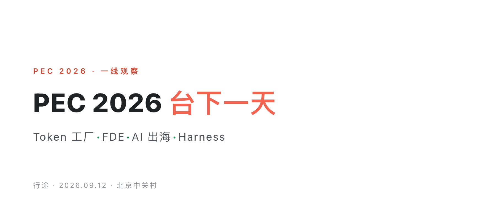
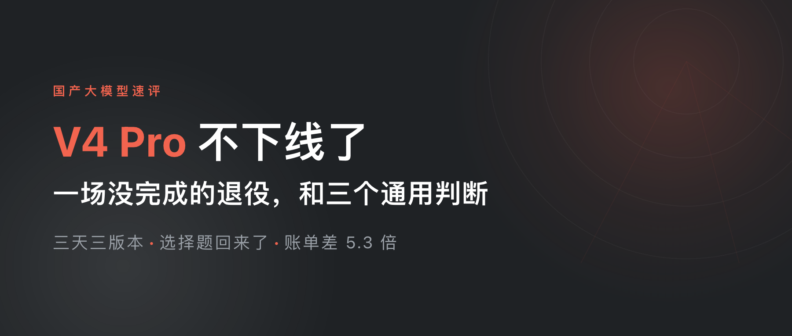
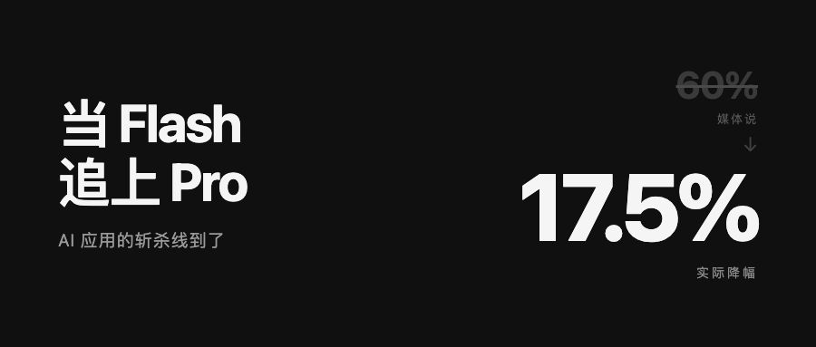

# XingTu Articles · 行途文章资产仓

> **个人 IP 文章库** · 公众号已发布文章的 GitHub 镜像 + 历史创作统一管理 ｜ 已公开


---

## 🎯 定位

公众号「行途技术手记」已发布文章的 **GitHub Markdown 镜像库**，作为 X → GitHub → 公众号三层引流漏斗的中间承载层。每篇文章带元数据头部（标题/日期/标签/阅读量/分类）和末尾引流引导（公众号/X/GitHub/个人站）。

> 技术细节终会过时，工程思想历久弥新。

---

## 📄 已发布文章镜像（23篇 · 均已微信首发）

### 🔥 爆款文章（阅读量破百）

| 日期 | 标题 | 阅读 | 分类 |
|------|------|:---:|------|
| 2026-09-16 | [员工比功能，老板看生态：WorkBuddy、豆包工作、千问办公选型账本](articles/2026-09-16-workbuddy-doubao-qwen-ecosystem-choice.md) | 133 | 看懂AI Agent |
| 2026-09-13 | [PEC 2026 AI 创新者大会台下一天：Token 工厂、FDE、AI 出海与 Harness](articles/2026-09-13-pec-2026-conference-field-notes.md) | 198 | AI大模型观察 |
| 2026-09-10 | [国家点名 FDE：AI 落地缺的不是模型，是现场的人](articles/2026-09-10-fde-ai-landing-people.md) | 157 | AI工程化实战 |
| 2026-08-27 | [智谱「牛来」GLM-5.3 Flash 正式开源：输入0.4元/输出1.4元，比DeepSeek V4 Flash还便宜](articles/2026-08-27-glm-5.3-flash.md) | 141 | AI大模型观察 |
| 2026-04-15 | [把4小时排查压到75分钟：我是如何用AI解决微服务"超卖"悬案的](articles/2026-04-15-microservice-overselling-ai-troubleshooting.md) | 111 | AI工程化实战 |

### 🛠 AI工程化实战

| 日期 | 标题 | 阅读 | 分类 |
|------|------|:---:|------|
| 2026-09-23 | [Vibe coding 出来的代码没人看了：我花 spec 的时间比写代码还多](articles/2026-09-23-vibe-coding-nobody-reads-code.md) | 68 | AI工程化实战 |
| 2026-09-17 | [Palantir 的 FDE 拆成两个人：Echo 懂、Delta 造，AI 落地最后 100 米](articles/2026-09-17-palantir-fde-dual-role.md) | 96 | AI工程化实战 |
| 2026-09-21 | [我给 5 个 AI 工具写同一份说明书，两个月后 Claude Code 追上来了](articles/2026-09-21-five-ai-tools-same-spec.md) | 10 | AI工程化实战 |
| 2026-09-20 | [FDE 沟通三段论：拒绝需求但不拒绝人](articles/2026-09-20-fde-communication-three-step.md) | 5 | AI工程化实战 |
| 2026-09-19 | [AI 工程师/FDE 招聘：会调 Prompt 不够，能去客户现场聊才是硬门槛](articles/2026-09-19-fde-hiring-client-site-communication.md) | 8 | AI工程化实战 |
| 2026-09-18 | [小团队加 AI，一个多月交付十多万行代码：一次 FDE 实战复盘](articles/2026-09-18-small-team-ai-delivery-fde-review.md) | 64 | AI工程化实战 |
| 2026-09-14 | [FDE 能力模型：8 个维度拆解，从技术到沟通的完整画像](articles/2026-09-14-fde-capability-model-8-dimensions.md) | 36 | AI工程化实战 |
| 2026-09-12 | [DeepSeek 升级没让我改一行配置，我却删了 306 行规则](articles/2026-09-12-deepseek-upgrade-306-lines-removed.md) | 2 | AI工程化实战 |
| 2026-09-07 | [Anthropic官方提示词手册：Fable 5.1的12条模式](articles/2026-09-07-fable-5.1-prompt-patterns.md) | - | AI工程化实战 |
| 2026-09-05 | [GPT-6 Astra与Work Agent时代，Harness是工具还是规矩？——基于五级认知梯度的AI工程化可控性研究](articles/2026-09-05-harness-cognition.md) | 5 | AI工程化实战 |
| 2026-09-04 | [Vibe Coder、FDE、Harness Engineer……AI时代的5种工程师，你是哪种？](articles/2026-09-04-five-types-engineers.md) | 6 | AI工程化实战 |

### 📈 AI时代知识复利

| 日期 | 标题 | 阅读 | 分类 |
|------|------|:---:|------|
| 2026-09-06 | [为什么你做了很多事，却什么都没留下？——一套普通人也能用的知识复利方法](articles/2026-09-06-knowledge-compounding.md) | 31 | 知识复利 |

### 💰 AI省token实战

| 日期 | 标题 | 阅读 | 分类 |
|------|------|:---:|------|
| 2026-09-24 | [AI 越用越笨？问题不在模型，在上下文管理](articles/2026-09-24-token-09-context-management.md) | - | 省token实战 |
| 2026-09-22 | [省token横评：9个主流编程Agent谁最省token](articles/2026-09-22-token-benchmark-9-coding-agents.md) | 13 | 省token实战 |
| 2026-08-28 | [省token的第一性原理：把「不用推理的活」，从模型手里拿回来](articles/2026-08-28-save-token-first-principle.md) | 1 | 省token实战 |

### 🤖 看懂AI Agent

| 日期 | 标题 | 阅读 | 分类 |
|------|------|:---:|------|
| 2026-09-08 | [普通人也能看懂：AI Agent到底是什么？三年，从会说话到会干活](articles/2026-09-08-ai-agent-explained.md) | - | 看懂AI Agent |

### 🚀 AI大模型观察

| 日期 | 标题 | 阅读 | 分类 |
|------|------|:---:|------|
| 2026-09-15 | [DeepSeek V4 Pro 不下线了：一场没完成的退役，和三个通用判断](articles/2026-09-15-deepseek-v4-pro-retirement-reversed.md) | 105 | AI大模型观察 |
| 2026-09-11 | [DeepSeek 降价全景：旗舰砍到 1/7.5，企业只省 17.5%](articles/2026-09-11-deepseek-price-cutdown.md) | 19 | AI大模型观察 |
| 2026-09-09 | [DeepSeek V4.1 Flash 内测上手：会看图了、快了 5.5 倍、价格一分没涨](articles/2026-09-09-deepseek-v4.1-flash-review.md) | 70 | AI大模型观察 |

---

## 📚 其他分类文章

- `articles/`：公众号已发布文章全文镜像（md + 配图平铺）
- `growth-review/`：成长复盘（B11 技术人的复利等）

---

## 🗂 目录结构

```
xingtu-articles/
├── articles/           # 已发布文章镜像：md 与配图同目录，md 内相对路径引用展示
├── articles/covers/    # 已发布文章封面缩略图（从发布包归档同步，见下方画廊）
├── growth-review/      # 成长复盘分类
├── LICENSE             # MIT
└── README.md           # 本文件
```

---

## 🖼 封面画廊（13 / 14）

> 封面从发布包 `03_封面/` 归档同步；无归档的早期文章由 PIL 按「白底黑字 + 行途蓝 #056DE8」标准生成，保证仓库观感一致。2026-09-06《知识复利》暂无归档封面。

| | |
|---|---|
| <br>2026-04-15 微服务「超卖」悬案 | <br>2026-08-27 智谱「牛来」Flash 开源 |
| <br>2026-08-28 省 token 的第一性原理 | <br>2026-09-04 AI 时代的 5 种工程师 |
| <br>2026-09-05 Harness 是工具还是规矩 | <br>2026-09-07 Fable 5.1 提示词模式 |
| <br>2026-09-08 AI Agent 到底是什么 | <br>2026-09-09 DeepSeek V4.1 Flash 内测 |
| <br>2026-09-10 FDE：国家点名的 AI 落地人 | <br>2026-09-12 删了 306 行规则 |
| <br>2026-09-13 PEC 2026 台下一天 | <br>2026-09-14 FDE 能力模型 8 维度 |
| <br>2026-09-15 V4 Pro 退役反转 | <br>2026-09-11 DeepSeek 降价全景 |
| <br>2026-09-16 三平台选型账本 | <br>2026-09-17 Palantir 双角色机制 |

---

## 📚 专题与系列

| 系列 | 内容 | 说明 |
|------|------|------|
| [PEC2026 大会](articles/PEC2026/) | [RAG 技术路线调研](articles/PEC2026/RAG技术路线调研.md) · [金句精选](articles/PEC2026/金句精选.md) | 2026-09-12 PEC2026 AI 创新者大会现场沉淀 |
| [成长复盘](growth-review/) | [工程师的复利](growth-review/B11-compound-interest-of-engineers.md) | 职业与方法论复盘 |

---

## 🎴 一图一观点（贴图卡）

公众号「贴图」形态的卡片归档——每个观点一张图，黑白极简 + 行途蓝 `#056DE8`，无 emoji。

设计纪律：`一个观点 → 一张图`。卡片不做信息堆叠，只承载一个可带走的反直觉判断。

| 编号范围 | 主题 |
|---|---|
| 001-007 | AI 工程化认知（省 token / 知识复利 / Harness 兜底 / 人与 AI 分工） |
| 008 | Token 消耗结构（最烧 token 的不是写代码，是找代码） |
| 008-017 | **行途反榜**：AI 写不了的十件事（从「线上故障排查」倒序到「写 CRUD」）——越靠前越难被替代 |
| 018-019 | 行业观察（旗舰模型被蚕食 / 微信 16 个 AI 入口 / 爆款不可规划） |
| 020-021 | 落地判断题（FDE 招人看什么 / Agent 堆量的边际收益 / 配置改不改） |

图片目录：[`tuitu/`](tuitu/) · 当前 24 张

---

## 👤 关于行途

一线 builder，仍在写代码。专注 AI 工具链与工程化落地，分享可抄作业的实战经验。

- 𝕏 X：[@xingtu1996](https://x.com/xingtu1996)（AI工程化实战，build in public）
- GitHub：[github.com/xingtu1996](https://github.com/xingtu1996)
- 🌐 个人站：[xingtu1996.pages.dev](https://xingtu1996.pages.dev)
- 📱 公众号：「行途技术手记」（深度长文 + 可抄作业的实战经验）

---

## 📄 版权声明

- 所有文章为原创，首发于公众号「行途技术手记」
- 转载请注明出处，禁止未经授权用于 AI 模型训练
- 文章观点仅代表个人，不构成任何投资或职业建议
