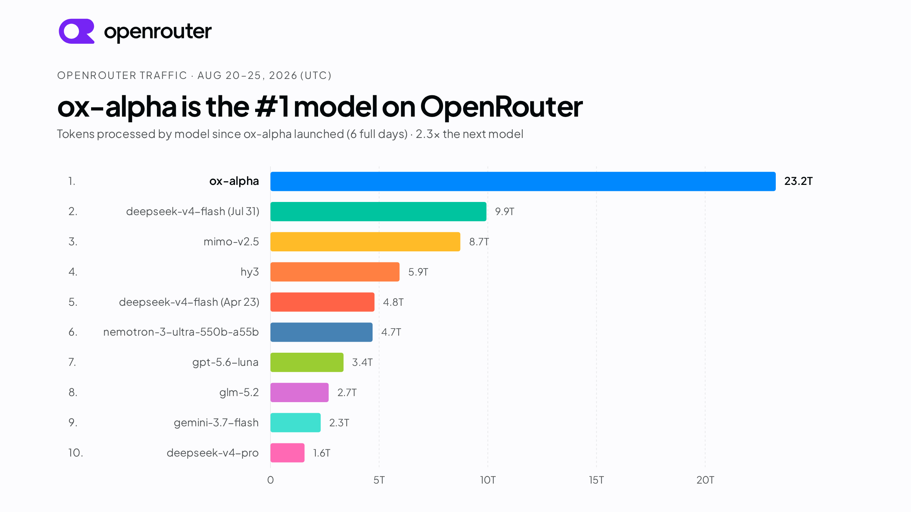
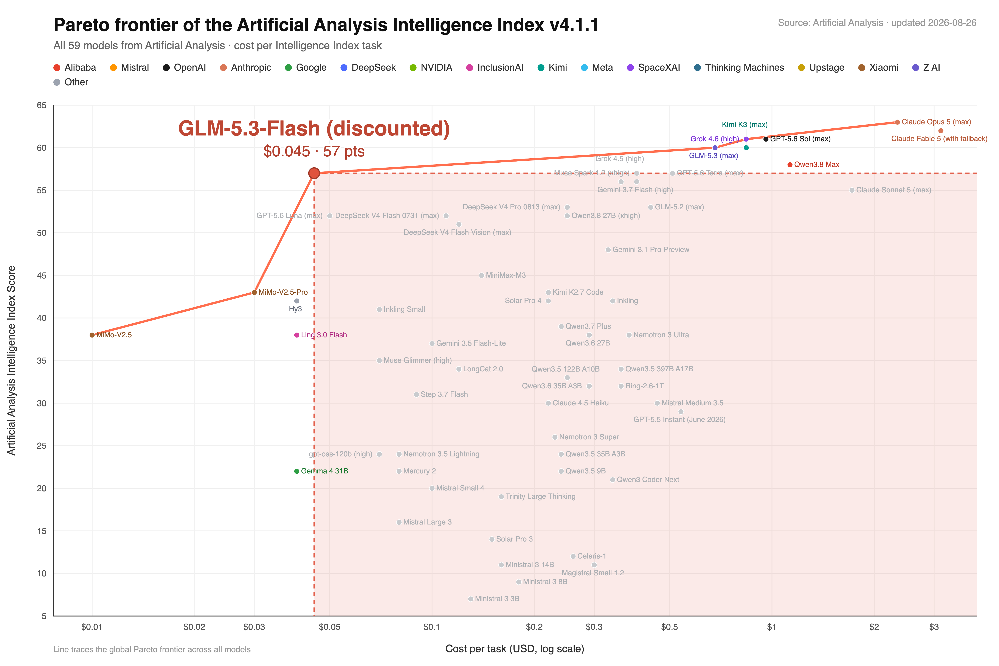
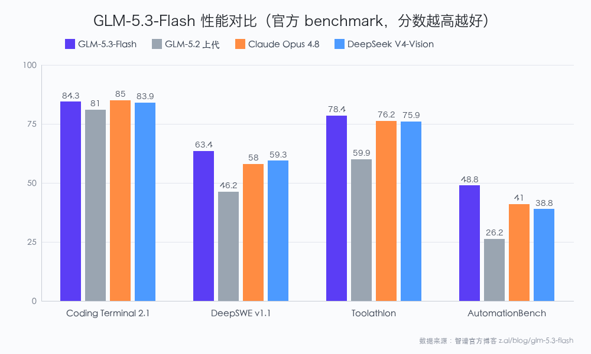
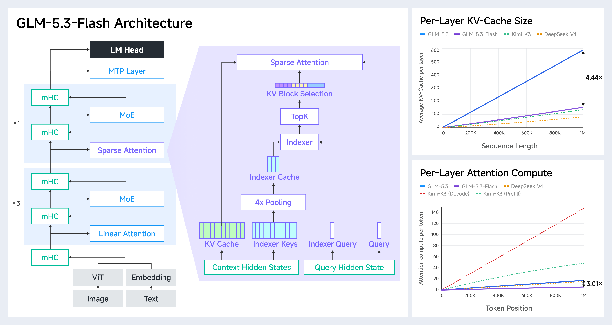
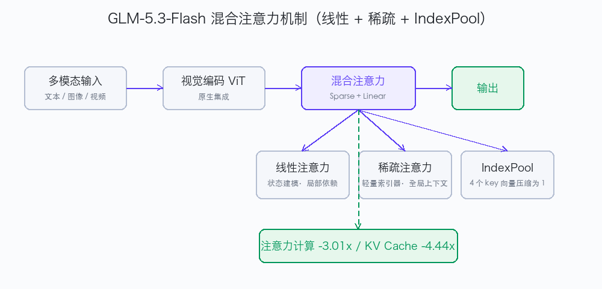

# 智谱「牛来（Ox Alpha）」GLM-5.3 Flash 正式开源：输入 0.4 元 / 输出 1.4 元，比 DeepSeek V4 Flash 还便宜

> 发布日期：2026-08-27 · 数据全部来自官方来源（文末标注） · 配图来源：智谱官网 z.ai/blog/glm-5.3-flash

上周 AI 圈最大的悬案破案了——OpenRouter 和 OpenCode 上那个匿名跑霸榜首的「Ox Alpha」，被智谱正式认领：它就是 **GLM-5.3 Flash**，GLM-5 系列首个**原生多模态大模型**，320B 总参数 / 18B 激活参数，**输入 0.4 元、输出 1.4 元（每百万 tokens，限时 5 折）**。

它 6 天在 OpenRouter 吃了 **23.2 万亿 tokens**——是第二名 DeepSeek-V4-Flash (Jul 31) 9.9T 的 **2.3 倍**，直接把 DeepSeek 连续 56 天的霸榜纪录按在地上。

*（图片来源：OpenRouter 官方榜单，转引自智谱官网 z.ai/blog/glm-5.3-flash）*

---

## 一、价格屠夫：真神下凡带着价格表

我第一时间打开 BigModel 官方定价页，白纸黑字：

> **GLM-5.3-Flash（5 折限时两周）**：输入 **0.4 元** / 输出 **1.4 元** / 缓存命中 **0.115 元**（每百万 tokens）
> 原价：输入 0.8 元 / 输出 2.8 元 / 缓存命中 0.23 元
> 上线前两周半价，结束后恢复原价。

横向对比 8 月刚提价的 DeepSeek V4 Flash（官方 api-docs.deepseek.com）：

**价格对比表（人民币元 / 百万 tokens）**

| 项目 | GLM-5.3 Flash 限时 5 折 | GLM-5.3 Flash 原价 | DeepSeek V4 Flash 空闲 | DeepSeek V4 Flash 高峰 |
|---|---|---|---|---|
| 输入（缓存未命中） | **0.4** | 0.8 | 1.5 | 3.0 |
| 输出 | **1.4** | 2.8 | 4.5 | 9.0 |
| 缓存命中输入 | 0.115 | 0.23 | **0.05** | 0.10 |
| 上下文窗口 | 1M | 1M | 1M | 1M |
| 输入模态 | 图/视频/文件/文本 | 同左 | 仅文本 | 仅文本 |

> 数据来源：智谱 BigModel 定价页 `bigmodel.cn/pricing` ；DeepSeek 官方定价页 `api-docs.deepseek.com/zh-cn/quick_start/pricing`（核验日期 2026-08-26）。

**一句话结论**：常规调用场景（输入未命中 + 输出为主）下，GLM-5.3 Flash 比 DeepSeek V4 Flash 更便宜；只有"几乎全是缓存命中输入"的极端重复前缀场景，DeepSeek 谷时略胜（0.05 vs 0.115）。

---

## 二、性能怪兽：便宜，恰恰是它最不重要的优点

怕「便宜没好货」？偏偏不是。

- **AA 智能指数 57 分**，与 **Claude Opus 4.8 持平**，超过自家上一代 GLM-5.2，**也超过 DeepSeek V4 Pro 正式版的 53 分**。
- 在自研 Z.ai Code Bench v1.0（跑在 Claude Code 2.1.207 上）上，max effort 几乎打平 Claude Opus 4.8：**29.0 vs 29.5**。
- DeepSWE v1.1 拿到 **63.4**（GLM-5.2 只有 46.2），AutomationBench **48.8**（GLM-5.2 只有 26.2）。

*（图片来源：智谱官网 z.ai/blog/glm-5.3-flash）*

**性能对比表（官方 z.ai blog benchmark，分数越高越好）**

| 基准 | GLM-5.3-Flash | GLM-5.2（上代） | DeepSeek V4-Vision-Exp | Claude Opus 4.8 |
|---|---|---|---|---|
| AA 智能指数 | **57** | — | — | **57** |
| Coding Terminal Bench 2.1 | 84.3 | 81.0 | 83.9 | **85.0** |
| DeepSWE v1.1 | **63.4** | 46.2 | 59.3 | 58.0 |
| Toolathlon Verified | **78.4** | 59.9 | 75.9 | 76.2 |
| AutomationBench v1.0.6 | **48.8** | 26.2 | 38.8 | 41.0 |

> 数据来源：智谱官方博客 z.ai/blog/glm-5.3-flash benchmark 表（DeepSWE / Toolathlon / AutomationBench 均为第三方权威 Agent 基准）。

看几个「反杀」点更直观：

*（图片来源：自制 · 数据源自智谱官方博客 z.ai/blog/glm-5.3-flash）*

一句话：把右上角那一坨贵价旗舰的"能力天花板"，硬生生拉到了 $0.045 / 任务的左下角——以前要花 **10 倍价格**才能拿到的智能等级。而且在 **DeepSWE（63.4 vs 58.0）和 Toolathlon（78.4 vs 76.2）** 上，它甚至**反超了 Claude Opus 4.8**。

---

## 三、架构 + 国产算力：模型、芯片、开源三件套

GLM-5.3-Flash 是首个采用 **稀疏注意力 + 线性注意力混合架构** 的开源前沿模型，加上 IndexPool 索引压缩：

- 注意力计算量相比 GLM-5.3 降低 **3.01 倍**
- KV Cache 降低 **4.44 倍**
- 层数从 92 砍到 45，激活参数从 32B 砍到 18B，几乎减半

*（图片来源：智谱官网 z.ai/blog/glm-5.3-flash）*

混合注意力机制一图看懂：

*（图片来源：自制 · 数据源自智谱官方博客）*

更狠的是：**Ox Alpha 匿名测试期间所有 23 万亿 tokens 的流量，全部跑在国产芯片集群上**。晚点 LatePost 报道集群规模超过 10 万张国产卡，供应商或来自华为昇腾 / 摩尔线程 / 海光（智谱未官方确认）。官方说：同硬件基线下端到端性能 +3 倍，单 token 成本追平主流英伟达 GPU。

视觉编码原生集成进模型：模型能在 Coding 循环里自主决定"何时看一眼"渲染结果，用视觉反馈迭代修改——前端 UI 设计稿经过 self-verification 后，布局问题被它自己修掉了。

---

## 四、上手三步曲（可直接复制）

**第一步 · 注册 BigModel，拿 API Key**
访问智谱开放平台模型文档（https://docs.bigmodel.cn/cn/guide/models/vlm/glm-5.3-flash），注册账号、创建 API Key，即可调用 GLM-5.3-Flash 的原生多模态 API（限时 5 折两周，1M 上下文）。

**第二步 · 开 GLM Coding Plan（编程订阅，性价比最高）**
入口：https://bigmodel.cn/glm-coding
- 三档：**Lite ¥118/月**（每周 1 万积分）→ **Pro ¥538/月**（6 倍额度）→ **Max ¥1078/月**（14 倍额度），包季 8 折、包年 7 折
- GLM-5.3-Flash 已全量接入，同等预算下可用配额是 GLM-5.3 的 **3 倍**
- 支持 ZCode / Claude Code / OpenCode / Cline / Kilo Code 等 **20+ 编程工具**，套餐均含视觉理解、联网搜索、网页读取、开源仓库 MCP
- 安装教程：https://docs.bigmodel.cn/cn/coding-plan/quick-start

**第三步 · 拉 HF 权重本地部署（可选，自托管）**
- 标准权重（**MIT 开源**）：https://huggingface.co/zai-org/GLM-5.3-Flash
- BF16 半精度权重：https://huggingface.co/zai-org/GLM-5.3-Flash-BF16
- 官方支持 SGLang / vLLM / TokenSpeed 本地推理，国产加速卡可承载 1M 上下文，企业可脱离公有云 API 实现数据闭环

---

## 写在最后

> 牛来，牛是自己的，草也是自己的。

这次不只是一家模型厂发新品，而是 **"前沿模型能力 + 1/40 价格 + 国产芯片承载 + MIT 开源权重"** 四件事第一次同时发生。

---

## 福利：注册就送 2000 万 tokens

我正在 BigModel 开放平台上打造 AI 应用。通过下面这个邀请链接注册，**你我各得 2000 万 tokens 新人大礼包**，一起把 GLM-5.3 Flash 的性价比用起来（复制链接到浏览器打开）：

https://www.bigmodel.cn/invite?icode=VWwqqiAL8m53RjMVI8cFvlwpqjqOwPB5EXW6OL4DgqY%3D

> 智谱新一代旗舰 GLM-5.3 已上线，推理 / 代码 / 智能体综合能力达到开源模型 SOTA。期待和你一起在 BigModel 畅享卓越模型能力。

---

## 五、资源链接清单（一字不漏 · 官方一手来源 · 搜一搜友好）

覆盖「云 API → 编程订阅 → 本地开源部署」完整链路：

| 资源 | 完整链接 |
|---|---|
| BigModel 定价页 | https://bigmodel.cn/pricing |
| BigModel 开放平台 · GLM-5.3-Flash 文档 | https://docs.bigmodel.cn/cn/guide/models/vlm/glm-5.3-flash |
| Z.ai · GLM-5.3-Flash 文档 | https://docs.z.ai/guides/vlm/glm-5.3-flash |
| GLM Coding Plan 订阅页 | https://bigmodel.cn/glm-coding |
| Coding Plan 快速安装教程 | https://docs.bigmodel.cn/cn/coding-plan/quick-start |
| 智谱官方博客（发布公告） | https://z.ai/blog/glm-5.3-flash |
| HuggingFace 标准权重 | https://huggingface.co/zai-org/GLM-5.3-Flash |
| HuggingFace BF16 权重 | https://huggingface.co/zai-org/GLM-5.3-Flash-BF16 |
| DeepSeek 官方定价（对比用） | https://api-docs.deepseek.com/zh-cn/quick_start/pricing |
| Artificial Analysis 智能指数 | https://artificialanalysis.ai |

> 以上链接均为官方一手来源。搜一搜用户按关键词即可直达：**GLM-5.3-Flash 开源下载** / **GLM Coding Plan 价格** / **BigModel 注册** / **GLM-5.3-Flash HuggingFace 权重** / **GLM-5.3-Flash 本地部署**。

---

*本文图片均来源于智谱官方博客 z.ai/blog/glm-5.3-flash，仅用于技术报道与产品介绍用途。*

---

## 📱 关注公众号获取更多

> 本文首发于公众号「**行途技术手记**」，关注后获取全文 PDF 与配套资源。

**公众号：行途技术手记**（搜索名称关注）

**推荐阅读**：
- [Harness是工具还是规矩？AI工程化的五级认知梯度](https://github.com/xingtu1996/xingtu-articles/blob/main/articles/2026-09-05-harness-cognition.md)
- [AI时代知识复利｜让过去的自己替未来的你打工](https://github.com/xingtu1996/xingtu-articles/blob/main/articles/2026-09-06-knowledge-compounding.md)
- [省token的第一性原理](https://github.com/xingtu1996/xingtu-articles/blob/main/articles/2026-08-28-save-token-first-principle.md)

更多文章见 GitHub 文章库：[xingtu-articles](https://github.com/xingtu1996/xingtu-articles)

---

## 👤 关于行途

一线 AI 工程化实践者，深度写代码。从 Java 后端起步，转向 AI 原生全栈开发，专注 AI 工程化（Harness / Agent / MCP / Skill / Rules）这条"把 AI 变成稳定生产力"的路线。

- 𝕏 X：[@xingtu1996](https://x.com/xingtu1996)（AI工程化实战，build in public）
- GitHub：[github.com/xingtu1996](https://github.com/xingtu1996)
- 🌐 个人站：[xingtu1996.pages.dev](https://xingtu1996.pages.dev)

> **技术细节终会过时，工程思想历久弥新。**

---

## 📄 版权声明

- 本文为原创，首发于公众号「行途技术手记」
- 转载请注明出处，禁止未经授权用于 AI 模型训练
- 文章观点仅代表个人，不构成任何投资或职业建议
