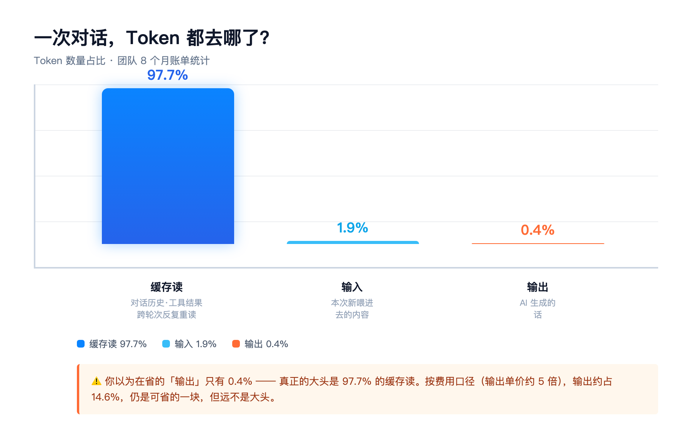
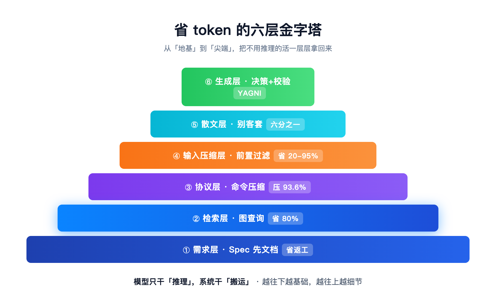

---

# 省 token 的第一性原理：把「不用推理的活」，从模型手里拿回来

> 发布日期：2026-08-28 · 数据来自团队 8 个月账单统计 · 配图自制

我是行途，一线技术经理，带团队也写代码。过去 8 个月，公司几十个人天天用 coding agent，烧掉了**上百亿 token**——用久了，「**省 token**」就成了肌肉记忆：让 AI「少说点」、关掉思考、换个便宜点的模型。

但上个月，我把这 8 个月的账单导出统计，发现一个反直觉到有点讽刺的事实：

**AI 说出来的话（输出），只占 token 总量的 0.4%；而它反复重读的「上下文」（缓存读），占了 97.7%。**

> （注：0.4% 是数 token 个数。按钱算，输出单价贵 5 倍，会占到约 14.6%。我全文按个数说。）

> 缓存命中率为什么这么高？这个后面单独拆一篇，今天先记住结论：大头在缓存读。

也就是说——你拼命让 AI 少说话，省的是那个只占 0.4% 的小头；真正的大头，97.7%，你压根没碰。

这篇文章想讲清楚一件事：**省 token 的正确姿势，不是让 AI 少说，而是让 AI 少看。**

> 一句话结论（可引用）：省 token 的本质 = 把「不用推理的活」（索引、检索、压缩、搬运、客套）从模型手里拿回来，交给确定性的系统；只把「需要推理的活」（理解、设计、生成、判断）留给模型。模型贵在「想」，不贵在「搬」。

## 一、省 token 先纠正认知：token 到底烧在哪

一个 AI 编程工具，每跑一次，token 的去向只有三个地方：

| 去向 | 是什么 | 占比（数量口径，我们 8 个月账单） |
|------|--------|:---:|
| 输入 | 你这次新喂进去的内容 | 1.9% |
| **缓存读** | **对话历史、工具结果、系统提示词这些跨轮次被反复重读的内容** | **97.7%** |
| 输出 | AI 生成的话 | **0.4%** |

看清楚了吗？**输出只占 0.4%（数量口径）。**

你天天琢磨「怎么让 AI 少说两句」「关掉思考省 token」，全是在那 0.4% 里抠。而 97.7% 的缓存读，是 AI 每次对话都要重新读一遍的「固定上下文」——对话历史、工具输出、项目说明、技能清单——这些才是账单上的大头。

这里有个更反直觉的坑，我必须先说破：

**缓存读便宜（按原价 1/10 计价），但它不免费。** 它吃掉的是另一件更贵的东西——**模型的注意力**。上下文越杂，模型越容易在噪音里迷路。这引出了下面这条底层规律。

## 二、省 token 的第一性原理：token 只有两种

我把所有 token 分成两类，这是整篇的地基：

1. **需要 AI 推理的**：理解需求、设计方案、写代码、判断对错。这类活，只有模型能干。
2. **不需要 AI 推理的**：索引代码、检索文件、压缩命令输出、搬运数据、写客套话。这类活，模型干是浪费。

**省 token 的本质，一句话：把「不用推理的活」，从模型手里拿回来，交给确定性的系统（脚本、工具、缓存）。**

模型贵在「想」，不贵在「搬」。让它想，别让它搬。

打个比方：你花高薪请了个架构师，结果天天让他干「把文件从 A 拷到 B」「把日志压缩一下」这种活——这不是省钱，这是浪费。省 token 的底层逻辑，和这个一模一样。

这条思想的关键好处是：**它不挑工具**。你用 Claude Code、用 Codex、用 WorkBuddy、用豆包、用 Cursor，这套「该模型的只模型、该系统的只系统」都成立。编码 agent 吃这套，办公/文档 agent 同样吃这套——需求、检索、输入压缩、散文这四层，对任何 AI 协作场景都成立。同一套 hook，我从 Claude Code 拆下来，装到 Codex 上照用不误。

**这不是我拍脑袋：业内也早就这么想**

「别让模型干不用推理的活」「把上下文管起来」不是我的发明，而是这两年 AI 工程界反复验证的共识，都有真实出处：

- **Rich Sutton《The Bitter Lesson》（2019）**：强化学习之父、图灵奖得主 Sutton 的核心论断——能随算力扩展的「通用方法」最终胜过人类硬编码的知识与规则。用人话讲：与其把规则写死让模型「遵守」，不如把活交给能自我迭代的机制。**「规则是愿望，钩子是墙」正是这条规律在 token 成本场景的投影。**
- **Anthropic《Effective Context Engineering for AI Agents》（2025）**：明确把「Just-in-time 上下文」列为 agent 工程的核心策略——别预先塞满，按需动态加载。这与本文「检索层·按需拉取」完全一致；其提出的「context rot（上下文越长模型越糊涂）」也印证了「注意力比 token 更贵」。
- **Andrej Karpathy**：「Context engineering 是一门为下一步填充恰当时机的恰当信息的艺术与科学。」——一句话点透：省 token 不是抠字，是「给对的信息」。

这些都不是前沿黑科技，而是写进官方文档、被一线工程验证过的「老道理」。我们只是把它落到「省钱」这一个切口，并用真实账单算给你看。

---

## 三、省 token 的六层：把「不用推理的活」一层层剥离

理解了「让模型只干推理」，接下来就是怎么落地。我把它拆成六层，从「喂进去」到「吐出来」，每一层剥掉一类「不该让模型干的活」。

> 先说清楚：下面每层我都用一个工具举例（来自 Claude Code 的实测），但**这六层本身不是某个工具的配置，是「让模型只干推理」这个思想的六种落法**——你换 Codex、换 WorkBuddy、换豆包、换任何 coding agent，这套思想照搬不误。

**① 需求层：先把需求写清楚，别让 AI 猜**

让 AI 猜着干，是最贵的浪费——它猜错了，你就得来回返工，每一轮都是 token。解法是 **Spec 先文档**：动手前先把「要做什么」写成结构化文档，作为唯一的「真相源」。

> 思想：**No Spec, No Code**。你省下的不是 token，是来回返工的整段成本。

**② 检索层：按需拉取，别一次全塞（省 token 的大头）**

多数人的默认操作，是让 AI 把整个仓库都读一遍再干活。这正撞上输入/缓存读的大头。解法是**图查询**：把代码库索引成一张关系图，AI 要什么查什么，而不是全量塞进上下文。（第一次读是「输入」，之后每轮重读都变成「缓存读」——减输入，缓存读自然跟着降。）

实测：同一个跨服务排查，从「20 次 grep」降到「3–4 次图查询」，**工具调用省了 80%**（CodeGraph 官方口径另有 94% 的说法，来源不同，量级一致）。

> 思想：**Just-in-time**。别让 AI 背下整本书，让它只翻需要的那一页。这层是省 token 贡献最大的地方。

**③ 协议层：命令的输出，别原样喂回去**

AI 跑一条命令，输出动辄几万字日志，如果你原样让它读，就是拿「机器吐的废料」去喂「最贵的推理」。解法是**协议压缩**：命令输出先过一层压缩，只保留有意义的部分。

实测：**命令输出压缩 93.6%**，累计省下几千万 token。

> 思想：**机器的输出，机器自己先消化**，别让模型当垃圾桶。

**④ 输入压缩层：从源头压输入**

在检索、协议之后，进模型之前，还有一层——**前置过滤和精简入参**。能提前砍掉的冗余，别等进了模型再让模型自己「忽略」。开源项目实测能省 20%–95%（随任务类型波动，JSON/结构化数据效果最好）。

> 思想：**垃圾在门口就扔掉，别搬进屋里再扔。**

**⑤ 散文层：别客套（就是「让 AI 少说话」，但只是六分之一）**

到这一层，才轮到大众最熟悉的「让 AI 少说」。把输出侧调成「先给结果、跳过铺垫」，这一步确实有用——它属于「不用推理的活」里的「写客套话」。但请记住：**它只占六层里的六分之一，是六个例子里最小的一个**。你只在它上面下功夫，等于治水只堵了最小的支流。（按费用口径，输出约占 14.6%，仍可省；但散文层真正的价值是减少返工与注意力浪费，不只是 token。）

> 思想：**该短则短，但该讲清的（报错、安全、破坏性确认）一根都不能省。** 短是手段，不是目的。

**⑥ 生成层：让「写代码」本身也讲效率**

最后一层，是写代码本身。一个常见误区是「让模型一次生成一大坨」。更好的做法是：**让模型只生成「做什么」的契约（骨架），让编译器/测试去验证、去补全细节**。把「生成」也拆成「决策 + 校验」两层，而不是指望模型一口气把所有真相都想对。

> 思想：**生成不是终点，校验才是。** 模型的产出交给工具去验证，错了立刻回收，而不是让模型反复自我揣摩。

## 四、省 token 的两条底层律（比工具更底层）

六层之上，还有两条贯穿全程的规律，理解它们，你才算真正懂了「省钱」：

**律 1：规则是愿望，钩子是墙**

我们给 AI 写了很多「规矩」（请不要做 X、必须做 Y），实测规则遵从率只有 **70%–90%**（随任务和表达方式波动，非精确值）。也就是说，靠「自觉」省 token 是靠不住的——它今天听，明天就忘。真正稳的，是**钩子（hooks）**：把约束变成系统级的硬墙，不是请 AI 遵守，而是让违规根本发生不了。我写过 20 多条「请不要 X」的规矩，实测只执行了七到九成——不如直接上一个 hook，比口头叮嘱管用。

**律 2：注意力比 token 更贵**

很多人以为「上下文越长越好，反正便宜」。错了。一份 128K 的上下文里塞了 70% 的噪音，模型的表现，往往不如一份精心管理到 32K 的干净上下文。token 省下来是账面的，模型在噪音里迷路才是真亏。

## 五、收束：省 token 真正的杠杆是思想，不是配置

写到这里，回到开头那句话——

你换 Claude、换 Codex、换 WorkBuddy、换豆包，界面在变、价格在变、榜单在变。但「把不用推理的活从模型手里拿回来交给系统」这条，从第一天到今天都成立。

所以这篇不是「Claude Code 配置教程」，而是一份**可以迁移的省钱思想**：

- 你今天在 Claude Code 里用图查询省检索；
- 明天在 Codex 里用同样的「Just-in-time」思路；
- 后天在豆包里用同样的「输入压缩」逻辑。

配置三个月就过期，这条思想我今天还能拿去改 Codex、改豆包。省钱的不是哪套配置，是你脑子里那条「模型只干推理」。

这个系列我会一周写 1–2 篇。每篇只拆一层，第一篇讲思想，下一篇拆检索层——那是我账单上省得最狠的一块。

如果你也想把团队的 token 账单扒一遍、看看钱烧在哪，欢迎在评论区聊聊你的数字。下一篇我会拆具体的一层——**检索层**，讲讲怎么用图查询把「20 次 grep」打到「3 次查询」，那是省 token 最大的一块肥肉。

**六层速查表（建议收藏）**

| 层 | 动作 | 效果 |
|----|------|------|
| ① 需求层 | Spec 先文档 | 省返工 |
| ② 检索层 | 图查询 | 省 80% |
| ③ 协议层 | 压缩输出 | 压 93.6% |
| ④ 输入压缩层 | 前置过滤 | 省 20-95% |
| ⑤ 散文层 | 别客套 | 六分之一 |
| ⑥ 生成层 | 决策+校验 | YAGNI |

> 六层落地清单、token 优化踩坑卡、提示词框架模板都整理好了——公众号回复「六层」自取，我把清单发你。

## 附录 · 六层工具链（GitHub 实时数据，2026-08-28 查证）

- ▸ 检索层：**CodeGraph**（github.com/colbymchenry/codegraph · ⭐68.4k · MIT）——预建代码知识图谱，安装 `npx @colbymchenry/codegraph`
- ▸ 检索层：**codebase-memory-mcp**（github.com/DeusData/codebase-memory-mcp · ⭐40.9k · MIT）——纯 C 知识图谱 MCP，安装 `brew install deusdata/tap/codebase-memory-mcp`
- ▸ 协议层：**RTK**（github.com/rtk-ai/rtk · ⭐77.6k · Apache-2.0）——命令输出压缩，安装 `brew install rtk`，`rtk init -g` 自动挂 hook
- ▸ 输入压缩层：**Headroom**（github.com/headroomlabs-ai/headroom · ⭐67.8k · Apache-2.0）——上下文压缩层，安装 `pip install "headroom-ai[all]"` 或 `headroom wrap claude`
- ▸ 散文层：**Caveman**（github.com/JuliusBrussee/caveman · ⭐101.4k · BSL-1.1）——散文/注释精简
- ▸ 生成层：**Ponytail**（github.com/DietrichGebert/ponytail · ⭐113.8k · MIT）——YAGNI 最少代码

> star 数随社区增长会变化，以上为查证当日数据。文章讲的六层思想不依赖任何具体工具——工具只是思想的落法，链接给你自证用。

> 本文由真实工程实践 + AI 协作产出。文里的数字都来自我们团队 8 个月的账单，方法你可以照抄。已列入行途「省 token」系列（共约 16 篇，本篇为第 1 篇，后续每周 1–2 篇）。

> 参考来源：Rich Sutton《The Bitter Lesson》（2019）；Anthropic《Effective Context Engineering for AI Agents》（2025）；Andrej Karpathy 公开论述；Claude Code 官方文档（Output styles / Settings / Env vars）；团队 2026 年 1–8 月 token 账单统计。

---

## 📱 关注公众号获取更多

> 本文首发于公众号「**行途技术手记**」，关注后获取全文 PDF 与配套资源。

**公众号：行途技术手记**（搜索名称关注）

**推荐阅读**：
- [Harness是工具还是规矩？AI工程化的五级认知梯度](https://github.com/xingtu1996/xingtu-articles/blob/main/articles/2026-09-05-harness-cognition.md)
- [AI时代知识复利｜让过去的自己替未来的你打工](https://github.com/xingtu1996/xingtu-articles/blob/main/articles/2026-09-06-knowledge-compounding.md)
- [省token的第一性原理](https://github.com/xingtu1996/xingtu-articles/blob/main/articles/2026-08-28-save-token-first-principle.md)

更多文章见 GitHub 文章库：[xingtu-articles](https://github.com/xingtu1996/xingtu-articles)

---

## 👤 关于行途

一线 AI 工程化实践者，深度写代码。从 Java 后端起步，转向 AI 原生全栈开发，专注 AI 工程化（Harness / Agent / MCP / Skill / Rules）这条"把 AI 变成稳定生产力"的路线。

- 𝕏 X：[@xingtu1996](https://x.com/xingtu1996)（AI工程化实战，build in public）
- GitHub：[github.com/xingtu1996](https://github.com/xingtu1996)
- 🌐 个人站：[xingtu1996.pages.dev](https://xingtu1996.pages.dev)

> **技术细节终会过时，工程思想历久弥新。**

---

## 📄 版权声明

- 本文为原创，首发于公众号「行途技术手记」
- 转载请注明出处，禁止未经授权用于 AI 模型训练
- 文章观点仅代表个人，不构成任何投资或职业建议
