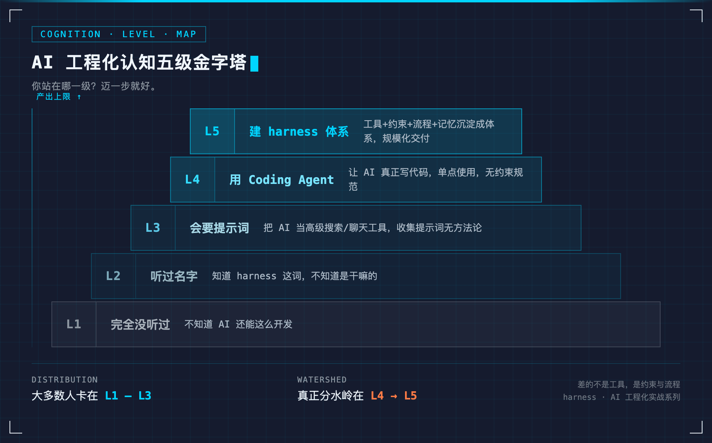

# GPT-6 Astra 与 Work Agent 时代，Harness 是工具还是规矩？——基于五级认知梯度的 AI 工程化可控性研究

> 全文约 4900 字，预计阅读 12 分钟。
>
> **核心观点**：harness 不是工具收藏，是 AI 规模化使用的前提。模型会变，Agent 形态会变，但"可控"这个需求不会变。
>
> 关键词：harness · AI 工程化 · Coding Agent · Work Agent · AI 可控 · GPT-6 Astra

模型分数逼近天花板，真正的分水岭变成了"可不可控"。harness 就是把 AI 关进受控轨道的那套东西——它是工具，还是一条规矩？

上一篇聊了 AI 时代的 5 种工程师，这篇接着聊一个更底层的问题：harness 到底是什么。用一次真实对话讲清楚。

---

## 一、一次真实对话

最近和一个做技术的朋友聊 AI，他问我：「你们现在开发哪方面用 AI 了？」

我聊了聊我们这边的情况：开发全流程的 AI 工程化，业务侧也在用 vibe coding 优化自己的系统功能。

他追问：「有没有可收藏的提示词？这些都要自己写吗，还是用的统一模板？」

我发了张分层架构图过去，说：我们现在都是 harness 这类体系，主要就是 Claude Code CLI + 模型。我习惯用一个公式来拆解：业务研发 Agent = Model + Coding Agent 通用 Harness + 项目 Harness。

他愣了几秒，回了一句让我印象很深的话——「harness 我只是听名字，不知道开发具体要干啥，是照它的规范来工作吗？」

他不是不关心 AI，恰恰相反，他是主动来问的。但一个真实的技术人，对 AI 开发的认知，还停在"有没有提示词"。这大概不是个例。

"照它的规范来工作"——这句话其实说对了一半。harness 里确实装着一堆规范（AGENTS.md、rules、skills、scripts 门禁），但它的作用不是"照做"，而是**把不能靠语言自觉保证的事，变成机制来兜底**。

---

## 二、这不是个案：身边三个 Case

让我更确信这不是个案的是另外两件事：

**Case 1**：一个同学，做工资单相关的工作。我聊到办公自动化工具，他没听说过 WorkBuddy 这类东西——哪怕是帮他把月月重复的活变简单的工具。

**Case 2**：一个之前共事过的朋友，人很聪明、很上进。但"开发现在能做什么"，他完全没有概念。

**Case 3**：我自己。这套 harness / AI 工程化体系，已经是我的日常工作流。

三个 Case，来自不同公司、不同岗位，横跨"办公岗"和"技术岗"。它们都不是孤例，而是同一个现象的三种切片：**圈内已经把 AI 工程化玩成了体系，圈外还停在"有没有提示词"。**

> 说明：以上是我身边的现象观察，不是统计结论。但它足以说明——这条信息差是真实存在、且正在扩大的。

---

## 三、一条清晰的认知梯度：多数人卡在哪一级

基于我这一年多的一线实践和观察，我把这种差异画成一座五级金字塔——这是我的划分，不一定是标准答案，但足够帮你定位自己。看看你站在哪一级：



*图注：AI 工程化认知五级金字塔——越往上，人数越少，但产出上限越高。*

**Level 1 · 完全没听过**：不知道 AI 还能这么开发。

**Level 2 · 听过名字**："harness 我只是听名字"——知道有这词，不知道是干嘛的。

**Level 3 · 会要提示词**：把 AI 当高级搜索/聊天工具，收集提示词但没有方法论。

**Level 4 · 用 Coding Agent**：开始让 AI 真正写代码，但单点使用，没有约束和交付规范。

**Level 5 · 建 harness 体系**：把工具、约束、流程、记忆沉淀成体系，能规模化交付。

大多数人，卡在 Level 1 到 Level 3。

而 Level 4 和 Level 5 之间，才是那条**"从会用工具，到能规模化交付"**的真正分水岭。差的不是工具，是那一整套约束与流程。

---

## 四、差一级，差多少

"1 个人干前端、后端、产品、测试"，在 Level 5 的人看来是日常；在 Level 1 的人听来像是夸张。

真实情况是：当一个开发把约束文件、流程、工具链搭好之后，AI 承担了大量执行层面的活，剩下的判断和验收由人来把关。不是 AI 替你做所有事，是你学会了一套"指挥 AI 干活"的体系。于是同样一个人，产出上限被抬高了不止一档。

这对中小公司尤其有意义：不用等大厂标配，小厂的技术人也能自己把这条路走通。这正是我为什么觉得这个话题值得认真讲——因为受益面最大的，恰恰是那些没人告诉"还能这么干"的人。

---

## 五、为什么现在尤其要讲：AI 越强，越要可控

最近有两件事，让我觉得这个话题不能拖。

一是大模型榜单快满分了。GPT-6 Astra 发布后，MMLU 这类基准上各家都在逼近满分——分数竞争进入尾声，"做题时代"见顶了。接下来真正的战场，从"刷分"转向"解决真实问题"，而真实世界里 AI 一旦跑偏，代价不是扣分，是事故。**让 AI 更可控，从加分项变成了生存项。**

二是大厂在 AI 办公领域集体入场。腾讯、字节、阿里都在重兵押注工作 Agent——字节把豆包工作、TRAE、扣子整合进同一体系，腾讯 WorkBuddy 跑出千万月活，阿里也在整合桌面与云端 Agent。

这里要区分两个概念：**Work Agent（工作代理）和 Coding Agent（编码代理）**——Work Agent 面向所有人，使用门槛更低，更易用；Coding Agent 面向开发者，更专业、更可控、更快速。两者不是替代关系，而是互补：Work Agent 降低了 AI 的使用门槛，让非技术岗也能用上 AI；Coding Agent 则把专业开发者的生产力放大到极致。

大厂为什么集体入场？创新工场联合首席执行官、管理合伙人汪华的判断很直接：「这仗打错了，最多是白烧几十亿；但如果不打，可能是生死问题。」背后的逻辑是：Agent 时代的办公场景，恰好处于"既能体现模型真实能力，又因用户规模可控不会压垮算力，且商业模式能跑通"的理想区间。法律、财务等专业赛道一旦被 Agent 重新定义，丢失的可能是整张船票。

这两件事指向同一个结论：**harness 不是工具收藏爱好，是 AI 规模化使用的前提。** 模型会变（GPT-6 Astra、国产追赶、蜂群架构），Agent 形态会变（Work Agent、Coding Agent、蜂群 Agent），但"可控"这个需求不会变——这就是 harness 的价值锚点，也是「AI 工程化实战」系列一直在讲的核心。

---

## 六、每个阶段，往前迈一步的方法

不用一步登天，先确认自己站在哪一级，迈一步就好：

**Level 1 / Level 2**：先解决"知道"——找一篇讲"开发现在能做什么"的内容，建立基本认知。

**Level 3**：别再只收藏提示词。挑一个真实小需求，让 AI 帮你跑通，体会"上下文 + 工具 + 约束"的关系。

**Level 4**：把常用的 Coding Agent 用熟（如 Claude Code、Cursor、Trae），试着写自己的约束文件，让输出稳定可交付。如果是非技术岗，可以从 Work Agent 开始（如 WorkBuddy、豆包工作），使用门槛更低，先体会"AI 帮你干活"的感觉，再逐步深入。

**Level 5**：把流程沉淀成体系——从行为规范、规则、流程、技能、脚本、记忆、模板到测试，一层层搭起来。

一句话：先别急着追新工具，先看清自己站在哪一级。

---

## 七、一个可参考的 harness 目录结构

说到「可验证」，我把自己的 harness 文件夹目录摊开给你看。这不是 PPT 上的架构图，是我每天打开电脑就要用的东西：

```
xingtu/（行途工作区）
├── AGENTS.md          # AI 入口指引：角色/语言/铁律
├── HARNESS.md         # 产品说明书：六层架构/纪律
├── CHANGELOG.md       # 变更时间轴：最近发生了什么
├── DIRECTORY.md       # 资产注册中心：东西在哪
├── workflows/         # SOP 工作流
├── .agents/skills/    # Skills 实体（AI 自动激活）
├── rules/             # 规则（编号 SSoT）
├── specs/             # 规格文档（No Spec No Code）
├── tools/             # 工具脚本
├── models.json        # 模型配置
├── mcp.json           # MCP 配置
├── xingtu-vault/      # 内容仓库
├── 素材库/             # 可发布素材卡
└── outputs/           # 产出物
```

你可以照着这个结构搭自己的 harness，也可以根据自己的需求裁剪。核心不是文件夹叫什么名字，而是**每一层都有明确的职责**——`AGENTS.md` 管 AI 协作规范，`CHANGELOG.md` 管变更留痕，`DIRECTORY.md` 管资产索引，`HARNESS.md` 管产品定义。有了这四个文件，AI 进来知道自己是谁、该干什么、不能干什么；人进来知道东西在哪、发生过什么、接下来要干什么。

这就是「可验证」的意思——不是我在文章里说 harness 有多好，而是你可以照着这个目录，自己搭一个，用一周，看看它到底有没有用。

需要说明的是，harness 不是一套通用模板——售前项目有售前的 harness，开发有开发的 harness，内容创作有创作的 harness，它们的具体规则和工具链都不一样，不是一套东西打天下。但底层框架结构是相通的：都需要规范、流程、工具、记忆这几层。你看到的这个目录是我做内容创作的 harness，你可以参考它的结构，搭自己领域的 harness。

### 写在最后

我见过太多人，在 AI 时代焦虑地追新工具、收藏提示词，却从来没有停下来想过：**我到底要解决什么问题？我用的这套东西，能不能被验证、被复用、被传承？**

harness 不是银弹，它不能替你思考，不能替你做决策，不能替你承担责任。但它能做一件事：**把你每次踩过的坑、每次总结的经验、每次验证的方法，都沉淀下来，变成下一次的起点。**

在这个 influencers（博主）满天飞、builders（实干家）闷头干活的时代，我选择做后者——不追热点，只讲那些「工具会变，但思想不变」的东西。如果你也在搭自己的 harness，或者对 AI 工程化有疑问，欢迎关注「行途技术手记」。

> **［名片位］** 发布前在后台：工具栏「更多」→「账号名片」→ 搜索「行途技术手记」→ 插入公众号名片卡片（读者一键关注）。此占位提示发布时删除。

---

## 八、结语

认知差最大的时候，就是讲清楚它价值最大的时候。

下次再有人问"有没有可收藏的提示词"，我希望他得到的不是又一份提示词，而是**一张往前走的地图**。

> 「金句」：提示词只能解决一个问题，体系才能解决一类问题。**工具会变，规矩不变；模型会变，可控不变。**

---

### 文末尾舱（发布必带）

**关于行途**
> 一线 builder，仍在写代码。专注 AI 工具链与工程化落地，分享可抄作业的实战经验——把「省 token、跑模型、搭 harness」讲成普通团队用得起的方案。

**延伸阅读**
> 操作：在公众号编辑器中选中下方文字 → 点工具栏「超链接」→ 选「查找文章」→ 搜索对应标题 → 插入链接。

[AI 时代的 5 种工程师，你是哪种？](上一篇文章链接)——承接本文，讲 AI 时代的角色定位

[省 token 的第一性原理](往期文章链接)——harness 的底层逻辑之一

---

行途技术手记 · AI 时代的工程师成长与效率提升
排版引擎：墨排 · md2wechat（行途自研，v2.2）
© 2026 行途 · 授权可转载，注明出处 · 禁止未经授权用于 AI 训练

---

## 📱 关注公众号获取更多

> 本文首发于公众号「**行途技术手记**」，关注后获取全文 PDF 与配套资源。

**公众号：行途技术手记**（搜索名称关注）

**推荐阅读**：
- [Harness是工具还是规矩？AI工程化的五级认知梯度](https://github.com/xingtu1996/xingtu-articles/blob/main/articles/2026-09-05-harness-cognition.md)
- [AI时代知识复利｜让过去的自己替未来的你打工](https://github.com/xingtu1996/xingtu-articles/blob/main/articles/2026-09-06-knowledge-compounding.md)
- [省token的第一性原理](https://github.com/xingtu1996/xingtu-articles/blob/main/articles/2026-08-28-save-token-first-principle.md)

更多文章见 GitHub 文章库：[xingtu-articles](https://github.com/xingtu1996/xingtu-articles)

---

## 👤 关于行途

一线 AI 工程化实践者，深度写代码。从 Java 后端起步，转向 AI 原生全栈开发，专注 AI 工程化（Harness / Agent / MCP / Skill / Rules）这条"把 AI 变成稳定生产力"的路线。

- 𝕏 X：[@xingtu1996](https://x.com/xingtu1996)（AI工程化实战，build in public）
- GitHub：[github.com/xingtu1996](https://github.com/xingtu1996)
- 🌐 个人站：[xingtu1996.pages.dev](https://xingtu1996.pages.dev)

> **技术细节终会过时，工程思想历久弥新。**

---

## 📄 版权声明

- 本文为原创，首发于公众号「行途技术手记」
- 转载请注明出处，禁止未经授权用于 AI 模型训练
- 文章观点仅代表个人，不构成任何投资或职业建议
