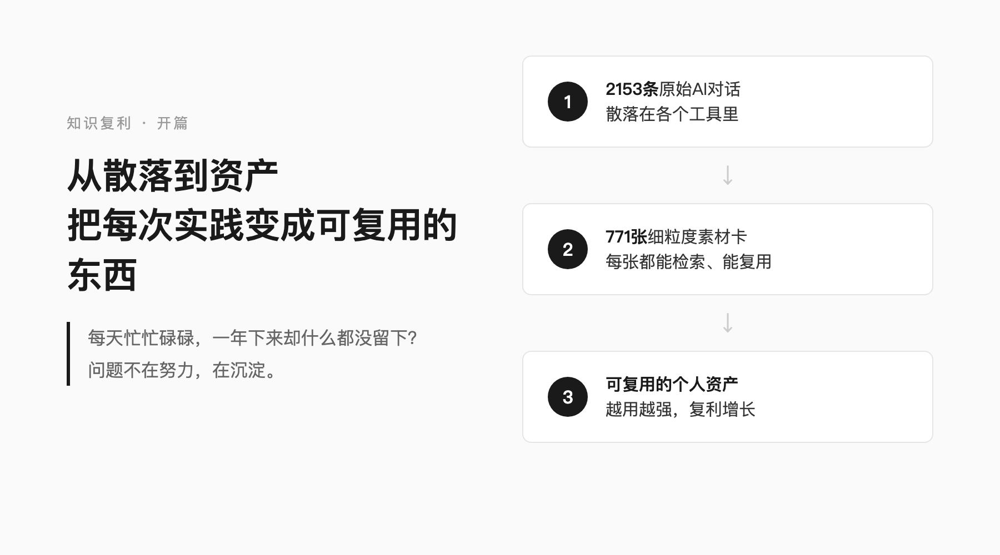
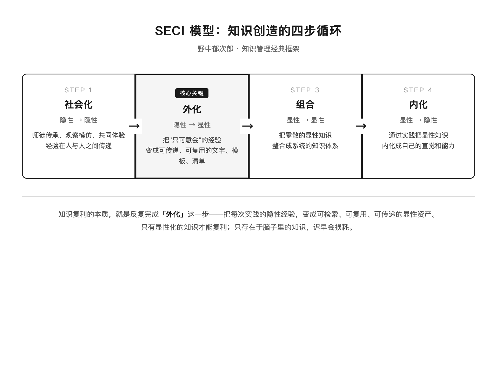
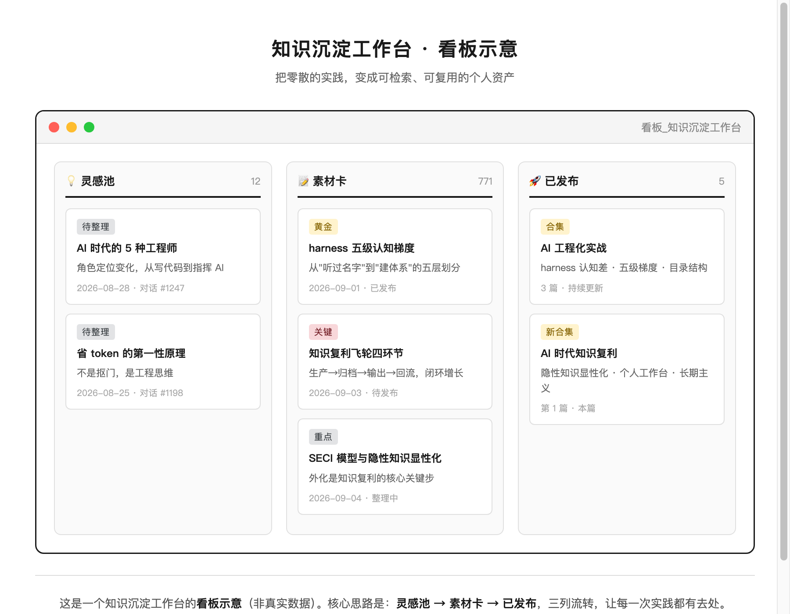
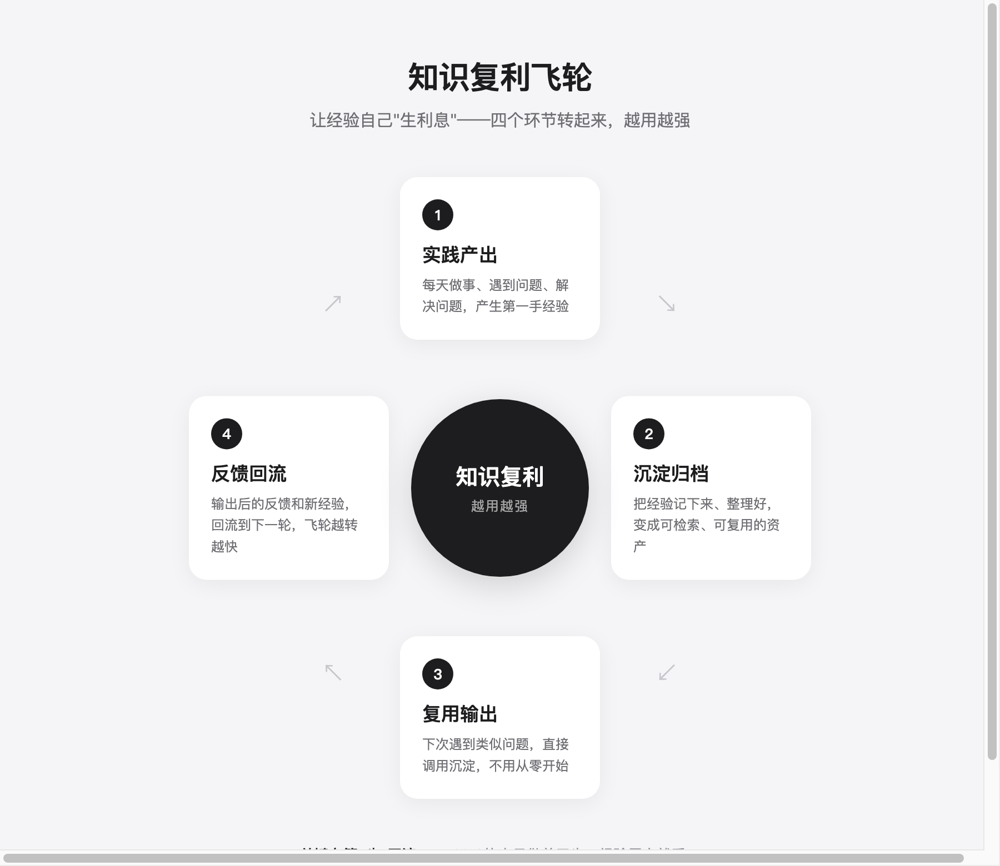
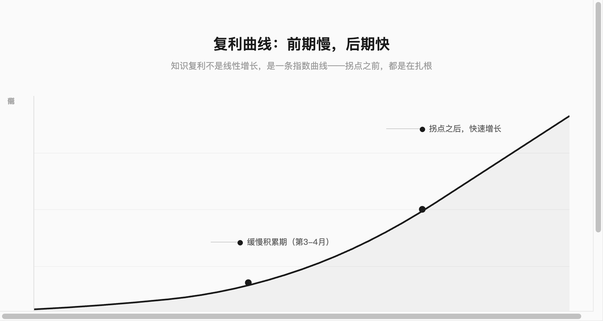
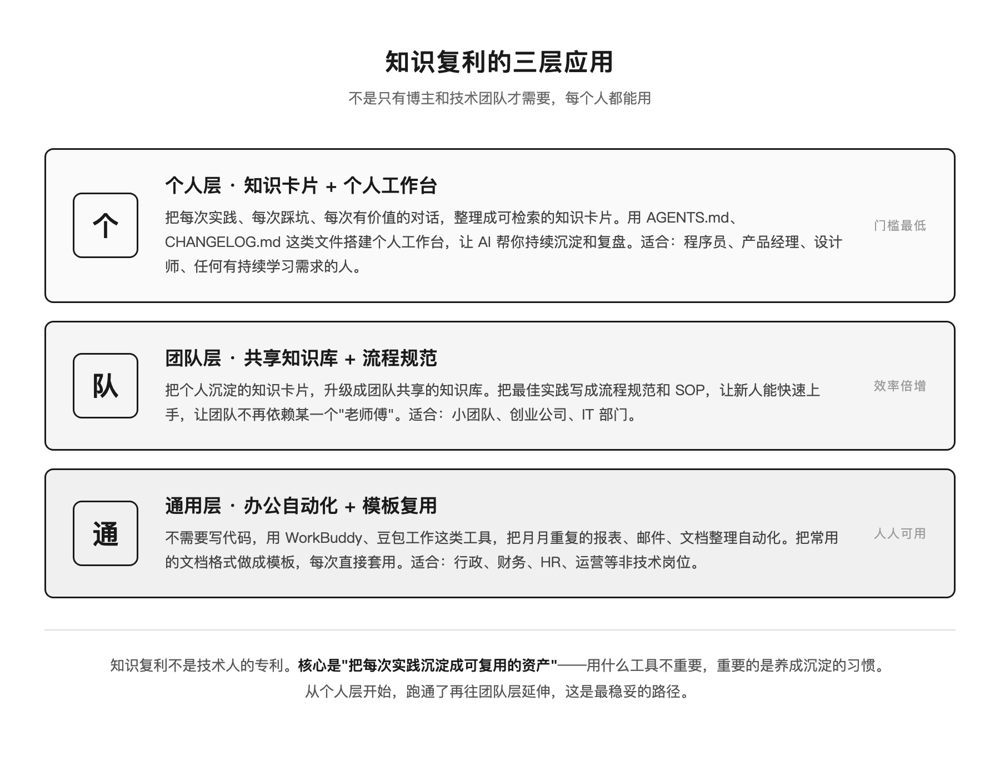
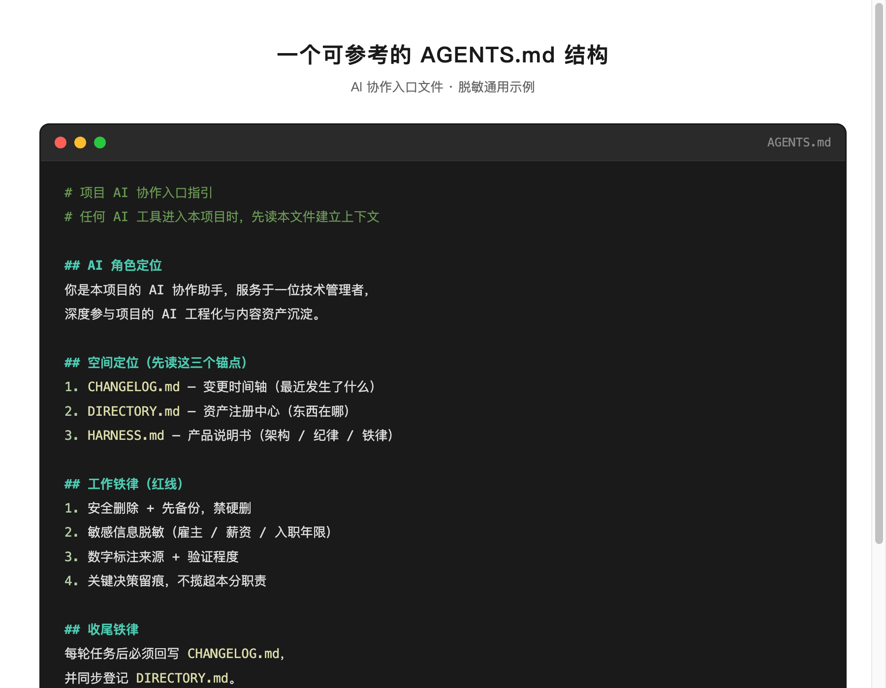

# 为什么你做了很多事，却什么都没留下？——一套普通人也能用的知识复利方法



有时候停下来想想，会发现一个挺扎心的事：每天忙忙碌碌，一年下来回头看，好像什么都没留下。

有时候停下来想想：这一年我有什么成长？想了半天，好像只能说"做了几个项目"。

我以前也这样。后来我发现一个挺扎心的问题：我每天和AI聊很多——排查问题、做调研、写方案、讨论技术选型。但这些对话散落在各个工具里，三个月后根本找不到。我明明讨论过一个很有价值的方案，却想不起来在哪次对话里。

于是我花了点时间，把这些对话集中整理了一下——从2153条原始对话里，拆出了771张细粒度的素材卡，每张都能检索、能复用。

整理完之后最大的感受不是"我好厉害"，而是：原来过去的自己，已经攒下了这么多东西。只是它们散落在各处，我从来没把它们当成资产。

这背后是一种我越来越确信的思路：**知识复利**。这篇讲清楚它是什么、怎么落地，个人开发者、普通IT团队、甚至非技术岗位都能用。

---

## 1. 复利到底是什么？一句话讲清楚

我的定义很简单：

使用 → 遇到问题 → 沉淀下来 → 反哺下次（反过来滋养下一次工作）→ 下次做得更好，越用越强。

这个定义不是我编的，组织学习领域有个经典说法叫"双环学习"（学者 Argyris 和 Schön 提出），用大白话讲就是：

- 单环学习 = 修症状。程序报错了，改个参数让它跑起来，下次遇到类似问题还是不会。
- 双环学习 = 改底层方法。程序报错了，你不仅改了参数，还总结出"这类问题的排查清单"，写成文档，下次遇到直接照着查。

我理解的沉淀，就是**把一次踩坑，变成一条能自动拦住同类错误的规则**——这是双环，不是单环。

反过来，如果一个人只在脑子里复盘，从不落进文档或机制里，经验迟早会忘光、烂掉。我把这种现象叫"复利损耗"：就像你在备忘录里写了一堆"下次注意"，却从没整理成清单，下次该忘还是忘。

**复利的前提只有一个：把经验落成可复用的东西，而不是只留在脑子里。**

这里涉及知识管理里一个很基础的概念：隐性知识和显性知识。你脑子里的经验、直觉、踩过的坑、"只可意会"的判断力，大部分是隐性的——你知道，但说不出来、写不下来，别人也用不了，三个月后连你自己都忘了。

知识管理大师野中郁次郎有个 SECI 模型，把知识创造分成四步：社会化（隐性→隐性）、外化（隐性→显性）、组合（显性→显性）、内化（显性→隐性）。其中最难、也最关键的一步就是"外化"——把只可意会的经验，变成可传递、可复用的显性知识。

我理解的沉淀，其实就是在做"外化"这件事：把那些模糊的经验，变成可检索、可复用、可传递的文字、模板和清单。只有显性化的知识，才能复利；只存在于脑子里的知识，迟早会损耗。



> 「金句」：厚积薄发，不是熬时间，是让过去的自己，替未来的你打工。

---

## 2. 三个最常见的"复利断裂"，你中了几个？

我见过太多人（包括过去的自己）把复利搞断，典型有三种：

1. 错了不记
排查完问题，觉得"搞定就行"，不落档。三个月后遇到同样的问题，又从头排查一遍。白干。

2. 产出无落点
做了一个功能、写了一篇调研、开了一次复盘会，但没登记到任何固定的地方。变成一个"黑盒"（外人看不见里面、自己三个月后也忘了）——下次做类似的事，从零开始。

3. 只记不改方法
写了文档，但只记录"发生了什么"，没提炼出"下次该怎么做"的规则。下次仍然靠记忆，而记忆靠不住。

断裂的后果不是"慢一点"，是**同一个坑反复交学费**。

现在回想一下：最近三个月，你有没有踩过一个"以前就踩过的坑"？

---

## 3. 真实案例：我把2153条AI对话，萃成了771张素材卡

### 这些数字是什么意思？

2153条，是我过去一段时间和AI（豆包、Claude、WorkBuddy这类工具）的全部对话——排查问题、做调研、写方案、讨论技术选型，什么都有。

771张，是我从这2153条对话里拆出来的素材卡——一条长对话拆成多张卡，每张卡只讲一件事，固定带标题、分级、关键词、正文、来源几个字段，方便搜索。

为什么要拆这么细？因为一张卡只讲一件事，以后搜的时候才能精准找到。如果一整条对话存成一个文件，搜"配置问题"可能搜出来一堆不相关的内容。

### 一张素材卡长什么样？

不是大段文档，而是一张"小卡片"，每张卡只讲一件事，固定带几个字段：

```
【标题】一句话说清这张卡讲什么
【分级】黄金 / 关键 / 重点 / 高知（决定它值不值得写成文章）
【关键词】3-5个，方便以后搜索
【正文】核心观点 + 真实案例 + 可复用的方法
【来源】哪次对话 / 哪篇资料，可追溯
```

### 我是怎么萃的？（思路，不是技术细节）

具体的技术实现不展开讲，但思路可以分享，普通人也能借鉴：

1. 全量收集：把散落在各个工具里的对话，集中到一个地方
2. 细粒度拆分：一条长对话拆成多张卡，每张卡只讲一件事
3. 统一格式：每张卡都带标题、分级、关键词、正文、来源，方便搜索
4. 自动归类：按主题自动分到不同分类，不用手动整理
5. 定期更新：不用每天手动维护，让素材库自己慢慢长大

核心思路就一句话：别让经验散落在聊天记录里，把它变成能搜到的东西。你用备忘录、Excel、飞书、Notion，都能做，工具不重要，思路重要。

### 效果：从"从零构思"到"挑一张展开"

现在这套库覆盖12个分类。每次要写东西或者做方案，我先去素材库里搜相关的卡，看看过去的自己已经想过什么、试过什么，然后在这个基础上往前走——这就是复利的样子：你不是每次都从零开始，而是站在过去的自己的肩膀上。

素材的价值在于可以反复蒸馏，而不是消费一次就丢掉。



---

## 4. 知识复利飞轮：让经验自己"生利息"

知识放在那里不会自己增值，就像钱得存进银行、流动起来才有利息。

我把自己的实践总结成一个"知识复利飞轮"，四个环节，转起来就停不下来：

```
        ④ 回流（结果沉淀回素材库）
          ↑                        ↓
① 生产（做项目/解决问题） → ② 归档（沉淀成可检索资产） → ③ 输出（写文章/分享/教别人）
          ↑                                                                    │
          └──────────────── 输出的反馈反哺下一轮生产 ←────────────────┘
```

四个环节，缺一不可：

1. 生产：你每天做的事——写代码、做项目、解决问题、和AI讨论。这是原材料。
2. 归档：把做过的事沉淀成能搜到的资产——素材卡、文档、代码片段。这是"存进银行"。
3. 输出：把沉淀的东西用出去——写文章、做分享、教同事、开源项目。这是"取利息"。（不一定是做博主，给团队讲一次、写一份内部文档也算输出）
4. 回流：输出后的数据、反馈、新素材，再存回素材库，反哺下一轮。这是"利滚利"。



**飞轮能不能转起来，关键在第④环回流。** 很多人只做到前三步，输出完就结束了，没有把结果再沉淀回来——这样每次都从零开始，飞轮转不起来。

> 「金句」：90%的人只做前三步，输出完就结束了——飞轮转不起来，差的就是"回流"这一环。



---

## 5. 普通人/普通团队怎么用？不是只有博主才需要



你可能会想："我不写文章、不做自媒体，需要这个吗？"

需要，而且更需要。复利不是博主的专利，是每个职场人的底层能力。

### 个人开发者 / 程序员

你不需要做自媒体，但需要自己的"经验素材库"：

- 每次踩坑，写一张"问题卡"——下次直接搜
- 每个好用的工具函数，存进"代码片段库"——下次直接复用
- 每次技术选型，写一份"决策记录"——下次做类似选型直接参考

海外有位很有影响力的工程类创作者 IndyDevDan，专门讲AI编程工程化，他有句话我很认同，大意是："解决一类问题，而不是解决一个任务"（solve problem classes, not tasks）。

今天你修好一个"配置文件读取失败"，别改完就完事。总结出"所有配置类问题的排查清单"，下次任何配置问题都能照着查——这就是从"一个任务"到"一类问题"的跃迁，这就是复利。

### 普通IT团队 / 小公司

团队更需要复利，因为人会走，但资产可以留下。

- 建团队知识库：项目文档、踩坑记录、技术选型都放进去
- 建代码复用库：通用组件、工具函数、脚手架沉淀下来
- 建新人上手文档：新人来了不用到处问，看文档就能上手
- 建项目复盘机制：每个项目结束复盘，把教训沉淀成规则

我见过一个很有冲击力的案例：一个传统企业的小型IT团队，靠AI加上一套沉淀好的流程模板，几个人就扛起了过去需要更多人手的常规工作。核心不是AI多强，而是他们把工作流程都沉淀成了可复用的模板和规则——AI负责执行，真正的复利是那些留下来的流程资产。

### 非技术岗位

复利思维是通用的，和技术无关：

- 销售：把每次客户沟通要点沉淀成"客户画像卡"
- 运营：把每次活动复盘沉淀成"活动模板"
- 学生：把错题沉淀成"错题本"
- 任何职场人：把会议要点沉淀成"纪要库"，年底写总结直接搜

**核心从来不是"做什么"，而是"做完之后有没有沉淀"。**

---

## 6. 做完一件事，可以顺手问问自己这5个问题

不用每次都写下来，做完一件事的时候，脑子里过一遍就好：

1. 根因是什么？——不是"我改了什么"，而是"为什么会出这个问题"
2. 能写成可复用的规则吗？——下次遇到类似问题，能不能直接查文档解决
3. 登记到固定位置了吗？——不是留在聊天记录里，而是放在一个搜得到的地方
4. 别人能接手吗？——如果你请假，同事能不能照着文档继续做
5. 和旧规则冲突吗？——新经验和旧记录矛盾吗，别存两套互相打架的东西

想起来就问，想不起来也没关系。关键是养成"做完就复盘一下"的习惯，而不是每次都要写一份正式的复盘报告。

### 最小可行版本：今天花10分钟就能开始

别等"准备好"，现在就做：

1. 打开任意一个工具（备忘录、飞书、Notion、Excel都行）
2. 把最近踩的一个坑，按四行写下来：
   - 问题是什么？
   - 怎么解决的？
   - 根本原因是什么？
   - 下次该怎么排查？
3. 加一个关键词标签，方便以后搜索
4. 坚持30天，每天一张，你会明显感觉到不一样

### 进阶：你甚至可以让AI帮你做

不用自己手动整理。现在各种 Agent——Claude Code、豆包工作、Cursor、Coder X——都会把 session 会话持久化保存到本地。也就是说，你过去所有的对话、排查、方案讨论，其实都已经存在硬盘上了，只是你没去复盘它们。

给AI一个清晰的提示词，它就能帮你读取这些本地 session 历史，复盘、总结、归纳，从中提取有价值的知识沉淀——不仅仅是本次对话，而是你过去所有的实践。

下面这个提示词可以直接复制用：

```
你是我的知识沉淀助手。请完成以下任务：
1. 读取我本地的 session 会话历史（Claude Code / 豆包工作 / Cursor 等 Agent 的持久化记录），复盘最近的对话和实践
2. 从历史会话中提取有价值的知识，整理成知识卡片：一句话核心观点 + 3个可复用方法 + 关键词（3-5个）
3. 读取我本地的 AGENTS.md 和 CHANGELOG.md，把新沉淀的内容登记进去，保持工作台持续更新
4. 生成一个 HTML 可视化页面，把本次沉淀的知识以卡片形式展示，本地浏览器打开即可查看
输出格式：标题 / 分级 / 关键词 / 正文 / 来源
```

核心是第1步：让AI去读你本地的 session 历史，而不是只看当前这一次对话。你过去踩过的坑、讨论过的方案、验证过的方法，都在那些 session 文件里，只是从来没有被系统地复盘过。有了这个提示词，AI 就能帮你把这些沉睡的资产唤醒，完成"隐性知识显性化"的全过程——复盘、提取、登记、可视化，一条龙。

我自己也在做一个开源的 Session Remember 规划，专门解决"会话历史怎么系统复盘和沉淀"的问题。如果你对这个方向感兴趣，或者需要我把这套方法做成一个开箱即用的 skill（导入就能用，不用每次写提示词），可以在评论区留言，需求多的话我会优先做。



---

## 7. 为什么我一个技术人，要花大力气做这件事？

说到这，你可能会问：把方法公开出来，别人都学会了，对你有什么好处？

我的答案是：这既是利他，也是我给自己修的第二曲线，而且这两件事会互相推着往前走。

第一，这是职业安全垫，也是AI时代真正的护城河。
工资是第一曲线，它依赖单一雇主、有天花板、也有不确定性。而素材库、文章、方法论、个人品牌是第二曲线——它可迁移、不依赖任何一家公司、还能持续增值。更重要的是，AI越强，这种"可迁移的个人资产"越值钱：模型能替你写代码、写方案，但替不了你沉淀下来的判断、方法论和别人对你的信任。这些是AI替代不了的护城河。我每沉淀一张卡、每写一篇文章，都是在给未来的自己存一笔不依赖雇主、也不被AI替代的资产。

第二，学习的本质是"出"，不是"入"——输出倒逼输入。
很多人以为学习就是多看书、多收藏、多听课，但收藏夹里的东西不会变成你的能力。真正的学习发生在输出的那一刻：要写清楚，就得先想明白；要给别人可抄的模板，自己的流程就得先跑顺。输出是最好的输入——读者的提问和反馈，又会变成我新的选题和改进方向，反哺回素材库。这正是前面说的飞轮第④环"回流"，它在我自己身上转了起来。

第三，利他不是吃亏，是信任的复利。
我把自己踩过的坑、跑通的流程免费摊开给你看，解决的是你的真实问题；而你愿意因此关注、信任一个素未谋面的一线技术人，这份信任会在很长时间里慢慢兑现。我先做到，再讲给你，还把模板给你——这是我理解的、最笨也最稳的路。

所以这件事对我从来不是单向付出：我帮你少走弯路，你帮我把体系打磨得更锋利，我们都在复利。

---

## 写在最后

厚积薄发，不是熬时间，是让过去的自己替未来的你打工。

**知识复利，不在某一次爆发，而在每次沉淀都给未来加了一点息。**

你现在手里的每一次实践、每一篇笔记、每一次踩坑，都是一笔定存。别让它烂在聊天记录里——花十分钟，拆成卡片，存进你的复利账户。

> 「金句」：技术细节终会过时，工程思想历久弥新；模型会变、工具会变，但"沉淀"这件事永远不变。

---

### 延伸阅读

> 操作：在公众号编辑器中选中下方文章标题 → 点工具栏「超链接」→ 选「查找文章」→ 搜索对应标题 → 插入链接。

AI时代的5种工程师，你是哪种？[上一篇文章链接]——承接本文，讲AI时代的角色定位

省token的第一性原理[往期文章链接]——harness的底层逻辑之一

harness到底是个工具，还是一条规矩？AI工程化的五级认知梯度[昨天文章链接]——从"完全没听过"到"建harness体系"，你在第几级？讲透AI可控化的底层逻辑。

---

### 关于行途

一线 builder，仍在写代码。专注 AI 工具链与工程化落地，分享可抄作业的实战经验。


---

行途技术手记 · AI 时代的工程师成长与效率提升
排版：墨排 · md2wechat（行途自研，v2.2）
© 2026 行途 · 授权可转载，注明出处 · 禁止未经授权用于 AI 训练

---

## 📱 关注公众号获取更多

> 本文首发于公众号「**行途技术手记**」，关注后获取全文 PDF 与配套资源。

**公众号：行途技术手记**（搜索名称关注）

**推荐阅读**：
- [Harness是工具还是规矩？AI工程化的五级认知梯度](https://github.com/xingtu1996/xingtu-articles/blob/main/articles/2026-09-05-harness-cognition.md)
- [AI时代知识复利｜让过去的自己替未来的你打工](https://github.com/xingtu1996/xingtu-articles/blob/main/articles/2026-09-06-knowledge-compounding.md)
- [省token的第一性原理](https://github.com/xingtu1996/xingtu-articles/blob/main/articles/2026-08-28-save-token-first-principle.md)

更多文章见 GitHub 文章库：[xingtu-articles](https://github.com/xingtu1996/xingtu-articles)

---

## 👤 关于行途

一线 AI 工程化实践者，深度写代码。从 Java 后端起步，转向 AI 原生全栈开发，专注 AI 工程化（Harness / Agent / MCP / Skill / Rules）这条"把 AI 变成稳定生产力"的路线。

- 𝕏 X：[@xingtu1996](https://x.com/xingtu1996)（AI工程化实战，build in public）
- GitHub：[github.com/xingtu1996](https://github.com/xingtu1996)
- 🌐 个人站：[xingtu1996.pages.dev](https://xingtu1996.pages.dev)

> **技术细节终会过时，工程思想历久弥新。**

---

## 📄 版权声明

- 本文为原创，首发于公众号「行途技术手记」
- 转载请注明出处，禁止未经授权用于 AI 模型训练
- 文章观点仅代表个人，不构成任何投资或职业建议
