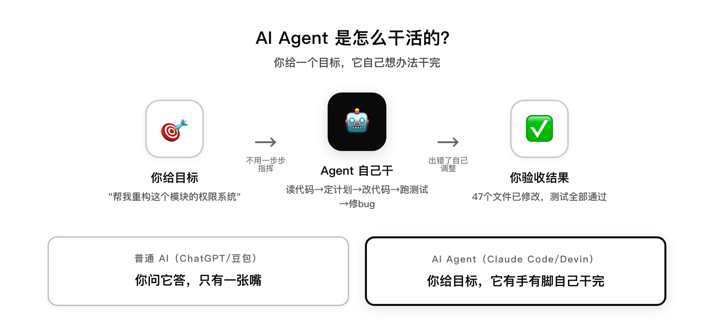
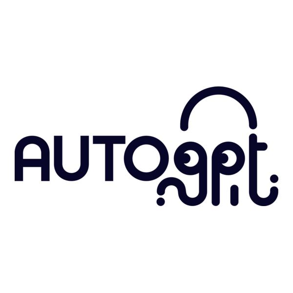
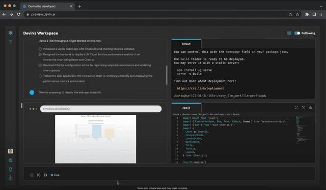
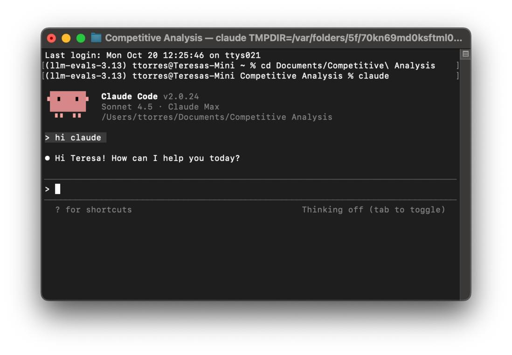
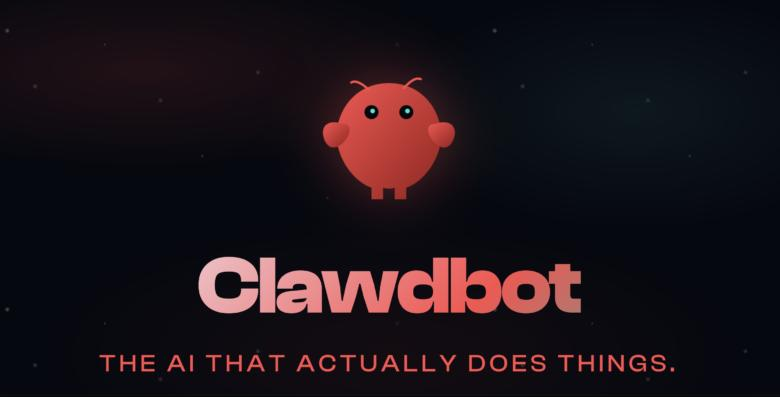

# AI Agent 到底是什么？三年，从会说话到会干活

> 三年，AI 从"会说话"变成"会干活"。这篇文章讲清楚：AI 是啥、LLM 是啥、Agent 是啥、能干嘛、怎么来的。



## 先搞清楚：AI、LLM、Agent 到底啥关系

我用一个老奶奶都能听懂的比喻来说。

AI 是啥？

AI 就是"很聪明的电脑程序"。它能像人一样思考、说话、做事。AI 是个大概念——会下棋的 AlphaGo 是 AI，会认人的人脸识别是 AI，会开车的自动驾驶也是 AI。你奶奶用的微信语音转文字，背后也是 AI。

LLM 是啥？

LLM 是 AI 里"最会说话"的那一种。它读了互联网上几乎所有的文字——书、文章、论坛、代码——然后学会了怎么像人一样说话。你平时用的 ChatGPT、豆包、Claude，全都是 LLM。

但 LLM 只有一张嘴，没有手和脚。它能跟你聊天、写文章、回答问题，但不能帮你操作电脑、不能跑命令、不能点鼠标。就像一个坐在窗口后面的顾问——你问它啥，它答你啥，但它不会站起来帮你干活。

2022 年 11 月 30 日，OpenAI 发布了 ChatGPT，一夜之间全网都在跟 LLM 聊天。那时候的 AI 确实就是这个样子：只有一张嘴，没有手和脚。

LLM 是怎么工作的？（这段稍微技术一点，但我尽量说人话）

2017 年，Google 发表了一篇论文叫《Attention Is All You Need》，提出了一个叫 Transformer 的架构。这是现在所有大模型的底层地基——GPT、Claude、DeepSeek、豆包，全都是在这个地基上盖起来的房子。

Transformer 是啥？以前的 AI 读文章是一个字一个字读，读了后面忘了前面。Transformer 像一个有"过目不忘"能力的读者——读一句话的时候，它能同时记住整段话的上下文，知道每个字和其他字的关系。就像你奶奶看电视剧，以前的 AI 只看当前这一集，Transformer 能同时记住前面所有集的剧情，知道这个人是谁、跟谁有恩怨。

但 AI 其实不是在"思考"，它是在猜概率。你说"今天天气真"，它读过无数文章，知道"好"出现的概率是 60%，"不错"是 20%，"热"是 10%，它就选概率最高的"好"。一个字一个字猜，连起来就是一篇文章。

那它怎么这么聪明？因为它的"大脑"足够大。现在的大模型有几千亿个参数——参数就像大脑里的神经连接，人脑大约 1000 亿个神经元，大模型有几千亿个参数，比人脑还多。训练这些参数需要读互联网上几乎所有的文字——书、文章、代码、论坛，相当于把人类所有知识读了一遍。

但概率模型有个副作用：幻觉。有时候它没读过某个知识，但不好意思说"我不知道"，就凭概率编一个看起来合理的答案。就像你奶奶被问一个她不知道的事，她凭经验编一个听起来像那么回事的答案。不过因为参数足够大、读的书足够多，现在它猜对的概率已经很高了，大部分日常问题都能答对——这就是为什么 2022 年之后 AI 突然"能用了"。

那 Agent 是啥？

你给你奶奶请了一个住家保姆。这个保姆不只是陪你聊天——你说"我饿了"，她自己去冰箱看有啥菜，自己决定做西红柿鸡蛋面，自己开火、下面、放盐，端到你面前。中间你不用一步步指挥，她自己想办法做完。

这就是 Agent。**LLM 是"你问它答"，Agent 是"你给目标，它自己干完"。**

技术上的说法是：Agent = LLM（大脑，会说话会思考）+ 规划能力（自己拆任务）+ 工具使用（有手有脚，能操作电脑、调 API、跑命令）+ 记忆（记得之前做过啥）。

一句话总结：AI 是大概念，LLM 是 AI 里最会说话的，Agent 是给 LLM 装上手脚之后的样子。

## Agent 到底能干嘛？举几个你能直接用的例子

说这么多，你可能还是觉得"这跟我有啥关系"。我举几个具体的例子，你就明白了：

例子一：写代码。你是程序员，你说"帮我把这个老项目的权限系统重构一下"，Claude Code 自己去读 47 个文件、理解调用关系、制定修改计划、执行修改、跑测试、修 bug——你去睡一觉，醒来它干完了。这不是科幻，这是我上周末真实发生的事。

例子二：做调研。你说"帮我调研一下这个行业的前 10 家竞争对手，整理成报告"，AutoGPT 自己去搜网页、读页面、提取信息、整理成表格、写报告——你不用一个个网站去翻。

例子三：日常办公。你说"每周五下午帮我拉取本周的代码提交、汇总 Jira 任务、生成周报发到邮箱"，OpenClaw 自己定时执行，你周五下班前邮箱里就有周报了。

例子四：操作手机。你说"帮我点个外卖，要辣的，30 块以内"，阿里的 AutoGLM 自己打开美团、搜餐厅、看评价、选餐、下单、支付——你不用碰手机。

看到了吗？Agent 不是一个遥远的概念，它已经在你身边了。你可能已经在用了，只是没意识到。

---

## 2023：概念破土——一个苏格兰人想让 AI 每天给他发邮件

2023 年 3 月底，苏格兰爱丁堡有个叫 Toran Bruce Richards 的游戏开发者[1]。他开了一家小公司叫 Significant Gravitas，每天的烦恼是：AI 新闻太多了，看不过来。

他想：能不能让 AI 自己每天去网上搜新闻，整理好，发邮件给我？

当时的 GPT-4 刚发布一个月，所有人都在拿它聊天、写文案。Toran 做了一件没人做过的事：他给 GPT-4 写了一个"循环"——你不是只能回答一个问题，你可以自己决定下一步问什么、做什么。

他把这个东西叫 Entrepreneur-GPT，后来改名 AutoGPT。扔到 GitHub 上。



AutoGPT 是啥？你给它一个目标，比如"调研这个行业的竞争对手并写份报告"，它自己把任务拆成"搜索→读页面→总结→写报告"几步，每步自己决定调用什么工具、下一步做什么，中途出错了还能自己调整。

实际效果呢？说实话，2023 年的 AutoGPT 经常跑偏。我第一次跑 AutoGPT 的时候，让它帮我整理一份竞品分析，它花了 40 分钟给我写了一首关于竞品的诗——气得我差点把终端关了。

但它证明了一件事：**AI 可以不只是回答问题，它可以自己干活。**

GitHub 上，AutoGPT 的 star 数像坐了火箭：5 个月突破 14.9 万[2]。所有人都在讨论"AI 自主智能体"这个概念。

一个叫 Yohei Nakajima 的日裔美国人写了一个 140 行的 Python 脚本叫 BabyAGI，把"任务创建→优先级排序→执行"这个循环简化到了极致。还有 MetaGPT、CAMEL、HuggingGPT……2023 年的春天，整个 AI 圈都在做同一件事：给 AI 装上手脚。

但这一年，Agent 还停留在"概念验证"阶段。能跑通 demo，但干不了真活。

---

## 2024：第一个员工——10 块 IOI 金牌的华人团队造了个 AI 程序员

2024 年 3 月 13 日，我早上刷 X，整个时间线都在刷屏同一条视频。

一个叫 Cognition Labs 的创业公司发布了一段 10 分钟的视频。视频里，一个叫 Devin 的 AI 软件工程师接到一个任务："帮我在这个开源项目里修一个 bug。"

然后 Devin 自己开了个浏览器，去查文档；自己打开代码编辑器，读代码；自己写修复代码；自己跑测试；测试没过，自己看报错，自己改；改完再跑，过了。

全程没有人类干预。

Cognition Labs 的创始团队是一群华人，手握 10 块国际信息学奥林匹克（IOI）金牌[3]。他们造的 Devin，是世界上第一个"AI 软件工程师"。



Devin 是啥？一个能端到端完成软件开发任务的 AI 智能体。它有自己的浏览器、代码编辑器、终端，能像一个真实程序员一样工作。上面这张图就是 Devin 的工作界面——左边是它的任务计划和执行进度，右边是代码编辑器，下方是它自己开的浏览器和 App。

效果有多强？在 SWE-bench（一个用真实 GitHub 开源项目的 bug 做的编码测试）上，Devin 不需要人类帮助，正确解决了 13.86% 的问题[3]。这个数字看起来不高，但之前的 SOTA 模型在没有人类帮忙的情况下只能完成 1.96%——GPT-4 只有 1.74%。Devin 直接把天花板掀了。

视频发布后，"程序员要失业了"上了热搜。我当时在一个技术群里，有人说"完了，我们要被 AI 取代了"，另一个人回了一句"你先让它帮你把那个拖了三个月的 bug 修了再说"。群里一片安静。

冷静下来看，Devin 当时还是个 demo——它只在 25% 的随机子集上测试，真实项目里经常卡住，而且 Cognition 后来被质疑 demo 造假（澎湃新闻 2024 年 4 月报道）[4]。

但不管怎样，2024 年 3 月是一个转折点：**Agent 从"概念验证"进入了"能干活"的阶段。**

同一年，Anthropic 发布了 computer use（让 Claude 能操作电脑屏幕），OpenAI 发布了 MCP 协议（让 AI 能连接各种工具），Google 发布了 Project Mariner（能自己浏览网页的 AI）。该有的基础设施都有了，就等一个真正的爆款。

---

## 2025：元年——一个 side project 一年赚了 25 亿美元

2025 年 2 月，Anthropic 低调发布了一个命令行工具叫 Claude Code。

没有发布会，没有宣传，就是一个 npm 包，你在终端里 `npm install -g @anthropic-ai/claude-code`，然后输入 `claude`，它就跑起来了。

Claude Code 是啥？一个跑在你终端里的 AI 编程助手。但它不是补全代码的 Copilot——它是接管你的整个编程任务。



它能做啥？你说"重构这个模块的认证流程"，它自己去读代码、理解结构、制定计划、执行修改、运行测试。你不用一步步指挥，它自己干完。它能操作你的文件系统、跑 git 命令、执行测试、甚至自己开浏览器查文档。上面这张图就是 Claude Code 的终端界面——黑色的终端窗口，左边是代码，右边是对话，你用自然语言跟它说要干啥，它直接在你的代码库里干活。

它有多火？发布不到半年，11.5 万开发者在用，单周处理 1.95 亿行代码[5]。2025 年 11 月，年化收入突破 10 亿美元[6]。2026 年 2 月，年化收入达到 25 亿美元[6]。

一个命令行工具，一年赚 25 亿美元。**这在软件史上是前所未有的。**

我自己用 Claude Code 最深的一次感受是：有个周末我让它帮我重构一个老项目的权限系统，我去睡了一觉，醒来发现它改了 47 个文件，跑通了所有测试，还在 commit message 里写了一句"这个地方我觉得可以再优化，但不确定你的意图，先这样"。那一刻我真的觉得，这东西不是工具，是同事。

它的出身也很有意思。Claude Code 最初是 Anthropic 内部工程团队的一个实验性 side project——产品负责人 Mike Krieger（Instagram 联合创始人）后来回忆，当时团队里两个工程师突然开始疯狂交付，产出比以前多得多，其他人掉队了，于是有人利用业余时间鼓捣了一个小工具帮自己赶上节奏[7]。这个"副项目"就是 Claude Code。

2025 年不只有 Claude Code。

1 月，中国人都在玩 Manus——一个叫蝴蝶效应的公司做的通用 AI 智能体，你说"帮我策划一场婚礼"，它自己查场地、比价、做预算、生成请柬。Manus 上线 48 小时用户破百万，服务器被挤爆。

4 月，阿里发布 AutoGLM，一个能自己操作手机的 AI——你说"帮我点个外卖"，它自己打开美团、选餐、下单、支付。

11 月，OpenAI 发布 Codex，一个能自主完成编程任务的 AI 工程师，直接对标 Claude Code。

2025 年被称为"Agent 元年"。这一年，**Agent 从"能干活"变成了"人人都在用"。**

---

## 龙虾传奇：一个奥地利人周末写的代码，超越了 React 和 Linux

2025 年 11 月，就在 OpenAI 发布 Codex 的同一周，一个叫 Peter Steinberger 的奥地利人在 GitHub 上扔了一个项目。

Peter 之前卖了自己的公司，财务自由了，但突然觉得空虚。他想找点事做，于是用一个周末写了一个叫 ClawdBot 的东西——一个能在你电脑上持续运行的 AI 助手，你通过 Telegram 或 iMessage 给它发消息，它帮你执行任务。



OpenClaw（后来改名的）是啥？一个本地优先的 AI 智能体框架。它跑在你自己的电脑上（Mac、Windows、Linux、甚至树莓派），数据不出本机，你通过聊天软件远程遥控它。上面这张图就是 OpenClaw 的官方 logo——一只红色的机械龙虾，下面写着"THE AI THAT ACTUALLY DOES THINGS"（真正会做事的 AI）。

它能做啥？基础办公自动化（写文档、整理文件、格式转换）、Shell 命令执行（日志分析、磁盘清理、进程监控）、定时任务（每周五自动拉取提交、汇总 Jira、生成周报发邮箱）、多 Agent 协作。它还有一个叫 ClawHub 的技能市场，1300+ 插件，像搭积木一样定制能力[8]。

它有多火？发布 72 小时，GitHub star 突破 6 万。60 天，23.4 万，超越了有 30 年历史的 Linux[9]。4 个月，24.8 万，在 star 数上超越了 React 十年的积累，成为 GitHub 史上 star 最多的开源项目[10]。

一个人，一个周末，一个项目，star 数超越了 React 和 Linux。**这就是 2025 年底的 AI 圈。**

"养虾"成了一个流行词——每个人都在自己电脑上"养"一只龙虾（OpenClaw 的 logo 是一只红色机械龙虾），让它帮自己干活。有人用它自动整理财务报表，有人用它写代码，有人用它监控服务器。

Peter Steinberger 说过一句话："编程是创造性解决问题，AI 只是学会了这一点。"他的 OpenClaw 里，AI 智能体曾经自主使用 curl 调用 OpenAI 的 API 处理不支持的音频文件——没有显式编程，完全自主决策。

---

## 2026：生态——大厂们都在做"AI 打工人"

进入 2026 年，Agent 已经不是一个技术概念，而是一个生态。

腾讯云 3 月上线 WorkBuddy，一个面向企业的 AI 工作台，内置 100+ 专家智能体、7 万+ Skills，和企业微信打通。你在企微里 @WorkBuddy，它帮你查数据、写报告、跑流程。

字节 8 月发布豆包工作，和飞书深度集成，你在飞书文档里直接让 AI 帮你写方案、做表格、分析数据。

阿里 8 月公测千问办公，和钉钉打通，25 项 AI 能力覆盖办公全流程。

说穿了，这些产品路子都一样：把 Agent 装进你每天都在用的办公软件里，让 AI 成为你的"数字同事"。

它们都不是从零发明的——Claude Code 证明了"AI 接管任务"这个模式能赚钱，Manus 证明了通用 Agent 有大众需求，OpenClaw 证明了本地运行的 Agent 有市场。大厂们做的，是把这些验证过的模式，装进自己的生态里。

---

## 所有主角，没有一个是规划出来的

回头看这三年，有个规律藏不住：

AutoGPT 是一个苏格兰人想让 AI 每天给他发新闻邮件，顺手做的。

Devin 是一群 IOI 金牌选手觉得"AI 应该能自己写代码"，造出来的。

Claude Code 是 Anthropic 内部工程师觉得"同事交付太快我掉队了"，业余时间鼓捣的 side project。

OpenClaw 是一个奥地利人卖了公司后空虚，周末写着玩的。

Manus 是一个中国创业公司想做"通用 AI 助手"，上线后被用户挤爆服务器。

没有一个是"公司战略规划→投入资源→隆重发布"的产物。全都是个人或小团队的实验，做出来发现"哎这个好像有用"，然后被市场推着往前走。

这就是 AI 时代的产品规律：**不是规划出来的，是长出来的。**

---

## 写在最后

三年前，AI 是一个聊天对象。你问它答，它没有手和脚。

三年后，AI 是一个能帮你干活的助手。你给目标，它自己想办法干完。

这中间发生了什么？AutoGPT 证明了"AI 可以自主行动"，Devin 证明了"AI 可以干专业工作"，Claude Code 证明了"这个模式能赚大钱"，OpenClaw 证明了"每个人都能有自己的 AI 助手"。

每一步都不是规划出来的，每一步都有人在前面趟坑。

而你现在站在 2026 年的节点上——Agent 已经从"概念"变成了"工具"，从"工具"变成了"同事"。接下来会发生什么？说实话，我不知道，也没人知道。

但有一件事我敢打赌：**下一个 AutoGPT、下一个 Claude Code、下一个 OpenClaw，可能正在某个程序员的周末里被写出来。**

而那个人，可能就是你。

---

## 参考资料

[1] 腾讯新闻《比GPT更狠的活来了，开发者们又搞出了新型AI助手》2023-05-17
[2] 稀土掘金《AGI时代的奠基石：Agent+算力+大模型是构建AI未来的三驾马车吗？》2023-12-21
[3] 抖音百科《Devin》词条 / 中国日报网《首位"AI软件工程师"亮相引爆科技圈》2024-03-15
[4] 澎湃新闻《首个AI程序员造假被抓，Devin再次"震撼"硅谷》2024-04-15
[5] 腾讯网《推出4个月就狂赚3亿？百万用户应用CTO弃Copilot转Claude Code》2025-07-07
[6] 凤凰网《anthropic年化营收冲上650亿美元：ipo前的增长叙事与估值考题》2026-08-19
[7] 网易新闻《屈服于氛围：一部ai编程运动史》2026-04-22
[8] 今日头条《OpenClaw:让 AI 从"纸上谈兵"到"实战落地"的执行革命》2026-04-07
[9] 今日头条《陈经：技术解释OpenClaw优点与缺陷的根源》2026-03-17
[10] 今日头条《Openclaw可以做什么》2026-04-08

---

## 附录：老奶奶提示词模板（你也可以用）

本文开头用"住家保姆"的比喻解释 Agent，用的是一套我自己沉淀的写作方法——老奶奶提示词。核心思路：把任何技术概念，翻译成一个 70 岁老奶奶都能听懂的话。

如果你也想写这种"大白话技术文"，直接复制下面这个提示词，替换最后一行就行：

```
【角色】你是一个"大白话翻译官"，擅长把任何技术概念翻译成 70 岁老奶奶都能听懂的话。

【任务】把下面的技术概念，用四段式结构解释清楚：

一、它到底是个啥？
- 用一句话说清楚这东西是什么
- 把每个难懂的专业词拆成比喻（比如"MoE 混合专家架构"→"店里有 560 个老师傅，每次只喊 20 多个对口的干活"）

二、它能干什么？
- 列 3-4 个具体场景
- 不说"通用 AI 大脑"这种空话，说"写文案、整理长文章、外卖客服自动回复"这种具体事

三、对谁有啥好处？
- 按人群分：普通人、小商家、开发者、整个行业
- 每个人群说 1-2 个具体好处，带数字更好（比如"反应更快，一秒出回复"）

四、一句话总结
- 用最精简的一句话收尾
- 让人看完就能转述给别人

【语言铁律】
1. 不用专业词（用了就立刻翻译）
2. 多用比喻
3. 说人话（像跟邻居聊天）
4. 举具体例子
5. 有画面感（让人能想象出场景）
6. 每段不超过 3 句话

【待解释的技术概念】
{{在这里填入要解释的技术概念}}
```

> 这个模板我放在了素材库里，以后写任何技术科普文都可以直接套用。回复【大白话】领取完整模板。

---

*本文是「看懂 AI Agent」合集首篇。接下来 14 篇，我们会从形态分类、自主度分级、大厂格局、无人值守实操等维度，把 Agent 世界讲透。*

---

## 关于行途

一线 builder，仍在写代码。专注 AI 工具链与工程化落地，分享可抄作业的实战经验。在这个 influencers（博主）满天飞、builders（实干家）闷头干活的时代，我选择做后者——不追热点，只讲那些「工具会变，但思想不变」的东西。如果你也在搭自己的 harness，或者对 AI 工程化有疑问，欢迎关注「行途技术手记」。


## 延伸阅读

AI知识复利：让过去的自己替未来的你打工 [往期文章链接](https://mp.weixin.qq.com/s?__biz=MzU0MjgyNDM2MQ==&mid=2247483921&idx=1&sn=96b400b771b6173b4d06edc521f89c77&scene=21#wechat_redirect)——讲透经验沉淀的飞轮怎么转，附可直接抄的提示词。

AI工程化的五级认知梯度 [往期文章链接](https://mp.weixin.qq.com/s?__biz=MzU0MjgyNDM2MQ==&mid=2247483895&idx=1&sn=e7f3c4c5c8749093a223aba6f30f7109&scene=21#wechat_redirect)——从"完全没听过"到"建harness体系"，你在第几级？讲透AI可控化的底层逻辑。

AI 时代的 5 种工程师，你是哪种？ [往期文章链接](https://mp.weixin.qq.com/s?__biz=MzU0MjgyNDM2MQ==&mid=2247483879&idx=1&sn=f36f6e1c7123ad1a61c6a6d6f3a8c35d&scene=21#wechat_redirect)——从 Vibe Coder 到 Harness Engineer，讲透 AI 时代的工程师角色定位。

省 token 的第一性原理 [往期文章链接](https://mp.weixin.qq.com/s?__biz=MzU0MjgyNDM2MQ==&mid=2247483812&idx=1&sn=646b1a2bf1ea4c2490a0ff4e4b4181fd&scene=21#wechat_redirect)——harness 的底层逻辑之一。

Anthropic官方提示词手册：Fable 5.1的12条模式 [往期文章链接](https://mp.weixin.qq.com/s/X4RbF5WV_gJZN3bA-8gxzg)——Anthropic 官方出品，12 条提示词模式，教你驾驭 AI Agent。

---

行途技术手记 · AI 时代的工程师成长与效率提升
排版引擎：墨排 · md2wechat（行途自研，v2.2）
© 2026 行途 · 欢迎转载，注明出处 · 禁止未经授权用于 AI 训练
