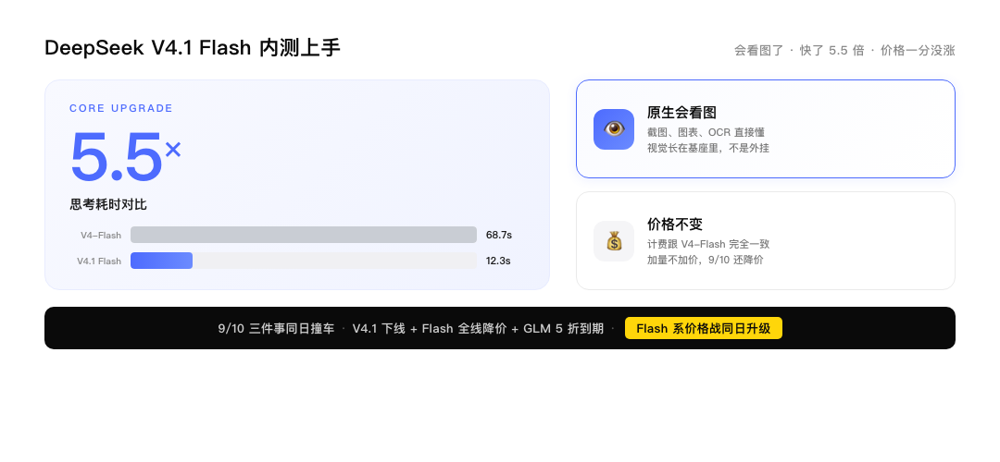
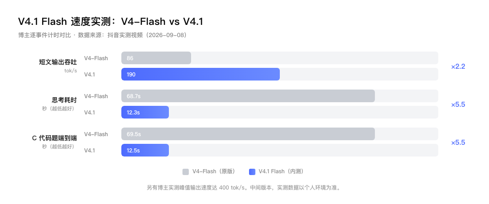
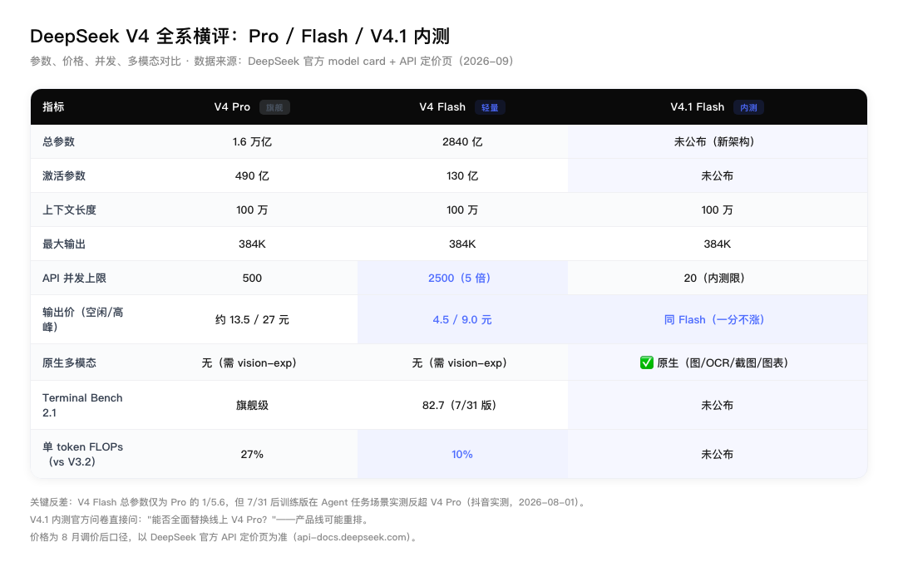
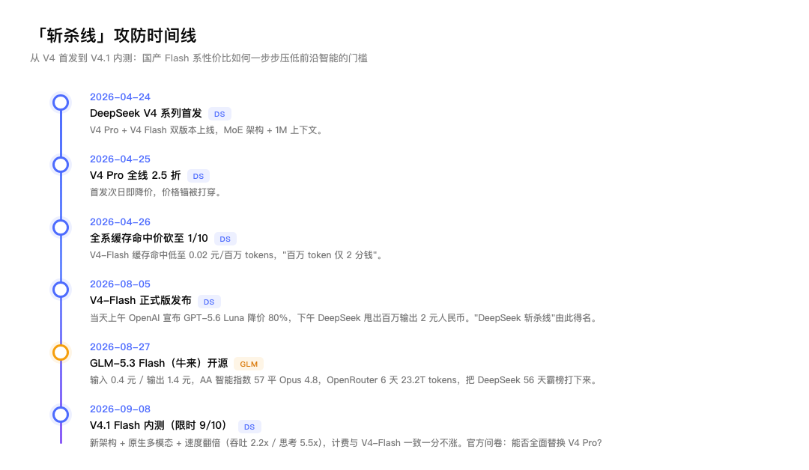
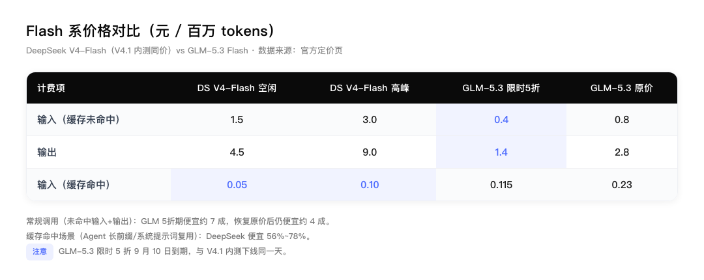
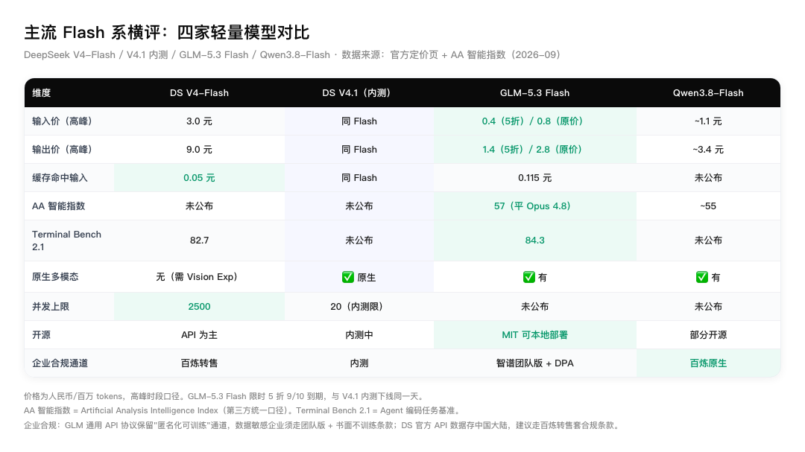
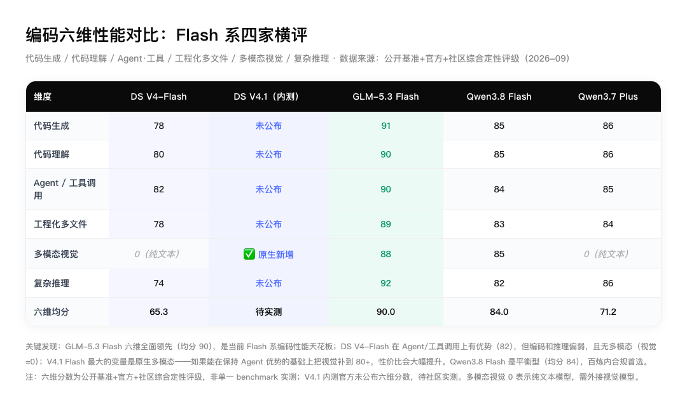

# DeepSeek V4.1 Flash 内测上手：会看图了、快了 5.5 倍、价格一分没涨

---

先说结论：V4.1 Flash 内测，是 Flash 系从"轻量快速"变成"多模态全能"的关键一步——原生会看图、思考速度快 5.5 倍、价格跟 V4-Flash 完全一致。但官方标了"中间版本"，别直接上生产，先拿真实场景测一轮再说。

这篇写了 8 个部分，挑你关心的看：

1. 三个关键词：新架构、原生多模态、一分不涨
2. 实测数字：快是最大的感受
3. V4 Pro vs V4 Flash：参数差 5.6 倍，Agent 任务却反超
4. 和 GLM-5.3 Flash 怎么比（价格 + 性能 + 速度）
5. 主流 Flash 系横评：四家杀成红海
6. 编码六维：GLM 全面领先，DS 靠 Agent 卡位，V4.1 补的是视觉
7. 一个信号：9/10 三件事同日发生
8. 怎么接入

今天下午，DeepSeek 在官方交流群放出了 **V4.1 Flash（Flash 是轻量快速版，价格便宜、响应快；对应的 Pro 是旗舰高精度版）中间版本限时内测**。官网和 API（开发者调用 AI 的接口）文档还没更新，模型名自带过期日 `expires-on-0910`——9 月 10 日自动下线，窗口只有两天。

说人话：你用的 AI 聊天、AI 写作、AI 画图工具，背后都在调用这些大模型。模型越便宜、越快，你能用的 AI 功能就越多、越便宜。这次 V4.1 Flash 的意义不在于又出了个新模型，而在于它把"会看图 + 跑得快 + 价格不变"三件事同时做到了——以前要花高价买旗舰模型才能看图，现在轻量版就能干。

## 1. 三个关键词：新架构、原生多模态、一分不涨

官方说法：全新模型结构，能力更强、速度更快、成本更低。

最值得琢磨的是多模态（AI 能直接看图、截图、图表，不用先把图片转成文字再处理）。V4-Flash 正式版只能看文本，8 月 21 日补的实验版 `vision-exp` 是"外挂"——视觉和文本分开，先转文字再处理，中间有信息损耗。这次 V4.1 Flash **原生支持图文混合输入输出**：图片理解、OCR（图片里的文字识别）、截图解析、图表分析，视觉直接长在基座里。

对做 Agent（能自己动手干活的 AI，不是只跟你聊天）的人，这是补齐了最大一块短板：之前的 DeepSeek Agent 看不了截图，自动化测试看渲染结果、读报表截图、处理工单图片，都得绕路。

### 迭代速度：一个月五连更

V4 系列这一个月走得很快：

| 时间 | 事件 |
|---|---|
| 4/24 | V4 系列首发（Pro + Flash） |
| 7/31 | V4-Flash 0731 版，不动架构，靠后训练把 Agent 能力拉起来（Terminal Bench 2.1 到 82.7） |
| 8/13 | V4 Pro 正式版 |
| 8/21 | Vision Exp，Flash 首次能看图 |
| 9/8 | V4.1 Flash 内测，架构层面重做 |

"新架构"具体是什么，官方还没出技术报告，这是眼下最大的悬念。

## 2. 实测数字：快是最大的感受

内测当晚已经有博主做了逐事件计时对比（V4-Flash 原版 vs V4.1）：

| 维度 | V4-Flash（原版） | V4.1 Flash | 差距 |
|---|---|---|---|
| 短文输出吞吐 | 83~88 tok/s | 184~196 tok/s | 约 2.2 倍 |
| 思考耗时 | 68.7s / 10003 tok | 12.3s / 416 tok | 快约 5.5 倍 |
| C 代码题端到端 | 69.5s | 12.5s | 快约 5.5 倍 |

还有人实测峰值冲到 400 tok/s。按"高吞吐、低延迟、不挑硬件"这个方向看，它想打的不是跑分榜，是**工业落地**：批量改写、翻译、代码生成、客服总结这类吞吐型业务，速度翻倍等于同样的钱买 2 倍产出。

社区也做了功能实测，结论比较诚实：强约束指令、24 点、七位数密码锁这类题目全过；但浏览器 OS 项目桌面背景没加载、太空射击游戏报错跑不起来；3D 赛车和 Trello 看板可用。中间版本，快是真的，个别项目还有坑，别直接上生产。

## 3. V4 Pro vs V4 Flash：参数差 5.6 倍，Agent 任务却反超

说 V4.1 之前，先把 V4 自家两个版本的账算清楚——这是企业选型最容易踩坑的地方。

V4 Pro 总参数 1.6 万亿、激活 490 亿；V4 Flash 总参数 2840 亿、激活 130 亿——体量差了 5.6 倍。价格差约 3 倍（Pro 输出约 13.5/27 元 vs Flash 4.5/9.0 元），并发差 5 倍（Pro 500 vs Flash 2500）。

但 7 月 31 日 V4 Flash 后训练版上线后，情况变了：博主实测发现，轻量版在 Agent 任务场景的表现反而优于 V4 Pro 预览版。Terminal Bench 2.1 跑到 82.7，离 Opus 4.8 的 85.0 只差 2.3 分。

这意味着什么？对大多数企业开发场景（代码生成、Agent 自动化、批量处理），Flash 已经够用，而且并发更高、价格更低——Pro 的"旗舰"定位正在被 Flash 蚕食。这也是 V4.1 内测问卷敢问"能不能全面替换 Pro"的底气。

## 4. 和 GLM-5.3 Flash 怎么比（价格 + 性能 + 速度）

上个月 GLM-5.3 Flash（牛来，Ox Alpha）刚开源时，我写过一篇：输入 0.4 元、输出 1.4 元，把 DeepSeek 的斩杀线往下踩了一脚。现在 V4.1 Flash 来了，而且 DeepSeek 宣布 9 月 10 日起 Flash 全线降价——两家的账得重新算。

价格对比（每百万 tokens，元）：

| 计费项 | DS V4-Flash 现价（空闲） | DS 9/10 降价后（空闲） | DS 高峰（2倍） | GLM-5.3 限时5折 | GLM-5.3 原价 |
|---|---|---|---|---|---|
| 输入（缓存未命中） | 1.5 | 1.0（降33%） | 2.0 | 0.4 | 0.8 |
| 输出 | 4.5 | 4.0（降11%） | 8.0 | 1.4 | 2.8 |
| 输入（缓存命中） | 0.05 | 0.02（降60%） | 0.04 | 0.115 | 0.23 |

结论分三种场景：

1. 常规调用（未命中输入 + 输出为主）：**GLM 仍便宜**。5 折期内便宜 6 成左右，恢复原价后仍便宜约 3 成。DS 降价后差距缩小，但没翻盘。
2. 缓存命中为主（Agent 长前缀、系统提示词复用）：**DeepSeek 更便宜**，降价后 0.02 vs 0.115，省 8 成以上。这是 DS 对 Agent 场景的精准卡位。
3. 一个巧合变成了三件事同日发生：GLM 的 5 折 9 月 10 日到期，V4.1 内测同一天下线，DeepSeek Flash 全线同一天降价。9 月 10 日是 Flash 系价格战的分水岭——过了这天，GLM 恢复原价、DS 降价到位，两家差距会明显拉近，真正进入"1 元档输出"的贴身肉搏。

**性能跑分对比（官方数据，2026-09）：**

| 基准 | GLM-5.3 Flash | DS V4-Flash（7/31 版） |
|---|---|---|
| AA 智能指数 | 57（平 Opus 4.8） | 50（AII，Artificial Analysis） |
| Terminal Bench 2.1 | 84.3 | 82.7 |
| DeepSWE | 63.4（反超 Opus 4.8 的 58.0） | 54.4 |
| Toolathlon Verified | 78.4（反超 Opus 4.8 的 76.2） | 70.3 |

**功能与架构对比：**

| 维度 | GLM-5.3 Flash | DS V4-Flash（7/31 版） |
|---|---|---|
| 原生多模态 | 有（图/视频/文件/文本，视觉自迭代） | 无（需 Vision Exp） |
| 架构 | 320B 总参 / 18B 激活，混合注意力 | 284B 总参 / 130B 激活 |
| 算力 | 10 万+ 国产卡，23.2 万亿 tokens | 未公布 |
| 开源 | MIT 权重可本地部署 | 以 API 为主 |

V4.1 Flash 的跑分官方还没放，只有速度实测。它和上面两款的核心差异是：**新架构 + 原生多模态 + 同价**——跑分待社区实测，但多模态这块已经从"无"变成"有"，是 DS 追赶 GLM 的关键变量。

### 官方排名：开源权重前四，全是中国厂商

把视野拉到整个开源模型赛道。Artificial Analysis 智能指数（第三方统一口径，不收厂商钱）截至 2026 年 9 月的数据：

| 开源权重排名 | 模型 | AA 智能指数 | 厂商 |
|---|---|---|---|
| 1 | Kimi K3 (Max) | 60 | 月之暗面 |
| 2 | GLM-5.3 | 60 | 智谱 |
| 3 | Qwen3.8 2.4T | 58 | 阿里 |
| 4 | GLM-5.3 Flash | 57 | 智谱 |

开源权重前四全是中国厂商——这是 2026 年的新格局。DeepSeek V4 Pro 在这个榜单上排不进前四，但 V4 Flash 靠"性价比散点图上的斩杀线"守住了另一个维度：同样的智能，它最便宜。

V4.1 Flash 如果能在保持 Flash 价格的同时把智能拉到 GLM-5.3 Flash 同档（57 分级别），那开源权重前五里 DeepSeek 就有了真正的性价比杀手。

## 5. 主流 Flash 系横评：四家杀成红海

把视野从 DeepSeek 一家拉到整个 Flash 赛道。现在主流的四款轻量模型——DeepSeek V4-Flash、V4.1 内测、智谱 GLM-5.3 Flash、阿里 Qwen3.8-Flash——已经把价格和性能杀成了红海。

价格上（单位是元/百万 token——token 是 AI 的计费单位，1 万字中文≈1 万 token，一篇公众号文章约 3000~5000 token），GLM-5.3 Flash 限时 5 折期最便宜（输入 0.4 / 输出 1.4 元），恢复原价后仍比 DS V4-Flash 高峰价便宜；Qwen3.8-Flash 居中；DS V4-Flash 高峰价最高，但缓存命中价 0.05 元是四家最低——Agent 长前缀、系统提示词复用的场景反而是它最省。

性能上，GLM-5.3 Flash AA 智能指数 57 平 Opus 4.8，是当前 Flash 系智能天花板；DS V4-Flash 7/31 版 Terminal Bench 82.7，Agent 任务反超自家 Pro；Qwen3.8-Flash 在 Agentic 指数拿下全球第一（55.4），但通用智能略逊。

我们团队的实操经验：日常编码和 Agent 自动化用 DS V4-Flash（缓存命中率高、并发 2500 够团队用）；需要更强推理和多模态时切 GLM-5.3 Flash；Qwen3.8-Flash 作为合规通道备选（百炼内直接可用，企业级数据合规路径最短）。四家各有场景，没有通吃的赢家。

一个容易被忽略的点：企业级选型不能只看价格。GLM-5.3 Flash 走智谱通用 API 时，协议保留"匿名化后可用于训练"通道——数据敏感的企业需要走智谱 Coding Plan 团队版（默认不训练）加书面不训练条款。DeepSeek 官方 API 协议层面无训练授权，但数据存中国大陆、无 SOC2 模板，走百炼转售能套百炼合规条款。Qwen 系在百炼内原生可用，合规路径最短。

## 6. 编码六维：GLM 全面领先，DS 靠 Agent 卡位，V4.1 补的是视觉

价格和智能指数是宏观维度，真正写代码的人关心的是六个具体能力：代码生成、代码理解、Agent 工具调用、工程化多文件、多模态视觉、复杂推理。我们把四款 Flash 系模型放在这六个维度上对比（分数来自公开基准+官方+社区的综合定性评级，非单一 benchmark 实测）：

几个关键发现。

第一，GLM-5.3 Flash 六维全面领先，均分 90，是当前 Flash 系编码性能天花板。代码生成 91、复杂推理 92、多模态视觉 88——没有短板。如果你的场景是纯编码加多模态，它是性能最优解。

第二，DS V4-Flash 的优势在 Agent 工具调用（82），但编码和推理偏弱（代码生成 78、复杂推理 74），且无多模态（视觉为 0，纯文本模型，看图需外接视觉模型）。它适合 Agent 自动化、长前缀缓存复用的场景——我们团队日常就是用它跑 Agent，缓存命中率高、并发 2500 够团队用。

第三，V4.1 Flash 最大的变量是原生多模态。如果它能在保持 DS 的 Agent 优势（82）基础上，把视觉补到 80 以上，那它就从"纯文本 Agent 专用"变成"编码加多模态全能"，性价比会大幅提升。官方未公布六维分数，待社区实测。

第四，Qwen3.8 Flash 是平衡型（均分 84），百炼内合规首选。代码生成 85、多模态 85、复杂推理 82——没有明显短板，也没有明显长板。适合企业级合规场景（百炼内原生可用，数据合规路径最短）。

还有一个容易被跑分掩盖的维度：速度。GLM-5.3 Flash 慢是网友反馈的客观事实，不是错觉。

速度对比（输出 token/秒，API 实测）：

| 模型 | API 输出速度 | 本地部署速度 | 备注 |
|---|---|---|---|
| GLM-5.3 Flash | ~48-50 tok/s | 20-35 tok/s | 79% 输出是推理 token，"慢是因为想得细" |
| DS V4-Flash | ~84-107 tok/s | ~70 tok/s | 三款 Flash 里最快 |
| DS V4.1 Flash | 峰值 400 tok/s | 未公布 | 吞吐是 V4-Flash 的 2.2 倍，思考速度 5.5 倍 |
| Qwen3.8 Flash | ~60-80 tok/s | ~50 tok/s | 居中 |

V2EX 网友做的本地横向对比排序是：Qwen3.8-Flash > DS V4-Flash > GLM-5.3-Flash。GLM 慢的原因有两个：一是 320B 总参数、18B 激活的混合注意力架构，计算量比 DS 的 284B/130B 更大；二是它 79% 的输出 token 是推理过程——相当于它在"边想边写"，而不是直接给答案。关了推理模式速度会快，但能力也会降。

这对选型的影响很直接：如果你做的是实时对话、流式输出、Agent 多轮迭代这种对延迟敏感的场景，DS V4-Flash 和 V4.1 的速度优势会很明显——GLM 单次调用可能要等 1-2.5 分钟，DS 可能几十秒就出结果。但如果你做的是批量处理、离线编码、不需要实时响应的场景，GLM 的"慢"就不是问题，反而它"想得细"带来的质量提升更划算。

对普通人来说，这些数字意味着什么？你用的 AI 编程助手、AI 写作工具、AI 客服背后，都是这些模型在跑。GLM 编码强，所以用它的编程助手写代码更靠谱；DS Agent 强，所以用它的自动化工具更流畅；V4.1 补了多模态，以后 AI 工具能直接看懂你发的截图和图表了——不用再手动描述"截图里有个报错"。

## 7. 一个信号：9/10 三件事同日发生

先看一条时间线，四年四个转折：2023 年 ChatGPT 引爆，国内差距最大，提示词还值钱；2024 年 Sora 让普通人都看懂了 AI；2025 年 DeepSeek R1 用极低成本逼近顶尖水平，把"算力护城河"打了个缺口；2026 年，Agent 成了真正的主题词。V4.1 Flash 内测，是 2025 年那条线的延续：不拼谁的显卡多，拼谁把智能的边际成本压得更低。

9 月 10 日这一天，Flash 赛道有三件事同时发生：

第一，V4.1 Flash 内测自动下线（model id 自带 `expires-on-0910`）。内测结论将决定 V4.1 是转正为正式版，还是回炉继续调。

第二，DeepSeek Flash 全线降价。缓存命中降 60%（0.05→0.02）、输入降 33%（1.5→1.0）、输出降 11%（4.5→4.0）。这是 DeepSeek 对 GLM 价格屠夫的直接回应——你踩我斩杀线，我就把线再往下画。

第三，GLM-5.3 Flash 的 5 折优惠到期。恢复原价后（输入 0.8 / 输出 2.8），GLM 和 DS 的价格差距从"6 成"收窄到"3 成"，两家真正进入贴身肉搏。

三件事同一天不是巧合。这是 Flash 系价格战从"各家单独出招"进入"同日升级"的标志。对企业来说，9/10 之后的选型逻辑会变：不再是"谁便宜用谁"，而是"谁的缓存命中率高、谁的 Agent 能力强、谁的合规路径短"——价格已经杀到地板，接下来拼的是场景适配。

还有一个更大的背景：GLM-5.3 Flash 是 MIT 协议开源的，总参数 320B、激活仅 18B，用稀疏注意力加线性注意力的混合架构，匿名测试期间处理的 23.2 万亿 tokens 全部跑在超过 10 万张国产芯片集群上——同硬件下端到端性能提升 3 倍，单 token 成本追平英伟达 GPU。这意味着"前沿模型能力 + 1/40 价格 + 国产芯片承载 + MIT 开源权重"四件事第一次同时发生。DeepSeek 的降价，某种程度上也是对这个组合的回应。

## 8. 怎么接入

想测的话，改三行配置就行：

base_url 不用动，model 换成 `deepseek-v4.1-flash-expires-on-0910`，计费跟 V4-Flash 一样。单账号 20 并发，个人用够了，团队超过 10 人同时调会排队——内测期建议个人先跑，团队级生产等正式版（正式版 2500 并发）。9 月 10 号自动下线，想测抓紧。

不写代码的朋友跳过这段。你能感受到的就是：DeepSeek 官网聊天能直接发截图了、回复变快了；接了这个模型的第三方工具（写作、客服、代码助手）价格可能会降、速度可能会提。用就完了。

建议你这两天拿自己的真实场景跑一轮——截图解析、图表识别、长代码生成、批量吞吐，各测一次，记个数，跟 GLM-5.3 同题比一下。官方标了"中间版本"，别光看别人的跑分，自己测了才算数。

---

关于行途

一线 builder，仍在写代码。专注 AI 工具链与工程化落地，分享可抄作业的实战经验。

延伸阅读

智谱「牛来」GLM-5.3 Flash 正式开源：输入 0.4 元 / 输出 1.4 元 —— 斩杀线第一回合，本篇是其续篇（2026-08-27，公众号 138 阅读，搜一搜占比 77%）

普通人也能看懂：AI Agent 到底是什么？三年，从会说话到会干活 —— Agent 元年的科普打底，与本篇"Flash 系价格战"形成"能力+成本"双视角（2026-09-08）

省 token 系列：Claude Code 省 token，我改了 3 个配置只有 1 个真生效 —— 成本和效率的实操视角（2026-09-08）

行途技术手记 · AI 时代的工程师成长与效率提升
排版引擎：墨排 · md2wechat（行途自研）
© 2026 行途 · 欢迎转载，注明出处 · 禁止未经授权用于 AI 训练

搜一搜关键词直达：DeepSeek V4.1 Flash 内测 / DeepSeek V4 Flash 价格 / DeepSeek API 注册 / V4.1 Flash 多模态 / Flash 系模型对比 / GLM-5.3 Flash 速度

---

数据来源与核验时间（2026-09-09 00:30）

- V4.1 Flash 内测公告与接入方式：上海证券报（m.toutiao.com/group/7683135478081585718）、人人都是产品经理（m.toutiao.com/group/7683124176965681700）
- 速度实测（吞吐 2.2 倍 / 思考 5.5 倍 / 端到端 5.5 倍）：抖音博主逐事件计时对比（iesdouyin.com/share/video/7683113925274372987）；峰值 400 tok/s（iesdouyin.com/share/video/7683098624654025946）
- 社区功能实测（数学题通过 / 浏览器 OS 与太空射击项目缺陷 / 3D 赛车与 Trello 可用）：博主实测视频资料（2026-09-08）
- V4-Flash 现行价格：DeepSeek 官方定价页 api-docs.deepseek.com/zh-cn/quick_start/pricing（2026-09-02 更新）
- V4-Flash 9/10 降价公告：DeepSeek 官方通知（2026-09-09），空闲时段缓存命中 0.05→0.02（降 60%）、输入 1.5→1.0（降 33%）、输出 4.5→4.0（降 11%），高峰时段为空闲 2 倍
- GLM-5.3 Flash 价格与跑分：智谱官方 z.ai/blog/glm-5.3-flash（5 折限时两周，8/27 起，9/10 到期）；行途已发布文章（2026-08-27，公众号链接 mp.weixin.qq.com/s/_PqvmYkiitgfjJtbiOG_CQ）
- GLM-5.3 Flash 速度实测：Z.ai API 输出 48.7 tok/s、TTFT 1.52s（yorozuipsc.com 调查报告）；技术栈实测吞吐约 48 tok/s、79% 输出为推理 token（jishuzhan.net）；本地部署 20-35 tok/s（V2EX、NVIDIA Developer Forums）
- 三款 Flash 速度横向对比：技术栈（jishuzhan.net/article/2095006048541921282）DS V4-Flash 84 tok/s 三款最快；V2EX（global.v2ex.co/t/1239350）本地排序 Qwen3.8 > DS V4 > GLM-5.3
- GLM-5.3 Flash 架构与国产算力：智谱官方 z.ai/blog/glm-5.3-flash（320B 总参 / 18B 激活 / 稀疏+线性混合注意力 / 注意力计算量降 3.01 倍 / KV Cache 降 4.44 倍）；晚点 LatePost 报道 23.2 万亿 tokens 全部跑在 10 万+ 国产芯片集群
- V4 系列迭代脉络：上海证券报 + 行途已发 V4-Pro 速评素材
- "DeepSeek 斩杀线"词源：新浪财经（finance.sina.com.cn/stock/t/2026-08-18/doc-inintxxs0017289.shtml）
- 四年四转折（ChatGPT/Sora/R1/Agent 元年）：博主视频资料（2026-09-08）
