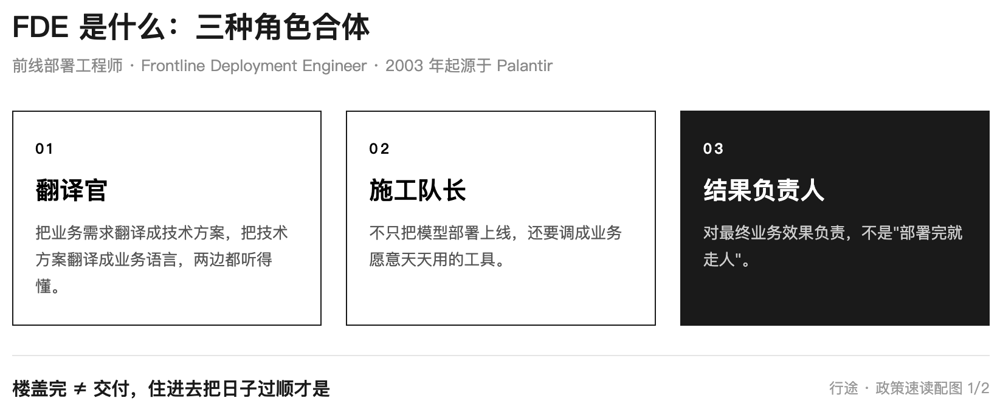
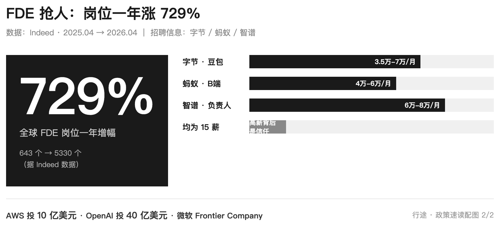

# 国家点名 FDE：AI 落地缺的不是模型，是现场的人

> 一句话摘要：2026年8月27日，工信部印发通知，点名鼓励培育"前线部署工程师（FDE）"团队。我从今年上半年开始关注这个岗位，做了 FDE 相关项目、面试了几位候选人。这篇把政策信号、一线实战和面试方法论合在一起讲清楚。

先说结论：8月27日，工信部发文，第一次在政策里点名培育 FDE 工程师。FDE 全称前线部署工程师（Frontline Deployment Engineer，硅谷也叫 Forward Deployed Engineer），说白了就是驻在企业业务现场、带着 AI 帮业务干活的人。国家想解决的是 AI 落地最难的一段路——模型再强，没人把它装进真实业务里，一切都停在演示。

我跟这个岗位的渊源比政策早。今年上半年梳理职业方向时就注意到了 FDE。当时主流岗位路径里还没有这个选项，但我判断这是未来趋势——能把架构、产品、项目、开发、商务串起来，在业务现场把 AI 真正落地的人。

没想到这个判断很快就有了政策层面的呼应。

目录：

1. FDE 是什么：AI 时代的翻译官加施工队长
2. 国家为什么点名：AI 竞赛从拼模型转向拼交付
3. 一线正在发生什么：三个案例加一组数字
4. 我在一线做 FDE：两个项目的真实经历加能力模型
5. 我面试了 4 个 FDE 候选人：这套考察维度分享给你
6. 跟你有什么关系：三个层面的机会
7. 冷静一下：FDE 不是万能钥匙

## 1. FDE 是什么：AI 时代的翻译官加施工队长

本章摘要：FDE 不是新岗位，2003 年就出现在硅谷，核心是驻场交付、对业务结果负责。

FDE 最早来自 Palantir。2003 年这家公司接了美国情报部门的订单，工程师接触不到机密数据，远程根本做不了，干脆把工程师派到客户办公室，跟情报分析师肩并肩工作。这套模式在政企、军工等高壁垒领域被证明极其有效。

后来 AI 公司继承了这个模式。OpenAI 成立 Deployment Company，投入超 40 亿美元；微软成立 Frontier Company，FDE 团队覆盖 50 多个国家。做的事情跟 Palantir 当年一样：把工程师派到客户现场，跟业务人员一起把 AI 用起来。

FDE 是三种角色的合体：

- 翻译官：把业务需求翻译成技术方案，把技术方案翻译成业务语言
- 施工队长：不只把模型部署上线，还要调成业务愿意天天用的工具
- 结果负责人：对最终业务效果负责，不是"部署完就走人"

以前做软件是"楼盖完就交钥匙"；FDE 是"楼盖完还要住进去，陪业主把日子过顺"。

这里要展开说一下。现在市面上很多 AI 落地项目，主要集中在四个方向：

第一，RAG（检索增强生成）。把企业私有文档（合同、手册、参数表、知识库）通过文档解析→文本分块→向量化嵌入→向量数据库存储的管道，构建企业专属知识库，让 AI 能"查资料再回答"。这是目前最成熟、落地最多的方向，但本质上是给 AI 配了个"更好的字典"。

第二，RPA（机器人流程自动化）。把 AI 能力和企业现有业务流程串起来，让重复性工作自动化——报价单自动核算、财务自动对账、报关单据自动处理。AI 分析完数据生成建议，自动推送到 ERP 生成工单，或推送到 OA 走审批流程。这是给企业配了个"更快的打字员"，但只适用于规则明确、重复度高的场景。

第三，AI 系统化改造。把 AI 能力嵌入企业现有业务系统（ERP、CRM、OA 等），做功能增强和流程优化。比如智能客服、智能风控、智能选品。这是给企业"换一套新办公软件"，但改造周期长、投入大，且往往停留在"功能叠加"层面，没有真正改变业务模式。

第四，Agent 开发。搭建智能体，让 AI 从被动检索升级成主动推理——能理解意图、规划任务、调用工具、执行操作。这是目前最热的方向，但 Gartner 也预警：超过 40% 的 Agentic AI 项目将在 2027 年底前因成本失控和 ROI 不明确而被取消。

这四个方向都很重要，但它们都是技术手段和工具。真正的问题是：谁来判断这个客户该用 RAG 还是 RPA？谁来把模糊的业务需求翻译成可落地的技术方案？谁来协调客户内部的资源、推动项目落地、对最终结果负责？

这就是 FDE 的价值。FDE 不是"会用 AI 工具的工程师"，而是"在客户现场把事办成的人"。RAG、RPA、AI 改造、Agent 都是 FDE 手里的工具，但工具本身不等于 FDE。

再说说我们关注的 AI 出海方向。2026 年 1-7 月，中国 AI 产业链商品出口达 5828 亿美元，同比增长 50.1%，占整体出口的 23.1%。但 IDC 指出，中国企业 AI 出海需要从"卖硬件"切换到"卖能力"——依托国内成熟的场景经验，将方案转化为软件与平台服务，重点卡位金融、零售及软件信息服务三大行业。

AI 出海的 FDE 跟国内还不一样。你面对的是海外客户，要跨文化沟通、理解不同市场的业务规则和合规要求、把中国成熟的 AI 应用经验适配到海外场景。这不是搭个 RAG 知识库就能解决的，需要真正扎根客户现场、理解业务、对结果负责。

Palantir 的做法值得参考。他们卖 AIP（人工智能平台）的方式叫 AIP Bootcamp——一个为期五天的沉浸式工作坊。客户提供自己的真实数据，Palantir 的 FDE 跟客户一块儿干，五天之内产出一个能跑的原型。更关键的是，Palantir 把"现场定制"这笔账记在"产品发现"上——工程师在客户现场踩的每一个坑，都是平台下一代产品的需求来源。FDE 不是外包，是咨询+实施+落地的综合体，对结果负责。

打个比方：RAG 是给你一本更好的字典，RPA 是给你一个更快的打字员，AI 系统化改造是给你换一套新办公软件，Agent 是给你配一个能自己干活的助手。但 FDE 是那个拿着这些工具，去客户现场把问题真正解决掉的人——而且在解决问题的过程中，还能把经验沉淀成可复用的产品能力。

个人观点：FDE 的核心不是技术有多强，是能把 AI 变成业务愿意用的东西。

## 2. 国家为什么点名：AI 竞赛从拼模型转向拼交付

本章摘要：工信部 8 月 27 日印发《关于开展人工智能应用服务商培育专项行动的通知》，首次专门围绕 AI 服务商发文，目标是 2026 年底 2000 家、2027 年底 3000 家服务商，FDE 被写进"支撑保障"章节。

文件的名字很长，你只需要记住三个点：

- 这是国家层面第一次专门为"AI 应用服务商"发文（据工信部办公厅文件）
- 目标：到 2026 年底，全国服务商资源池突破 2000 家；到 2027 年底不少于 3000 家
- 在"加强服务商支撑保障"一节里，白纸黑字写着：

> "鼓励服务商搭建前线部署工程师（FDE）团队，扎根用户现场，保障场景落地"（据工信厅科函〔2026〕414号）

为什么国家要管这件事？信号很清楚：AI 竞赛已经从"拼模型"转向"拼交付"。模型再聪明，没人落进业务场景，转型就永远停在演示。

文件还提到给服务商派发"算力券"、对接国家算力枢纽，降低算力成本。政策在想方设法让 AI 服务商活下来、把活干成。

顺带说一句，FDE 在现场遇到的第一道坎往往不是模型不够聪明，而是数据没法用——同一个客户三个系统三种叫法，指标口径各部门各说各话。数据治理没跟上，AI 应用就像沙上建塔。

个人观点：模型负责"能"，人负责"成"。

## 3. 一线正在发生什么：三个案例加一组数字

本章摘要：全球 FDE 岗位一年涨了 729%；蒙牛、中远海运、腾讯长安已经把人"驻扎"进业务一线；大厂 FDE 月薪 3.5 万到 8 万。

先看一组数字。全球招聘平台 Indeed 数据显示，FDE 岗位从 2025 年 4 月的 643 个涨到 2026 年 4 月的 5330 个，一年增长 729%（据 Indeed 数据，36氪报道引用）。

再看三个国内例子：

蒙牛从 28 个事业部选了 200 名"AI 先行官"，大部分不是 IT 部门的，而是销售、研发、供应链的业务人员——公司有意降低 IT 人员比例，因为业务的人"自带场景"（据 36氪报道）。

中远海运特运从 2026 年 3 月开始搞 FDE 模式，选派 18 名数字化专业人员常驻业务一线，参加业务例会、走访岗位，让技术和业务坐在一起（据公开报道）。

腾讯和长安汽车组了 34 人的联合 FDE 团队：长安选拔 24 位业务骨干脱产两个月，腾讯派 10 位专家驻场，围绕 7 大核心业务场景落地 AI 智能体（据公开报道）。

这些案例背后有一个共同点：AI 落地最难的从来不是模型，是"现场"。业务的人最懂自己的活，但要有人陪着他们把 AI 用起来。

个人观点：业务的人自带场景，场景才是 AI 落地的土壤。

## 4. 我在一线做 FDE：两个项目的真实经历加能力模型

本章摘要：前段时间，我参与了一个海外企业的应用改造试点项目，团队架构里专门设了"顾问组"，有人在项目群里提议"再加上一个 FDE 顾问"。另一个项目里，我作为 FDE 主导了一个某快消巨头的企业级应用改造，小团队加 AI 在一个多月里交付了十多万行代码。这两个项目让我对 FDE 的能力模型有了具体认知。

前段时间，我参与了一个海外企业的应用改造试点项目。这是售前加交付的混合场景——既要跟客户谈需求、做方案，又要实际动手把系统改出来。项目群里对齐团队架构时，有人发了一条消息："个人建议再加上一个 FDE 顾问。"

这是我第一次在真实项目里看到 FDE 被当作独立角色提出来。最后团队架构分成三层：

- 顾问组：负责方向把控和客户高层对接
- 实施组：我作为技术经理，带着研发团队做实际交付
- 商务：负责合同和客户关系

这个项目让我对 FDE 有了三个切身感受：

第一，客户现场的沟通能力是硬门槛。FDE 要跟客户面对面沟通需求、讲解方案、处理冲突。技术再好，沟通不过关，连需求都听不明白，更别说翻译了。

第二，Java 后端是主技术栈。客户系统是 Java 技术栈（Spring Boot + MyBatis + MySQL），要在现有系统上做改造，不是从零搭建。Node.js、Python 再熟练，到了客户现场也得补课。

第三，全生命周期交付意识比技术深度更重要。FDE 不是"拿需求写代码"，要从需求沟通、PRD 编写、方案设计、开发测试、部署上线到运维优化，从头到尾负责。客户现场的需求是模糊的、会变的，能把模糊需求变成可交付方案，比写一段漂亮代码值钱得多。

FDE 不是"什么都懂一点的万金油"，而是"在客户现场能把事办成的人"。技术是基础，但真正决定成败的是沟通能力、交付意识和对结果负责的态度。

如果说这个项目让我理解了 FDE 的"现场"，那另一个项目让我理解了 FDE 的"产能"。

前段时间，我作为 FDE 主导了一个某快消巨头的企业级应用改造项目。小团队加 AI 编程助手，一个多月里从 0 到完整交付了十多万行代码和大量文档，团队远程协作完成。

FDE 不是"会用 AI 的全栈工程师"，而是"项目管理 + 全栈架构 + 基础设施排障 + 团队协调 + 高情商客户沟通的综合体，把 AI 当效率倍增器"。

具体来说，FDE 需要 8 个维度的能力：

1. 项目管理：PMP 方法论，里程碑驱动，范围、进度、风险管控
2. 全栈架构：Spring Boot 加 React，能独立做前后端技术决策
3. 基础设施：VPN、CI/CD、WAF、APIM、K8s，独立排障
4. AI 编排：Prompt 工程、规则体系设计、工作流 SOP、Agent 编排
5. 领域建模：快速理解陌生业务域，建模为技术方案
6. 团队协调：分布式团队管理，任务分配，反馈跟进
7. 沟通管理：冲突消除、信息同步、需求翻译、高情商发言
8. 文档能力：PRD、设计、Spec、SOP 全类型覆盖，中英双语

说一个沟通管理的真实案例。项目中期，甲方一位技术负责人提出新需求，希望尽快看到 QA 版本。前端同事回应"现实情况是，这么还没开发，至少前端是"——需求期望与现实出现 gap，对话有摩擦风险。

我介入，三段话化解：

第一段，信息同步："信息有些 gap，我来同步分享一下。目前几个业务系统是两条线并行推进，工作节奏不完全一致，但信息和需求同步不应该断。"

第二段，技术翻译："某老师提到的新需求我看了下，本质上就是加个字段的事情。"把需求文档翻译为技术实现描述，让所有人都理解工作量。

第三段，高情商收尾："没问题的，也感谢某老师同步分享信息。"即使需求暂时做不了，也不让对方觉得被拒绝。

最后甲方 PO 决策"先记录到 backlog"，我跟进"好嘞"——接受裁决、不争论，随后主动推进正事。

这个案例里，AI 帮不上任何忙。AI 不理解人际关系张力，不知道谁手里有什么信息，不会维护关系，不会察言观色把握时机。这些是 FDE 的核心竞争力，也是 AI 暂时替代不了的部分。

个人观点：在客户现场，能把模糊需求变成可交付方案，比写一段漂亮代码值钱得多。

## 5. 面试了几位 FDE 候选人后，我总结出这套考察维度

本章摘要：前段时间，我作为技术面试官，面试了几位全栈交付工程师（FDE 方向）候选人。多轮面试后，我把考察维度从"AI 工程化优先"调整为"客户现场沟通+Java 双硬门槛"。这套方法论可能对你招人或自查都有用。

一开始我定的考察维度是"AI 工程化优先"，觉得既然是 AI 时代的 FDE，AI 实践经验应该是核心。但面了几位之后发现完全错了——市场上能同时满足"Java 后端深度 + 客户现场沟通能力 + 驻场意愿"的人已经稀缺，AI 工程化反而是可以培养的加分项。

最后我把考察维度调整为"3 硬门槛 + 4 核心 + 2 加分"：

**三个硬门槛（不通过直接淘汰）：**

1. 客户现场沟通能力。验证方法：模拟需求沟通场景，看能不能把技术方案讲清楚、把客户需求听明白。这是 FDE 的生存门槛，不过关连需求都拿不到。
2. Java 后端主栈（Spring Boot/MyBatis/MySQL）。验证方法：简历筛选即判定。客户系统大多是 Java 技术栈，主栈不对，补课周期不可控。
3. 能到客户现场（接受出差/驻场）。验证方法：直接确认。FDE 的核心就是"在现场"，不能驻场就不是 FDE。

**四个核心考察维度：**

1. 商务沟通能力。不只是能说话，还要能把技术语言翻译成业务语言。面对不懂技术的业务方，能不能把方案讲清楚，是关键。
2. 外部客户对接经验。有没有直接对接过外部客户？遇到过需求不清晰、客户反复变更的情况吗？怎么处理的？
3. Java 后端技术深度。Spring Boot 自动配置原理、设计模式实际应用、慢 SQL 排查、Redis 三穿、消息队列可靠性——这些是基本功，不过关做不了交付。
4. 全生命周期交付意识。从接到需求到代码上线经过哪些步骤？有没有自己写过 PRD 或技术方案？有没有从 0 到 1 主导过项目？能说清自己在项目中的边界。

**两个加分项：**

1. AI 工程化实践。日常用哪些 AI 工具？除了写代码，有没有用它做 review、测试、文档？这是加分不是核心，因为可以培养。
2. 前端能力。能写 React/Vue 是加分，不会不影响录用。FDE 项目后端工作量通常大于前端。

面试了几位之后，我的结论是：FDE 的人才画像其实很清晰——客户现场能沟通、Java 能交付、对结果负责。AI 工程化是锦上添花，不是雪中送炭。

如果你正在考虑转 FDE，用这套维度自查一下：硬门槛过了吗？核心能力够了吗？加分项有多少？答案会告诉你离 FDE 还有多远。

个人观点：FDE 的人才画像很清晰——客户现场能沟通、Java 能交付、对结果负责。

## 6. 跟你有什么关系：三个层面的机会

本章摘要：对普通人，机会在"业务 + AI"的复合能力；对企业，落地要靠扎根现场的人；对技术人，懂业务比追新模型更保值。

第一层，职业机会。FDE 不是只有程序员能干。行业里真正稀缺的，是懂行业运作规则的人——客户怎么买单、有哪些隐性规则，这些靠长期实践积累，不是靠工具能拿到的。如果你懂一个行业，又愿意把 AI 用进自己的业务，你比大多数只会写代码的人更接近 FDE。

我自己就是例子。我的优势不是算法多强，而是懂业务、能沟通、对结果负责。这些能力在 FDE 时代反而更值钱。

第二层，企业机会。AI 落地不是买个大模型就完事。政策点名 FDE，等于告诉你：先想清楚谁在现场把 AI 用起来，再谈 AI 转型。

第三层，技术人机会。说句冷静的话：模型、工具半年一换，追是追不完的。但"懂业务 + 对结果负责 + 跟 AI 协作"这三件事，十年后依然值钱。技术细节终会过时，工程思想历久弥新。

个人观点：AI 时代最稀缺的，不是会写代码的人，是既懂业务又懂 AI 的人。

## 7. 冷静一下：FDE 不是万能钥匙

本章摘要：FDE 模式还在早期：人才体系没建起来，已验证的行业有限，高薪岗位集中在大厂。普通人别被年薪百万带节奏。

说几个不中听的实话：

- 高薪数字是大厂特定岗位的价，不代表全行业。大部分企业连 FDE 是什么都还没搞明白
- FDE 模式目前只在容错率高的领域验证有效，医疗、金融这种"错不起"的行业，落地要慢得多
- 懂行业抽象的人才培养体系还没建起来，政策红利兑现需要时间
- 我面试的几位候选人，在新标准下都有短板——要么缺 Java，要么客户现场沟通没验证，要么深度不足。市场上真正符合 FDE 画像的人非常稀缺

那普通人现在能做什么？三件小事：

1. 把 AI 用进你自己的业务里，先当自己业务的"现场的人"
2. 攒行业理解：你所在行业的规则、流程、痛点，就是最值钱的私有经验
3. 对结果负责：AI 时代的岗位会变，但"能把事办成"的人永远有饭吃

政策的信号是方向，不是快钱。方向对了，慢就是快。

## 核心结论（5条）

1. FDE 是什么：前线部署工程师（Frontline/Forward Deployment Engineer），驻在企业现场、把 AI 翻译成业务价值的复合型人才，2003 年起源于 Palantir
2. 政策信号：2026-08-27 工信部 414 号文首次点名培育 FDE 团队，目标 2026 年底 2000 家、2027 年底 3000 家 AI 服务商
3. 市场数据：全球 FDE 岗位一年增长 729%（643→5330 个），字节/蚂蚁/智谱 FDE 月薪 3.5 万到 8 万
4. 实战经验：FDE 的三个硬门槛是客户现场沟通能力、Java 后端主栈、能到客户现场；核心能力是沟通、交付、对结果负责；AI 工程化是加分项
5. 机会：普通人的机会在"业务 + AI"复合能力，不在追新模型

---

延伸阅读

- [普通人也能看懂：AI Agent 到底是什么？三年，从会说话到会干活](https://mp.weixin.qq.com/s/n3K94FUTH20YnWJ8Ugqcvw) — 先搞懂 Agent 是什么，再理解 FDE 在忙什么
- [Vibe Coder、FDE、Harness Engineer……AI 时代的 5 种工程师，你是哪种？](https://mp.weixin.qq.com/s/b5nsNKoY1gNvJqpwMYcVLA) — FDE 在工程师谱系里的位置，一篇看懂

**看懂 FDE 合集**

- 第1篇：本篇（国家点名 FDE：AI 落地缺的不是模型，是现场的人）
- 第2篇：待发布（FDE 能力模型：8 个维度拆解，从技术到沟通的完整画像）
- 第3篇：待发布（FDE 视角：AI 落地卡在最后一公里的四个阻力）
- 第4篇：待发布（FDE 实战：小团队加 AI，一个多月交付十多万行代码的方法论）

系列预告

下一篇：FDE 能力模型详解——8 个维度拆解，从技术到沟通的完整画像

搜一搜关键词

FDE是什么 / FDE工程师 / 工信部AI服务商 / 前线部署工程师 / AI落地 / AI工程师年薪 / AI先行官 / FDE面试 / FDE能力模型

---

# 关于行途

一线 builder，仍在写代码。专注 AI 工具链与工程化落地，分享可抄作业的实战经验。热点只当切口，不做资讯搬运，落点永远是可抄的作业；只讲那些「工具会变，但思想不变」的东西。如果你也在关注 AI 落地、FDE，或者技术人的成长，欢迎关注。

既然看到这里了，说明这篇对你多少有点用。
顺手点个赞、点个在看，就是对我最大的支持。
觉得值得转给朋友，也别客气。
想第一时间收到推送，给「行途技术手记」加个星标。
谢谢你看我的文章，下篇见。

延伸阅读

[Vibe Coder、FDE、Harness Engineer……AI 时代的 5 种工程师，你是哪种？](https://mp.weixin.qq.com/s/b5nsNKoY1gNvJqpwMYcVLA) —— FDE 在工程师谱系里的位置，一篇看懂
[普通人也能看懂：AI Agent 到底是什么？三年，从会说话到会干活](https://mp.weixin.qq.com/s/n3K94FUTH20YnWJ8Ugqcvw) —— 先搞懂 Agent 是什么，再理解 FDE 在忙什么

行途技术手记 · AI 时代的工程师成长与效率提升
排版引擎：墨排 · md2wechat（行途自研）
© 2026 行途 · 欢迎转载，注明出处 · 禁止未经授权用于 AI 训练

搜一搜关键词直达：FDE是什么 / FDE工程师 / 工信部AI服务商 / 前线部署工程师 / AI落地 / AI工程师年薪 / AI先行官 / FDE面试 / FDE能力模型

---

数据来源与核验时间（2026-09-10 08:15 发布）

- 工信部《关于开展人工智能应用服务商培育专项行动的通知》（工信厅科函〔2026〕414号）：工业和信息化部官网，2026-08-27
- 全球 FDE 岗位增长数据（643→5330 个，一年增长 729%）：Indeed 公开数据，经 36氪报道引用，2026
- 蒙牛 / 中远海运 / 腾讯长安 FDE 实践案例：公开媒体报道，2026
- 字节 / 蚂蚁 / 智谱 FDE 月薪 3.5 万到 8 万：公开招聘信息整理，2026
- 个人 FDE 实战项目（某快消巨头企业级应用改造，小团队 + AI 一个多月交付十多万行代码）：本人项目经历，2026
