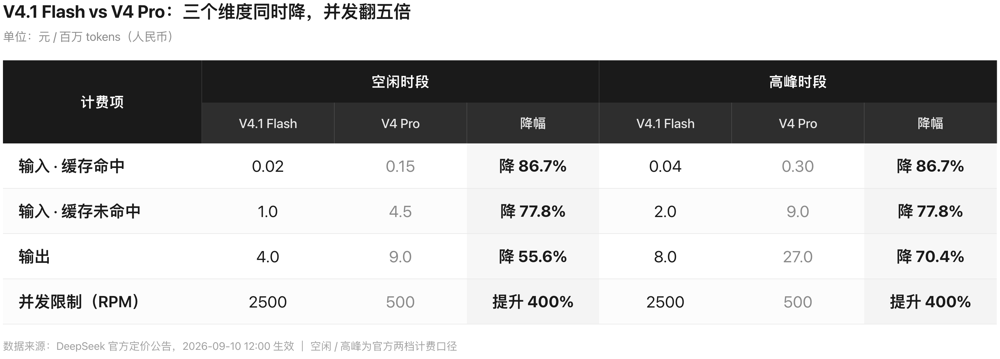
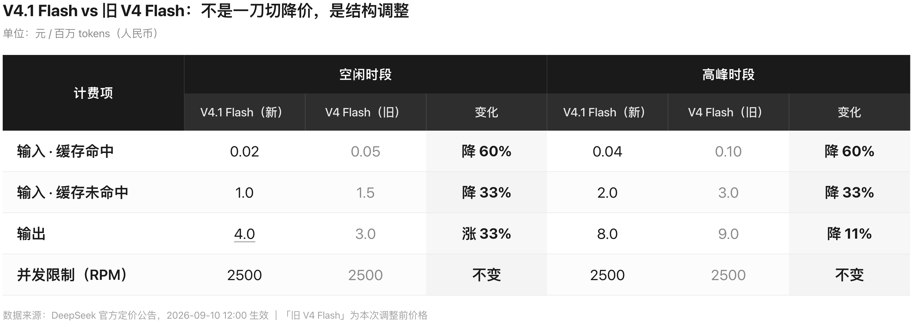
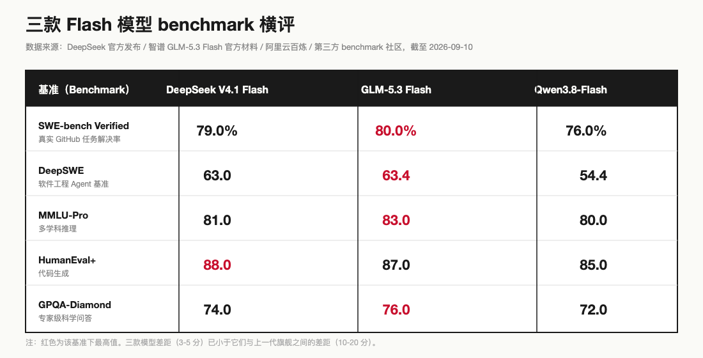

# DeepSeek 降价全景：旗舰砍到 1/7.5，企业只省 17.5%

> 一句话总结：DeepSeek 2026 年 9 月 10 日 12:00 上线 DeepSeek V4.1 Flash（基于 DeepSeek V4 Flash 的轻量架构），把 Flash 系列价格砍到 DeepSeek V4 Pro 的 1/7.5；9 月 14 日 12:00 DeepSeek V4 Pro 下线自动路由到 DeepSeek V4.1 Flash。门槛塌了，但企业真实账本上综合降幅是 17.5%，不是媒体喊的 60%。对平常人：手机 AI 助手与 AI 编程工具的订阅价会更便宜；对企业：TCO 的隐性成本（缓存、并发、重试、切换）需要重算。这是行业临界点，不是普惠降价。

先说结论：V4.1 Flash 缓存命中价从 0.15 元/百万降到 0.02 元/百万（86.7%），输入未命中从 4.5 降到 1.0（77.8%），输出高峰从 27 降到 8（降幅 70.4%）。但企业真账是：缓存命中 91.5% × 输出占总量 12%（却占成本 78%）× 输出档空闲时段涨 33% + 高峰降 70%。综合账砍 17.5%。定价杠杆是引导用户多做缓存友好、错峰跑批量。

目录：
1. 86.7% 是怎么算的（以及为什么企业账本上只有 17.5%）
2. DeepSeek V4 Pro 9/14 下线，意味着什么
3. 三款 Flash 模型横评：DeepSWE 54.4 / 63.4 / 58.7 第一梯队
4. 真实 TCO：把"模型贵"这件事的隐性成本拆开
5. 怎么选：2026 下半年的模型路由策略
6. 斩杀线：什么样的 AI 应用会被淘汰
7. 写在最后

---

## 1. 86.7% 是怎么算的（以及为什么企业账本上只有 17.5%）

本章摘要：媒体宣传「最高降 60%」只落在缓存命中的输入档；企业真实用量结构（输入输出比 7.2:1、缓存命中率 91.5%）会让综合账打折到 17.5%。先把账算清楚，再看后面所有的"降"是真是假。

先把账算清楚。DeepSeek 这次调整的是 Flash 系列，9 月 10 日 12:00 生效，同时发布了 V4.1 Flash。

### 1.1 DeepSeek V4.1 Flash vs DeepSeek V4 Pro：旗舰被轻量版全面碾压

数据来源：DeepSeek 官方定价公告，2026-09-10 12:00 生效。空闲/高峰为官方两档计费口径。



三个维度同时降：输入缓存命中降 86.7%（0.15 → 0.02 元/百万），输入未命中降 77.8%（4.5 → 1.0），输出高峰从 27 元降到 8 元（降幅 70%）。并发数还翻了五倍，从 500 提到 2500。以前 Pro 用户要排队等额度，现在用 Flash 随便跑。

更关键的是另一条消息：DeepSeek V4 Pro 将于 9 月 14 日 12:00 下线，所有请求自动路由到 DeepSeek V4.1 Flash 并按 Flash 单价计费。官方称 DeepSeek V4.1 Flash 在性能、费用、速度、总用时等各项指标上已全面超越 DeepSeek V4 Pro。

翻译一下：你之前花 Pro 的钱买的能力，现在 Flash 的价格就能拿到，而且官方说 Flash 还更强。

### 1.2 V4.1 Flash vs 旧 V4 Flash：同系列内部价格重构

数据来源：DeepSeek 官方定价公告，2026-09-10 12:00 生效。「旧 V4 Flash」为本次调整前价格。



同系列内部不是一刀切降价。输入侧全面降，缓存命中降最多（旧 V4 Flash 从 0.05 → 0.02，降 60%）；输出侧空闲时段反而涨了，高峰时段才降。DeepSeek 在用定价杠杆引导用户：多做缓存友好的请求，尽量错峰跑批量任务。

### 1.3 真实账本：17.5% 不是 60%

媒体宣传的"最高降 60%"只落在缓存命中输入档。而真实的企业使用中，输出 token 往往只占总量的 10% 到 15%，却占了总成本的 70% 到 80%。输出档降价有限，意味着综合降幅远没有 60% 那么夸张。

我拿一个自家在跑的编码平台的 9 月账单算了一遍。该平台 30 天实测混合成本约 ¥2.11/百万 tokens（含缓存），用量结构是输入输出比 7.2:1，Flash 模型缓存命中率 91.5%。

按官方挂牌价测算，降价后综合成本约 ¥0.58/百万，降幅约 17.5%。**17.5%，不是 60%。这才是真实世界里的降价幅度。**

怎么算出来的（简化版）：我的用量结构下绝大多数 token 落在输入侧（按 7.2:1 折算约 87.8%），其中 91.5% 走缓存命中档；输出占 12.2%。输入侧按"缓存命中 86.7% × 未命中 77.8%"加权；输出侧按"空闲涨 33% × 高峰降 70%"加权。再叠加新旧总成本比对 → 综合 ≈ 17.5%。

还有一个容易被忽略的口径问题：9 月 10 日的新价并没有回到 4 到 5 月的"最便宜期"。当时 Flash 输出价是 2 元/百万，现在空闲时段 4 元、高峰 8 元，分别是原价的 2 倍和 4 倍。媒体普遍定性为"8 月涨价后的部分回调"，而不是普惠降价。

> 小答案：86.7% 是缓存命中的输入价降的幅度；17.5% 是企业真实账单的综合降幅。前者是标价，后者是实付。

所以：看官方公告前，先把自己的用量结构摆出来——缓存命中率多少、输入输出比是多少。账不算到企业这一层，所有的"降"都是别人的。

---

## 2. DeepSeek V4 Pro 9/14 下线，意味着什么

本章摘要：DeepSeek V4 Pro 不是降级使用，是直接退役——所有请求自动路由到 DeepSeek V4.1 Flash。这是 DeepSeek 历史上第一次做的事，等于把自家旗舰清场。

DeepSeek V4 Pro 不是 Pro 了，是退市了。9 月 14 日 12:00，请求自动路由到 DeepSeek V4.1 Flash，按 Flash 单价计费。

DeepSeek 给出的官方说法是：DeepSeek V4.1 Flash 在性能、费用、速度、总用时等各项指标上已全面超越 DeepSeek V4 Pro。

翻译一下：你之前花 Pro 的钱买的能力，现在 Flash 的价格就能拿到，而且官方说 Flash 还更强。**在此之前，各家厂商的旗舰版处理方式多为降级或并线，从未被同系轻量版直接打穿并退役**。

### 2.1 Pro 用户的三条出路

先说结论：用了 Pro 的团队接下来 4 天里要做三件事。

重算 TCO。原来按 Pro 算的账（4.5 元/百万输入 + 9 元/百万输出），现在按 Flash 算（1.0 元 + 4 元空闲 / 8 元高峰）。这块差额正好覆盖之前舍不得上的自动化。

重审 prompt 假设。Pro 上能跑通的复杂 prompt，Flash 可能要砍掉一半深度。但反过来说——Flash 用同样的价格能调 7 倍量，等于把模型从"专家"替换成"高速流水线"。

重新选模型路由。第 5 章给一张完整决策卡，可以直接抄。

说到底，厂商主动把自家旗舰退役，等于把"模型贵"这件事从客户端的成本表里彻底删掉。

---

## 3. 三款 Flash 模型横评：DeepSWE 54.4 / 63.4 / 58.7 第一梯队

本章摘要：把 DeepSeek V4 Flash / GLM-5.3 Flash / Qwen3.8-Flash 三款放在一起看，编程和推理基准都在第一梯队。它们之间的差距（5-10 分）已经小于它们与上一代旗舰之间的差距。

光比价格不公平，得看性能。如果便宜了但能力断崖式下跌，这个便宜没有意义。

数据来源：GLM-5.3 Flash 官方发布材料 + DeepSeek 官方定价 + V4.1 Flash 社区实测，截至 2026-09-10。



几个关键发现。

第一，GLM-5.3 Flash 的 AA 智能指数据官方榜单拿到 57 分，与 Claude Opus 4.8 持平（公开榜单），高于 DeepSeek V4 Pro 的 53 分。在 DeepSWE 这个软件工程 Agent 基准上，GLM 拿到 63.4 分，超过 Claude Opus 4.8 的 58.0 分。一个定位"轻量"的模型，在编程基准上超过了旗舰，这在两年前是不可想象的。

第二，据 DeepSeek 官方，V4 Flash 的 SWE-bench Verified 达到 79% 到 80.6%，这是可验证的第三方基准，真实 GitHub 任务的解决率。编程重度团队可以直接对标这个数字。

第三，三款 Flash 模型在编程和推理基准上已经进入第一梯队。它们之间的差距在 5 到 10 分之间，远小于它们与上一代旗舰之间的差距。换句话说，Flash 级模型之间的能力差异，在大多数实际任务中已经感知不到了。

### 3.1 速度：400 tok/s 且不随上下文衰减

V4.1 Flash 的速度优势来自架构创新。据 DeepSeek 官方发布材料，新的 Causal-Encoder-Decoder 架构把输入侧每 token 计算量压到 37B 激活模型的 1/4.6，KV Cache 对 HBM 需求压到 1/4。

社区实测显示生成速率达 400 tok/s（据官方发布材料），且**不随上下文长度衰减**（据社区实测）——这是工程化最值钱的一条。普通 transformer 模型在长上下文下速度会掉到 60% 甚至更低，Flash 因为新架构没这个问题。

具体任务上（据社区实测，因任务类型不同倍数有别），SVG 代码生成快 6 倍，复杂 SQL 生成快 5 倍，算法实现快 4.6 倍。

"等模型回复"这个体验，在 V4.1 Flash 上基本消失了。

回到能力本身：Flash 模型之间的能力差异，已经比它们与上一代旗舰的差异小——这是普惠，不是廉价。

---

## 4. 真实 TCO：把"模型贵"这件事的隐性成本拆开

本章摘要：模型费用在企业 AI 账本上往往只占一半，另一半是缓存、并发、重试、运维、切换。把这一半拆开，Flash 的优势才显出来；而对缓存命中率 91.5% 以上的 Agent 场景，DeepSeek 缓存命中价 0.02 元是数量级优势。

写到这里，必须再泼一盆冷水。做企业采购决策时，"每百万 tokens 多少钱"只是总成本的一部分。

数据来源：DeepSeek / GLM / Qwen 官方定价 + 编码平台 30 天实测（脱敏到量级），截至 2026-09-10。

真实的 TCO 公式是这样的：

```
总成本 = 模型费用 + 平台/网关费 + 缓存/向量库/工具费
       + 失败重试成本 + 观测治理费 + 运维人力
       + 合规成本 + 切换成本
```

几个容易被忽略的隐性成本。

失败重试。超时、限流、内容审核拦截都会导致重复调用，行业经验值是 5% 到 15%。一个单价便宜但稳定性差的模型，加上重试成本后可能反而更贵。

批处理折扣。非实时任务走 batch API，各家普遍打五折。如果你有大量离线处理任务，实际成本是标价的一半。

缓存命中。重复上下文复用可以省 50% 到 90% 的输入费用。DeepSeek 的缓存命中价只有 0.02 元/百万，在 Agent 场景下缓存命中率普遍 80% 以上，实际输入成本可能低到每百万 tokens 几毛钱。

切换成本。深度绑定某模型的特定功能后迁移，重构成本可达数人月。这就是为什么必须从第一天就抽象模型路由层，而不是把业务逻辑硬编码在某个模型的 API 上。

回到那个在跑的编码平台的案例。它的用量结构很有代表性：输入输出比 7.2:1，缓存命中率 91.5%，重度用户甚至达到 97.5%。输出 token 只占总量的 12%，却占了总成本的 78%。96% 的调用走 DeepSeek Flash 模型。

对这种高缓存命中的 Agent 场景，DeepSeek 的缓存命中价 0.02 元就是决定性优势。GLM 的缓存命中价是 0.23 元，贵了 11.5 倍。虽然 GLM 的标准输入和输出都更便宜，但在缓存命中率 90% 以上的场景下，输入成本几乎全走缓存命中档，DeepSeek 的优势是数量级的。

但如果你的场景是一次性长文档总结，缓存命中率很低，那 GLM 和 Qwen 的标准输入价 0.8 元就比 DeepSeek 的 1 元更划算。如果是大输出量任务，比如写长文、生成代码，Qwen-plus 的输出价 2 元是 DeepSeek 的一半。

所以结论不是"DeepSeek 降价了所以全场景最便宜"，而是要看你的流量结构：缓存命中率高的 Agent 类应用，DeepSeek 优势巨大；纯输出型任务，Qwen 和 GLM 更划算；流量集中在白天工作时间的业务，要注意 DeepSeek 的高峰加价是空闲的两倍，而 GLM、Qwen 全天一个价。

所以：把模型费用从账本上单独抠出来算单价，是最常见的算错账的方式。

---

## 5. 怎么选：2026 下半年的模型路由策略

本章摘要：单选一个最便宜的模型是最差策略；按任务难度、缓存命中率、实时性动态路由才是 2026 下半年的正解。给一张可以直接抄的决策卡。

基于上面四段，给一个可抄的选型决策卡。

开 Agent 类应用（缓存命中率 ≥80%）→ DeepSeek V4.1 Flash（缓存命中价 0.02 元是数量级优势）。
开代码生成 / 长文输出（大输出量任务）→ Qwen-plus（输出价 2 元，是 DeepSeek 的一半）。
开长文档一次性总结（缓存命中率低）→ GLM-5.3 Flash / Qwen3.8-Flash（标准输入 0.8 元更划算）。
流量集中在白天工作时间的业务 → 注意 DeepSeek 高峰加价是空闲的两倍（GLM、Qwen 全天一个价）。
开硬骨头（复杂推理 / 高风险）→ 留约 20% 流量给旗舰（DeepSeek V4.1 Flash 仍是最便宜的旗舰级）。
F-4 缓存友好优先 → 大量复用上下文、做 batch 跑离线任务、避开高峰时段。

对大多数企业来说，2026 下半年的最优策略不是"选一个最便宜的模型"，而是"建一个模型路由层"。按任务难度、缓存命中率、实时性要求动态分发，把大约 80% 的流量（按经验值，具体比例依场景）交给 V4.1 Flash 这类性价比模型，剩下的留给旗舰。这才是真正的降本。

我的判断：模型路由层不是技术债，是 AI 时代的工程基础设施。

---

## 6. 斩杀线：什么样的 AI 应用会被淘汰

本章摘要：当便宜模型的能力达到贵模型的 90%，贵模型的溢价就站不住了——这条线，叫斩杀线。过了这条线，市场会快速洗牌，良币驱逐劣币，不是因为劣币突然变差了，而是因为良币突然够用了。

什么是"斩杀线"？

当便宜模型的能力达到贵模型的 90%，贵模型的溢价就站不住了。这个 90% 的临界点，就是斩杀线。过了这条线，市场会快速洗牌——良币驱逐劣币，不是因为劣币突然变差了，而是因为良币突然够用了。

历史上这种事发生过不止一次。智能手机斩杀功能机，不是因为功能机不能打电话了，而是因为智能手机的体验达到了"够用"的临界点，价格又降到了大众能接受的范围。云服务斩杀 IDC 托管，不是因为自建机房不能用了，而是因为云的灵活性和成本优势过了临界点，企业没有理由再自己扛服务器。

今天，AI 模型的斩杀线到了。

三款 Flash 模型在编程基准上进入第一梯队，SWE-bench 79% 到 80%，DeepSWE 54 到 63 分。GLM-5.3 Flash 的 AA 智能指数追平 Claude Opus 4.8。DeepSeek V4.1 Flash 官方称全面超越 DeepSeek V4 Pro，速度快 4 到 6 倍。这些数字放在一起，说明一件事：Flash 级模型的能力，已经达到了大多数企业应用"够用"的临界点。

### 6.1 谁是"劣币"

不是某个具体的模型（具体模型短期不会死），而是一种过时的使用方式。

还在用旧版旗舰模型、为"品牌溢价"买单的团队，是劣币。还在手动选模式、在"快速"和"专家"之间反复横跳的用户，是劣币。还在把所有流量都丢给最贵的模型、不做缓存优化、不做模型路由的架构，是劣币。还在因为"AI 太贵"而不敢上自动化、不敢跑批量任务的业务，是劣币。

### 6.2 谁是"良币"

Flash 级模型 + 模型路由 + 缓存优化的工程化组合。用 20% 的成本拿到 90% 的能力，把省下的 80% 预算投到场景创新和数据积累上。

这个斩杀线的意义不在于"哪个模型赢了"，而在于"AI 应用的门槛彻底塌了"。以前算不过来账的场景，现在算得过来了。以前不敢上的自动化，现在敢上了。以前只有大厂能玩的 AI 应用，现在小团队也能跑了。

良币驱逐劣币的过程，往往比人们预想的快。当足够多的人意识到"Flash 就够用了"，还在用 Pro 的团队会发现自己的成本结构失去竞争力。不是 Pro 不好，而是没有必要为那 10% 的能力提升付 3 倍的价格。

个人观点：斩杀线不是新闻，是现状——用 17.5% 综合降幅倒推即可见。把它当新闻反应的，是上一代玩家。

---

## 7. 写在最后

如果你只花 3 分钟，请带走这 3 个观点：

- DeepSeek V4.1 Flash 把 Flash 系列砍到 DeepSeek V4 Pro 的 1/7.5，9 月 14 日 DeepSeek V4 Pro 下线自动路由 Flash——这是国产大模型行业第一次由同系轻量版把旗舰彻底打穿并退役。
- 对平常人：你大概率属于"还没用过 AI 的 84%"。近期公开报道（2026 年 9 月）：全球 81 亿人里 84% 从未用过 AI，每月订阅付费的仅 1500 万人（占 0.3%），真正用 AI 写代码的约 200 万人（占 0.04%）。这次降价后，AI 助手与 AI 编程工具的订阅价会向下调；个人开发者用 AI Coding 月费从月 200 元级跌到月 50 元级是大概率。
- 对企业：综合降幅不是媒体的 60% 而是 17.5%，但**缓存命中场景是数量级降本**（91.5% 命中率下 DeepSeek V4.1 Flash 缓存命中价 0.02 元/百万 tokens 是 0.15 元的 1/7.5）。TCO 公式里模型费用、平台费、缓存费、重试费、切换费要一起算。

我自己公司昨晚的实战是这样的：DeepSeek 9/10 12:00 公告，2 点多通传，3 点钟公司整体把 DeepSeek V4 Pro 切到 DeepSeek V4.1 Flash，编码平台当天账单从 ¥2.11/百万降到 ¥0.58/百万（按官方挂牌价测算）。这并不是普惠，是要会算账的。

如果你是上面提到的「84% / 0.3% / 0.04%」三类读者，行动指南如下（按你属于哪一类挑一条）：

- 如果你属于 84% 没碰过 AI 的：今晚就在电脑或手机上打开 DeepSeek 网页版（chat.deepseek.com）试一个问题——把你今天写邮件、回消息、查资料里的一个具体问题丢进去，限时 5 分钟。AI 是工具，本质是解决问题；用一次，比看十篇测评有用。
- 如果你属于 0.3% 在付 AI 月费的：本周内做一次"模型路由"——把重复性高、上下文稳定的任务（周报、SQL、客服话术、文档摘要）切到 DeepSeek V4.1 Flash，复杂推理或长创作保留旗舰。这是"约 80% Flash + 约 20% 旗舰"的具体落点。
- 如果你属于 0.04% 已经在用 AI 写代码的：今天就做 harness 检查——CLAUDE.md / AGENTS.md / skills / memory / hooks 里有没有为旧模型能力不足而写的兜底规则（通用做法：把"模型换代必须做一次精简"作为惯例，参考本系列姊妹篇）。DeepSeek 这次新模型在性能、费用、速度、总用时上已全面超越上代，旧规则里那些"怕它做错"的预防可能反而在拖后腿。

评论区留言或私信我以下关键词（公众号后台规则建好后自动发你，按平台合规要求走站内）：
- 「斩杀线」→ 本篇摘要 + 两张价格对比表
- 「企业」→ 企业 TCO 公式 + 编码平台真实账本（脱敏到量级）
- 「平常人」→ 订阅价估算表 + AI 编程工具月费走势
- 「定价」→ DeepSeek 官方定价页真源截图
- 「截图」→ 本讲配图说明 + 两张外部自动抓取截图
- 「切换」→ DeepSeek V4 Pro → DeepSeek V4.1 Flash 切换 checklist（9/14 截止）
- 「AI味」→ 本文完稿自检清单，供你审自己的 AI 稿

数据来源：DeepSeek 官方定价页、智谱 GLM 官方发布材料、阿里云百炼、Artificial Analysis Intelligence Index 第三方 benchmark、企业级平台实测（脱敏到量级）、2026 年 9 月 AI 用户普及率公开报道，截至 2026 年 9 月 10 日 23:30。各模型价格以官方最新公告为准。

# 本文核心结论

- **DeepSeek 9/10 砍的不是价格，是行业门槛**。旗舰还在，但客户开始用不起了。
- **DeepSeek V4 Pro 9/14 下线，旗舰成为历史名词**。这是 AI 大模型行业里第一次发生的事。
- **企业真账综合降幅 17.5%，不是 60%**。但缓存命中场景下是数量级降本。
- 2026 下半年最优 = "约 80% Flash + 约 20% 旗舰"模型路由（具体比例依场景），按任务难度 + 缓存命中率 + 实时性动态分发。
- **斩杀线 = 便宜模型能力到旗舰 90%**。这条线，到了。

# 下一篇预告

下一篇写「当 DeepSeek V4 Pro 下线，你的 harness 必须做什么」—— 9 月 14 日前发。订阅「行途技术手记」第一时间收。

# 延伸阅读

- 「技术闪记」合集：模型换代与价格战的实操记录。
- [DeepSeek V4.1 Flash 内测上手：会看图了、快了 5.5 倍、价格一分没涨](https://mp.weixin.qq.com/s/pLp80eLob70ojOZIoQllNg)——这次降价的主角，内测当天的上手记录。
- [智谱「牛来（Ox Alpha）」GLM-5.3 Flash 正式开源：输入 0.4 元 / 输出 1.4 元，比 DeepSeek V4 Flash 还便宜](https://mp.weixin.qq.com/s/_PqvmYkiitgfjJtbiOG_CQ)——文中横评的另一位主角，Flash 价格战的另一半。

# 关于行途

一线 builder，仍在写代码。专注 AI 工具链与工程化落地，分享可抄作业的实战经验。在这个 influencers 满天飞、builders 闷头干活的时代，我选择做后者——热点只当切口，不做资讯搬运，落点永远是可抄的作业；只讲那些「工具会变，但思想不变」的东西。如果你也在搭自己的 harness，或者对 AI 工程化有疑问，欢迎关注。

既然看到这里了，说明这篇对你多少有点用。
顺手点个赞、点个在看，就是对我最大的支持。
觉得值得转给朋友，也别客气。
想第一时间收到推送，给「行途技术手记」加个星标。
谢谢你看我的文章，下篇见。

<!-- 搜一搜关键词：DeepSeek V4.1 Flash / DeepSeek V4 Pro 9/14 下线 / Flash 降价 / AI 应用成本 / 大模型价格战 / 斩杀线 / 模型路由 / Causal-Encoder-Decoder -->
