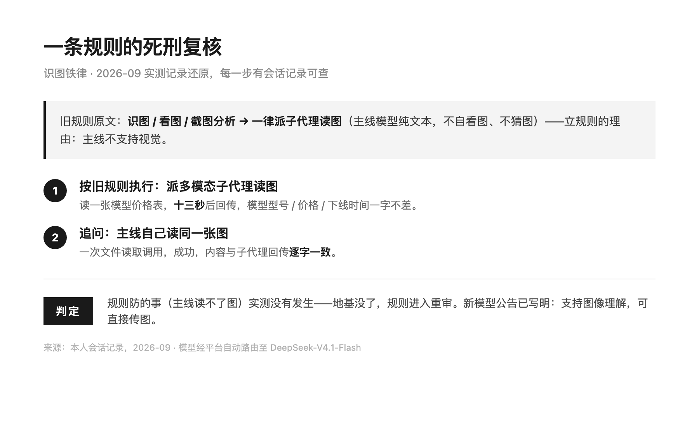
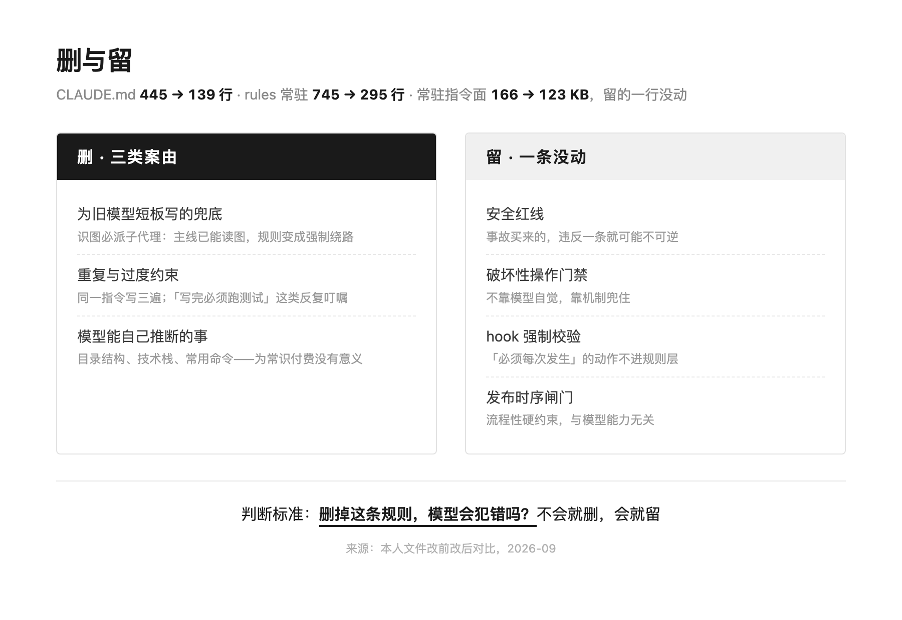

# DeepSeek 升级没让我改一行配置，我却删了 306 行规则

> 一句话总结：2026 年 9 月中旬，我用的 API 平台把 DeepSeek 升级到 V4.1-Flash，公告写明「无需改任何配置」——旧模型名自动路由，配置确实一行没动。但 harness 里为旧模型短板写的兜底规则，从升级那一刻起成了负资产：识图必派子代理、重复约束、为常识付费的清单。按「删掉这条规则模型会犯错吗」这一句标准，我把 CLAUDE.md 从 445 行砍到 139 行，安全红线与 hook 门禁一条没动。

先说结论：这次真正需要动的不是配置，是规则。判断标准只有一句——删掉这条规则，模型会犯错吗？会就留，不会就删。清理后 CLAUDE.md 445 → 139 行，规则库常驻 745 → 295 行，常驻指令面 166 → 123 KB。

目录：

1. 升级公告说「无需改配置」，这句话只对了一半
2. 一条识图铁律的死刑复核
3. 445 行砍到 139 行，删了什么、留了什么
4. 别删过头：三条边界
5. 这套重审流程，怎么发给 AI 让它自己跑
6. 写在最后

---

## 1. 升级公告说「无需改配置」，这句话只对了一半

本章摘要：平台层面确实无需动配置——请求自动路由、按新价计费。但公告管的是路由与模型名，不管你的 harness。基于旧模型能力假设写下的规则，平台不会替你改。

这周，我用的 API 平台发了一条升级公告：模型已升级到 DeepSeek-V4.1-Flash，无需改任何配置，继续用现有的模型名即可。

配置确实一行没改。我配置文件里的模型名还写着旧名字，请求被自动路由到新模型，按新价格计费。公告里还写着：旧模型名长期可用，V4 Pro 下线后会自动路由，无需手动迁移。

如果我只是个调 API 的，故事到这就该结束了。

但我不是。我的 harness 里养着几百行规则，其中一条铁律是这样的：识图、看图、截图分析，一律派子代理读图，主线模型纯文本、不自看图、不猜图。

这条规则的地基，是主线模型不支持视觉。而公告第二条写着：新增多模态能力，支持图像理解，可直接传图。

数据来源：平台升级公告，2026-09；公告同时说明 V4 Pro 将于 9 月 14 日 12:00 后下线并自动路由到 V4.1-Flash。

我的理解：「无需改配置」是一句只对了一半的话——它说的是路由和计费，没说你的规则库。

---

## 2. 一条识图铁律的死刑复核

本章摘要：旧规则派子代理读图，十三秒回传；主线直读同一张图，逐字一致。规则立着的理由（主线读不了图）实测没有发生，这条规则就该重审。

我做了个练习：把那条识图规则当成被告，走完一整轮「死刑复核」，每一步都有会话记录可查。

按旧规则，我让它读一张模型价格表。它规规矩矩派了一个多模态子代理——旧规则的设计就是识图外包，因为主线被假定读不了图。十三秒后子代理回传，图里的模型型号、价格、下线时间，一字不差。

我接着追问：主线自己能不能读？我让主线直接读同一张图。一次文件读取调用，成功，内容和子代理回传的逐字一致。

这个对照不严格——子代理用的是专门的多模态模型，不是同模型自比；一张价格表也撑不起「多模态多强」这种结论。但我要验证的从来不是跑分，是那条规则立着的理由：主线读不了图。实测里这件事没有发生，理由没了，规则就该重审。



我的理解：判一条规则死刑，不需要证明新模型多强，只需要证明它防的事没再发生。

---

## 3. 445 行砍到 139 行，删了什么、留了什么

本章摘要：三类案由删（旧兜底、重复约束、模型能推断的常识），一类东西一条不动（安全红线、破坏性门禁、hook 校验、发布闸门）。判断标准只有一句话。

想通这一层之后，我把主配置文件从 445 行精简到 139 行。同一轮里，规则库的常驻文件从 745 行减到 295 行，真正常驻的指令面从 166 KB 降到 123 KB。

删得不算快，每一条都要过一遍案由。删掉的行大致分三类：

- **为旧模型短板写的兜底**。识图必派子代理就是典型——主线已能读图，这条从「保命规则」变成了「强制绕路」，每次识图多一次子代理调度、多等十几秒。
- **重复与过度约束**。同一条指令在入口、规则库、技能层各写一遍；「写完必须跑测试」这类反复叮嘱，新模型看到测试脚本自己就会跑。
- **模型能自己推断的事**。目录结构、技术栈清单、常用命令，模型读一遍仓库就知道，写进规则等于每轮会话为常识付费。

留下的行数不多，但一条没动：安全红线、破坏性操作门禁、hook 强制校验、发布时序闸门。这些是事故买来的，违反一条就可能不可逆。

> 判断标准只有一句：删掉这条规则，模型会犯错吗？不会就删，会就留。



数据来源：本人工作空间文件改前改后对比，2026-09；行数与字节数为实测值。

---

## 4. 别删过头：三条边界

本章摘要：能力补上不等于行为稳定，删之前先跑对比，拿不准先挪不删。三条边界划好再动手。

砍规则容易上头，三条边界先划好。

能力补上了，不等于行为稳定了。新模型「知道」要跑测试，不代表每次都跑。凡是必须每次发生的动作，别指望模型自觉，用 hook 或脚本兜住——规则可以删，机制不能删。

删之前跑对比。我的做法是删完找几个真实任务跑一遍，看模型在没有这条规则时会不会犯错。犯错就加回去。凭感觉删，早晚删出事故。

拿不准先挪不删。不确定的规则先移进按需加载的技能里观察一个周期，一周后它从没被加载过，再删。删不可逆，挪可逆。

建议：今天先做最小的一步——翻一遍你的 CLAUDE.md，把所有「怕旧模型做错」而写的预防条款圈出来，一条都不用删，先圈出来。

---

## 5. 这套重审流程，怎么发给 AI 让它自己跑

本章摘要：换的不是我一个人的毛病，OpenAI 在 Astra 换代时提醒过同一件事。把下面这段提示词发给 AI，挂上项目，它会自己完成精简并逐条说明理由。

顺手查了下别的模型换代时大家怎么做，发现这不是我的洁癖。据社区公开讨论，OpenAI 在 GPT-6 Astra 升级时提醒过同一件事：把旧 prompts 和 skills 当负资产审一遍，删掉那些「为旧模型兜底」的规则。社区也有现成实践——有人把一千二百多行的配置砍到一百五十行，深潜内容移进按需加载的技能，事故教训逐字保留。方向都一样：模型能力跃迁之后，规则层要跟着重审。

这次升级本身的底色也交代一下，因为它是三条删除案由同时成立的原因。第三方机构 OpenDesign 于 9 月 9 日发布的实测（第三方口径，非官方对比，数据截至发稿）：以 GPT-6 Astra 约 1.4% 的成本，拿到其 98% 的得分；综合质量分 81.2，Terminal-Bench 90.6、CyberGym 88.1；并发上限从旧旗舰的 500 提到 2500。能看图、够便宜、扛得住并发——过去为了「绕过短板」和「省着用」写下的规则，一大半同时失去了前提。

把下面这段发给 AI，挂上你的项目：

```
请先阅读当前主力模型的官方 Model Guidance，以及"为新模型重构 prompts/skills"的实践文章。
然后检查本项目实际生效的持久化指令（CLAUDE.md / AGENTS.md / skills / rules / memory / hooks），重点识别：
1. 与新模型能力不匹配的旧规则（为旧模型能力不足加的兜底）
2. 重复、冲突或过度约束的指令
3. 可能导致过度测试、过度搜索、额外 token 消耗的规则
4. 已可交给模型自主判断、无需显式规定的流程
在保留安全边界、项目约束和关键工作流的前提下，完成精简与修改。
完成后逐条说明：删了什么、改了什么、留了什么，各自原因。
```

数据来源：社区公开讨论与公开实践案例；第三方机构 OpenDesign 公开实测（2026-09-09），非官方对比，数据截至发稿。

备注：判断标准就一句——这条规则删掉之后，模型会犯错吗；安全红线、破坏性操作、hook 门禁一律不动。基础版十分钟过一遍，拿不准的条目交给上一章那三条边界。

---

## 6. 写在最后

如果你只花 3 分钟，请带走这 3 个观点：

- 平台说的「无需改配置」是真的，但只覆盖路由与计费。harness 里那些为旧模型短板写的兜底规则，平台不会替你改。
- 判断一条规则该不该留，只需要一句：删掉它，模型会犯错吗？不会就删，会就留。
- 删之前先划三条边界：必须每次发生的动作靠机制不靠自觉；删完跑真实任务对比；拿不准的先挪不删。

如果你是下面三类读者，行动指南挑一条：

- 如果你刚升级完模型还没动规则：今天就翻一遍 CLAUDE.md / AGENTS.md / rules，圈出所有「怕旧模型做错」的预防条款，一个都先别删。
- 如果你在带团队：把「模型换代必做一次规则重审」写进团队惯例——它比事后救火便宜得多，也比多买一份额度有用。
- 如果你在用规则约束 AI 写代码：先拿识图这一条做实验。如果你的规则还写着「识图必派子代理」，先实测一次主线能不能自己读，再决定删不删。

# 本文核心结论

- **升级公告管的是路由，不是规则**。配置一行没改，不代表 harness 不用动。
- **判准只有一句**：删掉这条规则，模型会犯错吗？会就留，不会就删。
- **本次实测账本**：CLAUDE.md 445 → 139 行，rules 常驻 745 → 295 行，常驻指令面 166 → 123 KB，安全红线与 hook 门禁一条没动。
- **删规则的三条边界**：机制不能删、删前跑对比、拿不准先挪不删。

# 关于行途

一线 builder，仍在写代码。专注 AI 工具链与工程化落地，分享可抄作业的实战经验。热点只当切口，不做资讯搬运，落点永远是可抄的作业；只讲那些「工具会变，但思想不变」的东西。如果你也在搭自己的 harness，或者对 AI 工程化有疑问，欢迎关注。

既然看到这里了，说明这篇对你多少有点用。
顺手点个赞、点个在看，就是对我最大的支持。
觉得值得转给朋友，也别客气。
想第一时间收到推送，给「行途技术手记」加个星标。
谢谢你看我的文章，下篇见。

> 公众号卡片占位：插入「行途技术手记」账号名片

延伸阅读

DeepSeek V4.1 Flash 把旗舰价格砍了 86.7%：当 Flash 追上 Pro —— 这次升级的价格账本，本篇是它的动作层续篇（2026-09-11）

DeepSeek V4.1 Flash 内测上手：会看图了、快了 5.5 倍、价格一分没涨 —— 模型本身变了什么（2026-09-09）

国家点名 FDE：AI 落地缺的不是模型，是现场的人 —— 为什么一线实践者更该关心规则层（2026-09-10）

行途技术手记 · AI 时代的工程师成长与效率提升
排版引擎：墨排 · md2wechat（行途自研）
© 2026 行途 · 欢迎转载，注明出处 · 禁止未经授权用于 AI 训练

搜一搜关键词直达：DeepSeek V4.1 Flash / 无需改配置 / CLAUDE.md 精简 / harness 规则 / 提示词瘦身 / 省 token / AI 工程化 / 模型升级

---

数据来源与核验时间（2026-09-12 09:15 发布）

- 平台升级公告（模型升级至 DeepSeek-V4.1-Flash / 无需改配置 / 新增多模态 / V4 Pro 9 月 14 日 12:00 后下线并自动路由）：本人所用 API 平台公告，2026-09
- 行数与字节数账本（CLAUDE.md 445→139 行 / rules 常驻 745→295 行 / 常驻指令面 166→123 KB）：本人工作空间文件改前改后实测，2026-09
- 识图对照实验（子代理 13 秒回传 / 主线直读逐字一致）：本人会话记录，2026-09；对照不严格说明见正文第 2 章
- OpenDesign 实测（1.4% 成本 / 98% 得分 / 质量分 81.2 / Terminal-Bench 90.6 / CyberGym 88.1 / 并发 500→2500）：第三方机构公开实测，2026-09-09；非官方对比，数据截至发稿
- OpenAI 在 GPT-6 Astra 换代时提醒重审 prompts/skills：社区公开讨论转述，非官方一手声明
