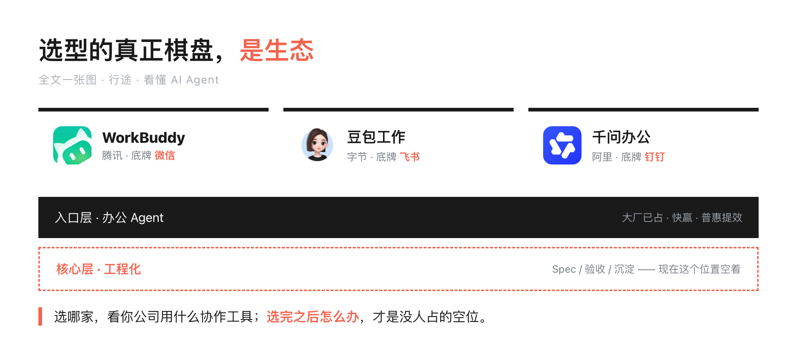
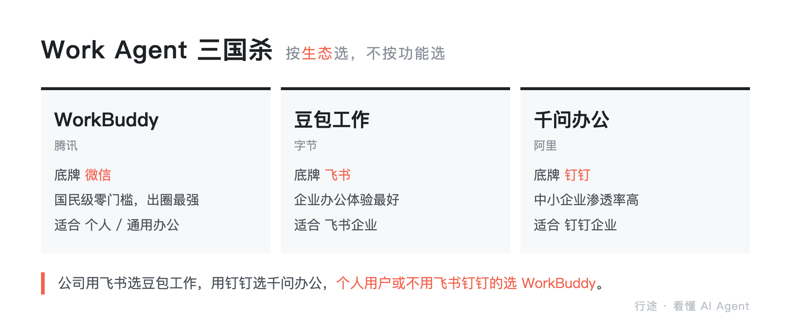
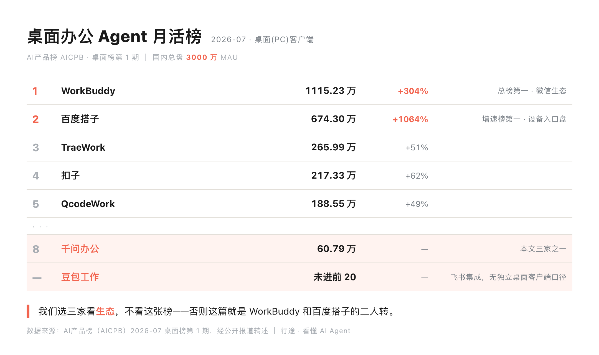
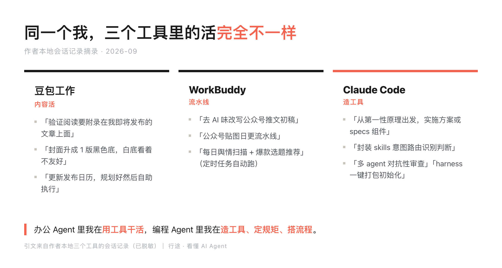
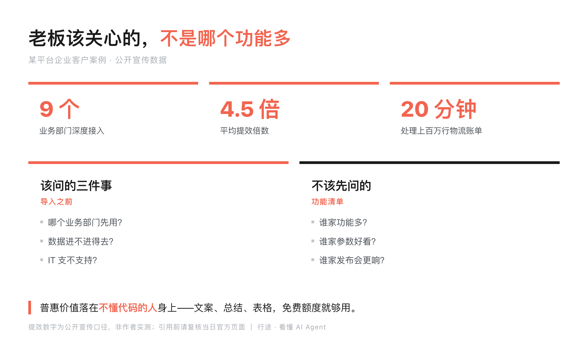
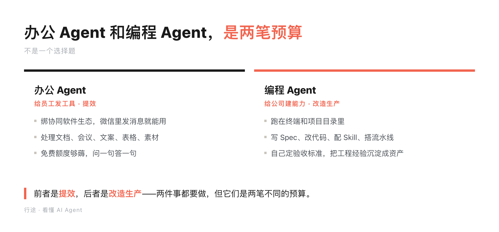
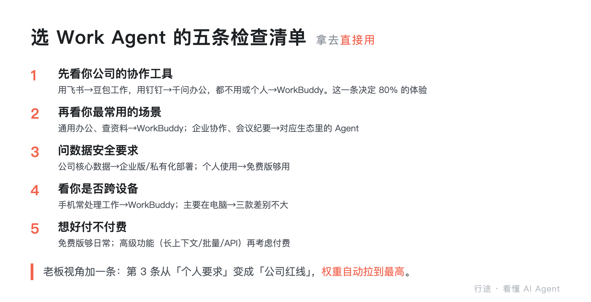
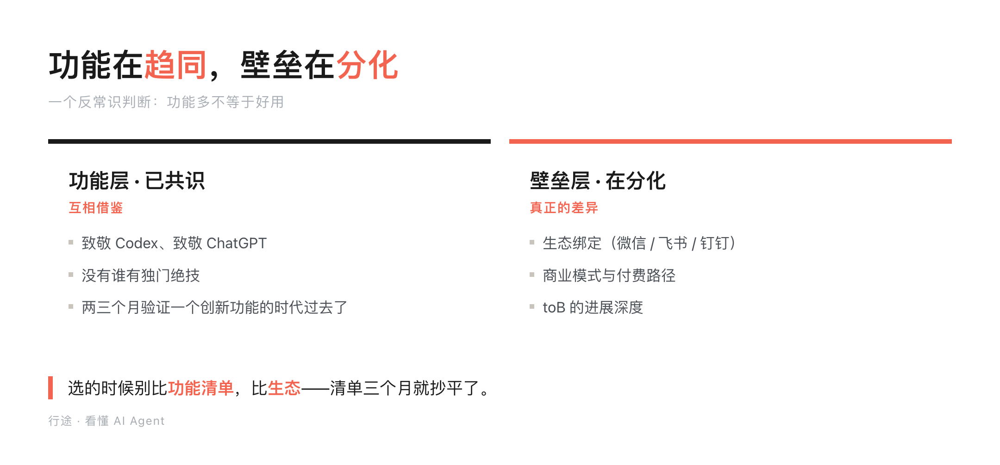
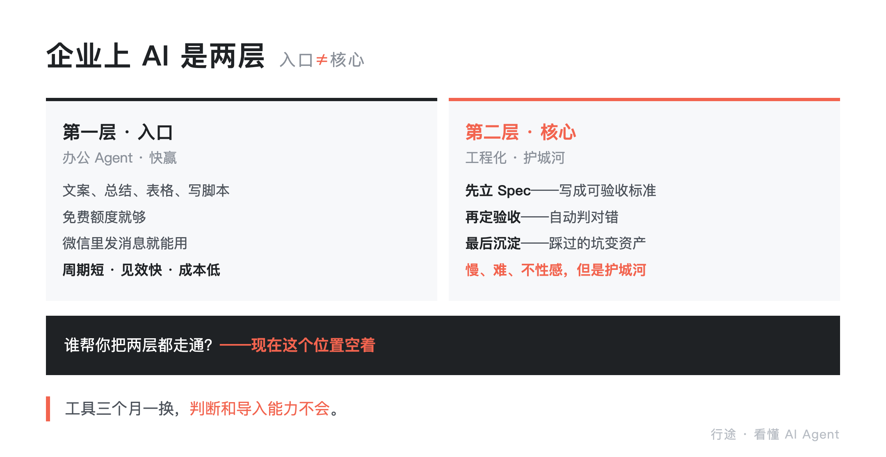

# 员工比功能，老板看生态：WorkBuddy、豆包工作、千问办公选型账本

> 一句话摘要：翻了三家大厂离职与在职资深从业者的公开访谈，三款工具各跑了一段真实工作流。判断：这场三国杀刚开打，终局跟协同软件绑死。

先说结论：三款 Work Agent 没有绝对的谁好谁坏，核心差异在生态。WorkBuddy 的底牌是微信——国民级应用，零门槛，出圈能力最强，适合个人用户和通用办公。豆包工作的底牌是飞书——互联网公司渗透率高，企业办公场景体验最好，但出圈难。千问办公的底牌是钉钉——中小企业市场渗透率高，和豆包工作一样受限于生态。选哪款不看功能多少，看你公司用什么协作工具。公司用飞书选豆包，用钉钉选千问，个人用户或公司不用飞书钉钉选 WorkBuddy。

先说我是谁：三款我都在真实工作流里跑——WorkBuddy 在微信里管日常，豆包工作挂在飞书协作，千问办公进过钉钉群。

目录：

1. 腾讯 WorkBuddy：微信生态里的黑马
2. 字节豆包工作：飞书生态里的优等生
3. 阿里千问办公：钉钉生态里的深耕者
4. 三家对比：一张表看懂底牌
5. 我在三个工具里的真实会话
6. 老板视角：上 AI 之前，先想清楚这三件事
7. 办公 Agent 和写代码，是两种物种
8. 选 Work Agent 的五条检查清单
9. 一个反常识判断：功能多不等于好用
10. 选完之后怎么办：入口和核心是两件事
11. 核心结论

## 1. 腾讯 WorkBuddy：微信生态里的黑马

WorkBuddy 是三家里最猛的。

易观口径下 2026 年 6 月 PC 端月访问 2097 万次、居国内同类第一（36氪转述），超过第二三名之和，访问量是现象级的。

注意这和文内那张榜不是同一指标：榜量的是桌面客户端月活，这里量的是 PC 端访问次数，别混着比。

成功的原因有三个。零门槛——微信里直接用，不需要下载 App、不需要注册、不需要配环境。微信生态——和微信、企业微信、腾讯文档深度集成，办公场景天然适配。迭代快——更新速度极快，用户提的需求很快就能上线。

WorkBuddy 的底牌是微信生态。这是字节和阿里都没有的优势——微信是国民级应用，WorkBuddy 站在微信的肩膀上，获客成本几乎为零。

但 WorkBuddy 也有短板。因为要兼顾所有用户，它的功能偏通用，在深度企业场景（比如复杂的项目管理、定制化工作流）上不如飞书和钉钉里的 Agent 精准。

## 2. 字节豆包工作：飞书生态里的优等生

豆包工作是字节的 Work Agent，底牌是飞书生态。

如果你公司用飞书，豆包工作的体验是最好的——直接读飞书文档、整理飞书会议纪要、写飞书邮件、查飞书知识库。所有操作都在飞书里完成，不需要切换工具。

豆包工作的优势是企业办公场景。飞书在互联网公司的渗透率很高，豆包工作天然就能切入这些公司的日常办公。

但豆包工作的问题是出圈难。不用飞书的人，基本不会用豆包工作。它的用户群主要是飞书用户，天花板比 WorkBuddy 低。

还有一个细节：豆包工作在飞书里的集成深度，取决于你公司的飞书版本和管理员配置。有些公司因为安全策略关闭了部分 AI 功能，体验会打折扣。

## 3. 阿里千问办公：钉钉生态里的深耕者

千问办公是阿里的 Work Agent，底牌是钉钉生态。

和豆包工作类似，千问办公深度集成钉钉——读钉钉文档、整理钉钉会议、写钉钉邮件、查钉钉知识库。如果你公司用钉钉，千问办公是最顺手的。

千问办公的优势是中小企业市场。钉钉在中小企业的渗透率很高，千问办公天然就能切入这些公司。

但千问办公的问题和豆包工作一样：出圈难。不用钉钉的人，基本不会用千问办公。

千问办公还有一个特点：阿里的模型能力在代码和数学上有优势，所以千问办公处理表格数据、简单公式的能力在三家里偏强。但这是模型层面的差异，普通用户感知不明显。

## 4. 三家对比：一张表看懂底牌

一句话版先给你：三家的用户分层基本是"年轻企业用飞书、传统制造用钉钉、生意场上用企业微信"——这跟办公 Agent 绑定的协同软件完全对得上。表格见配图，核心差异就一行：你的公司用什么协作工具，你就吃哪家的生态红利。

这里得把另一个盘说清楚。

7 月的第三方监测里（报道发在 8 月），桌面办公 Agent 月活前二是 WorkBuddy 和百度搭子：前者 1115 万登顶，后者增速榜第一（1063%）。

看着像打脸：百度搭子没有企业协同生态，凭什么进前二？因为它赢的不是这个盘。

9 月 8 日文心快码并入百度搭子，同一天它成了「超能小度」的 Agent 引擎，直接上了小度硬件。

它靠搜索、网盘、设备入口拿量，跟钉钉、飞书、企业微信不抢同一张办公桌。

所以这三家不是市场排名的前三，是企业协同盘里三个生态的代表。

把榜单摊开更直观：这份榜上千问办公排第 8（60.79 万），豆包工作没进前 20。

所以你看，我们真不是按月活选的这三家——按月活选，这篇就该是 WorkBuddy 和百度搭子的二人转。

给公司配，就在它们仨里选，看公司用什么协作工具；给自己配，走设备入口那类也在桌上，那是另一道题。

百度搭子我还没深度用，不给你体验结论。数据在那儿，我不替它说话，也不装看不见——但它和这三家不是同一道题，硬塞进一张表里比，才是真外行。

## 5. 我在三个工具里的真实会话

说回我自己。三款我都用过一段时间，而且我有个习惯：本地存会话记录。写这篇之前，我把三个工具的会话翻出来看了一遍，发现一件有意思的事——同一个我，在三个工具里干的是完全不同的活。

豆包工作里，我的会话几乎全是内容活："输出一下验证阅读，我都要附录在我即将发布的文章上面""封面升成 1 版黑色底的，公众号的文字是白色，白底看着不友好""更新我们的发布日历，省 token 和看懂 AI Agent 两个合集加起来 30 篇了，规划好然后自助执行""我有个痛点，作为资深知识治理专家管理我的空间，1 是找不到已发布日历，2 是不清楚发布规划"。

WorkBuddy 里，干的也是内容活，但更偏"流水线"："去 AI 味改写公众号推文初稿""公众号贴图日更流水线""每日舆情扫描与爆款选题推荐""AI 会话广撒网采集·主题与自媒体潜力分析（每日累积沉淀）"——后面这两条是我设的定时任务，每天早上自动跑。

Claude Code 里，画风完全变了："从第一性原理出发，实施方案或者 specs 组件，多 agent 对抗性审查执行一下""是不是能够封装 skills 意图路由识别判断，自己输入不用我多次提醒""针对 harness 体系，构建一个适合开源的一键打包或者初始化的工作"。

看出区别了吗？办公 Agent 里我是在"用工具干活"，编程 Agent 里我是在"造工具、定规矩、搭流程"。这不是我个人的特殊用法，是我们内部技术群的共识——群里有人转发 WorkBuddy 入职某大型快消企业的宣传（深入九个业务部门平均提效 4.5 倍、处理上百万行物流账单只要 20 分钟），有同事回了一句："这东西给不懂代码的人用很友好，写代码的还是 Claude Code 好用。"

这句话我记了很久，后面专门用一节讲。

再说三个真切的感受。

第一，生态绑定比功能差异重要得多。我公司用飞书，豆包工作直接读文档、整理会议纪要，一步到位。用 WorkBuddy 做同样的事，要先把文档导出、再上传给它，多了好几步。功能上 WorkBuddy 可能更强，但在我的工作流里，豆包工作因为生态集成，实际效率更高。

第二，WorkBuddy 的"微信里直接用"是真的香。有一次在地铁上，同事发微信问我一个数据，我直接在微信里让 WorkBuddy 查了、整理了、回了，全程没开电脑。这种场景下，豆包和千问都做不到——它们要开 App、要登录、要切换。

第三，三款都还不够"Agent"。说是 Agent，但大部分时候还是"你问一句它答一句"的模式。真正能自主规划、自主执行、遇到问题自己调整的场景，三款都有限。这不是某一家的问题，是整个 Work Agent 品类的现状——概念到了，能力还在追。

踩过一个坑：有一次让豆包工作整理一份飞书文档，它自动把文档里的表格转成了文字描述，丢了数据结构。我没仔细看就转发了，后来被同事指出数据不对。从那以后我定了规矩：Agent 处理过的表格和数据，一定核对原始版本。

还有个真实的别扭：会话管理。我在飞书群里跟 Coding Agent 协作，一个 bot 拉进好几个群，每个群对应它应用里的一个会话，只能靠"哪个群聊哪件事"硬记。原生 Remote Control 里会话列表是现成的，但一旦拆到第三方协同软件里，会话管理就断了。行业里聊下来，大家都在等一个"AI 群聊"——ChatGPT 曾灰度过群聊功能后来没全面推，到现在还没有一家把这事做好。

所以：选 Work Agent 不是选功能最多的，是选跟你工作流绑定最深的。

## 6. 老板视角：上 AI 之前，先想清楚这三件事

如果你是个老板，看到这里可能已经在想：那我的公司该上哪个？

我的回答是：先别急着选工具，先想清楚三件事。

**第一件事：你的员工，是"不懂代码的大多数"还是"写代码的少数"？**

这不是骂人，是个中性判断。我给两家公司做过 AI 工具导入，一个很深的感受是：办公 Agent 的普惠价值，恰恰落在"不懂代码的人"身上——文案、总结、表格、投研报告、写个脚本，这些以前要么花钱找人干、要么员工自己加班干的活，现在免费额度就够用。我们内部群里有同事转 WorkBuddy 进企业的宣传片：九个业务部门平均提效 4.5 倍，上百万行物流账单 20 分钟处理完。这种场景，老板该关心的是"哪个业务部门先用、数据进不进得去、IT 支不支持"，而不是"哪个产品功能多"。

**第二件事：数据安全合规，谁给你兜底？**

员工拿公司数据喂 AI，喂进去之后归谁？这是老板必须替公司回答的问题，员工回答不了。有的平台把客户数据和敏感信息不用于模型训练写进了承诺（比如走阿里百炼的路线，有明确承诺）；有的产品有隐私模式，数据不出本机、断网能用；有的走全本地路线。你的行业、你的数据敏感度，决定哪一条是底线，这一条比任何功能都是一票否决。

**第三件事：你要的是"用上 AI"，还是"改造生产"？**

这是老板视角和员工视角最大的分岔。员工视角是"我办公更省事"，老板视角是"我的公司怎么长出 AI 能力"。后者没有捷径——我们给客户做 AI 落地，看的不是装了几个工具，而是有没有人能带着团队把 AI 工程实践导进去：先立 Spec，再定验收标准，小步跑通再铺开。工具三个月一换，这个能力才是公司的资产。

顺便说个观察：目前各家办公 Agent 对企业的打法，还处在"卖会员、卖额度"的阶段，深度整合企业工作流的案例屈指可数。企业付费和个人付费是两套完全不同的逻辑——个人为省事付费，企业为合规和整合付费，价格差 10% 企业根本不敏感。toB 的攻坚战，现在才刚刚开始。

## 7. 办公 Agent 和写代码，是两种物种

现在回答标题里那个容易混的问题：办公 Agent 和专业编程工具，到底什么关系？

用我自己的会话当证据，两边差别一目了然。

办公 Agent（WorkBuddy、豆包工作、千问办公）：绑协同软件生态，处理文档、会议、文案、表格、素材；门槛低到微信里直接发消息就能用；免费额度够薅；大部分时候你问一句它答一句。

编程 Agent（Claude Code、Codex 这类）：跑在终端和项目目录里，干的是写 Spec、改代码、配 Skill、搭自动化流水线；要自己调配置、自己定验收标准；它不会免费给你干活，但它能把你的工程经验沉淀成资产——"封装 skills 意图路由识别判断""多 agent 对抗性审查""harness 一键打包初始化"，这些是我在编程 Agent 会话里的原话。

我见过最形象的总结，还是我们内部群同事那句："这东西给不懂代码的人用很友好，写代码的还是 Claude Code 好用。"

所以我的判断是：这不是一个选择题。老板给全公司配办公 Agent 是提效，工程团队用编程 Agent 是改造生产。前者是给员工发工具，后者是给公司建能力。两件事都要做，但它们是两笔不同的预算。

## 8. 选 Work Agent 的五条检查清单

市面上 Work Agent 产品多了起来，怎么选？我用五条标准筛：

1. 你的公司用什么协作工具？用飞书→豆包工作，用钉钉→千问办公，都不用或个人用户→WorkBuddy。这一条决定了 80% 的体验。
2. 你最常用的场景是什么？通用办公、查资料、写文档→WorkBuddy。企业协作、会议纪要、项目管理→对应生态里的 Agent。
3. 你对数据安全的要求有多高？涉及公司核心数据→选公司已采购的企业版（有私有化部署和数据隔离）。个人使用→免费版够用。
4. 你需不需要跨设备使用？经常在手机上处理工作→WorkBuddy（微信里直接用最方便）。主要在电脑上→三款差别不大。
5. 你愿不愿意为 AI 付费？三款都有免费版，日常使用够了。如果需要高级功能（长上下文、批量处理、API 调用），再考虑付费版。

这五条不是理论，是我帮团队选工具时一条条试出来的。老板视角的补充：第 3 条在你当老板之后，从"你个人的要求"变成"公司的红线"，权重自动拉到最高。

## 9. 一个反常识判断：功能多不等于好用

最后说一个反常识的判断。

很多人选 Agent 喜欢比功能清单——这个支持 20 种文件格式，那个支持 15 种，所以这个好。但实际用下来，功能多不等于好用。

原因很简单：你日常用的功能就那三五个。功能多了，界面复杂了，找一个功能要翻三层菜单，反而降低效率。WorkBuddy 功能不是最多的，但它在微信里，打开就能用，这一步的便捷性抵消了所有功能差异。

另一个反常识的点：更新快不一定是好事。WorkBuddy 两天一迭代，有时候更新完界面变了、入口挪了，你要重新找。稳定的产品反而让你形成肌肉记忆，不用分心。

行业里的人看得更透。把几家大厂离职与在职资深从业者最近的公开表态放在一起，功能共识已经非常强——互相借鉴，致敬 Codex、致敬 ChatGPT，没有谁有独门绝技，两三个月验证一个创新功能的时代已经过去了。差异化和壁垒不在功能清单，在生态、商业模式、toB 的进展。

还有个信号值得注意：我接触到的独立开发者和小团队里，已经有人放弃自建 Agent——自己造轮子造不过大厂，打不过就加入。

他们转而基于大厂办公 Agent 做交付：给企业做导入、做验收、做沉淀，实施方案整套长在 WorkBuddy 这类入口上。这正好印证下一节那两层——入口是大厂的，核心空位还在。（作者与从业者的交流观察，不具名）

开放性也是一道分水岭。标杆还是 Coze：coze server、coze sdk 都在仓库里开源了。国内办公 Agent 普遍没到这个程度——你想私有化、想自己接，选择很少。

我的建议是：别比功能清单，比"你每天用的那三个场景，哪款最顺手"。用一周，答案自然出来。

## 10. 选完之后怎么办：入口和核心是两件事

聊完三款产品，说点更大的。

我观察下来印象最深的一点：三家对行业阶段的判断相当一致——这场大战才刚刚开打，而且大概率是中国市场独有的事。国际市场上各家打的是个人助理，不是办公 Agent。国内这边，内部开发阶段基本结束，开始打外战，离收尾还早得很。

第二个判断更关键：终局大概率跟协同软件绑死。企业不是个人，企业选办公 Agent 是"用飞书就配豆包，用钉钉就配千问，用企业微信就配 WorkBuddy"——协同软件和办公 Agent 是共构的。这也解释了为什么选型第一问必须是"你公司用什么协作工具"：这不是我的经验，是整个行业都在往这个方向走。

但选型只是第一步。真正的问题在选完之后：工具买回来了，然后呢？

我的经验是，企业上 AI 其实是两层。

**第一层是入口，办公 Agent 干的就是这层。** 让普通员工先动起来——文案、总结、表格、投研报告、写个脚本，免费额度就够，不需要培训，微信里发条消息就能用。这层是快赢：周期短、见效快、成本低，老板花小钱就能看到员工在提效。

**第二层是核心，工程化干的是这层。** 光让员工各自提效，AI 只是散装的工具；要让 AI 变成公司的能力，得有人带着做三件事：先立 Spec——把"AI 要干成什么样"写成可验收的标准；再定验收——写完了怎么自动判对错，而不是人肉复核；最后沉淀——把踩过的坑变成流程和资产，下次直接复用。这层慢、难、不性感，但它是护城河。

现在市场上的办公 Agent，基本都停在第一层。个人提效这块的社会价值已经出来了——让白领免费给自己偷懒，一天干好多活不花钱。但和企业内部工作流的深度整合还早，公开案例里飞书在汽车行业有落地，算走得快的。toB 的攻坚战，现在也才刚刚开始。

所以那个"谁帮你把两层都走通"的位置，现在是空的。老板买了工具，员工用了两周觉得新鲜，三个月后回到原样——不是工具不行，是没人做导入。

顺便把付费的事说透。办公 Agent 现在的主流是会员订阅，这套在海外成立，在国内存疑。我去看过不少非 IT、非互联网企业，普通员工是"哪家免费额度够用就薅哪家"，文案总结、整理表格、写个脚本，各家的免费额度基本够。更麻烦的是底牌：我的体感是国内推理成本高、速度不稳，订阅制靠"卖 token"撑收入，在这个前提下撑不起周期。企业付费和个人付费是两套逻辑：个人为省事付费，企业为合规和整合付费，价格差 10% 根本不敏感。

我的判断：办公 Agent 是企业 AI 落地的最短入口，但入口之后需要工程化导入。工具三个月一换，判断和导入能力不会——这个位置现在空着，谁能补上，谁就吃到这轮 toB 的红利。

---

## 11. 核心结论

1. 三款 Work Agent 没有绝对好坏，核心差异在生态：WorkBuddy=微信，豆包工作=飞书，千问办公=钉钉
2. 选型逻辑：公司用飞书选豆包，用钉钉选千问，个人用户或不用飞书钉钉选 WorkBuddy——生态绑定决定 80% 的体验
3. 一线实证（本地会话）：办公 Agent 里我在"用工具干活"（写作/发布/舆情/素材），编程 Agent 里我在"造工具、定规矩"（specs/harness/skill）——办公 Agent 普惠不懂代码的人，写代码的还是编程 Agent 好用
4. 老板视角三件事：员工是"不懂代码的大多数"还是"写代码的少数"、数据安全合规谁兜底、要"用上 AI"还是"改造生产"
5. 踩坑经验：Agent 处理过的表格和数据一定核对原始版本（豆包工作自动转表格丢数据结构的教训）
6. 行业判断：这场"三国杀"刚进入外战阶段，终局大概率跟协同软件绑死；功能层面已共识化，壁垒在生态、商业模式、toB 进展
7. 付费提醒：订阅制在海外成立、在国内存疑，普通用户薅免费额度足够；企业付费和个人付费是两套逻辑
8. 落地路径：企业上 AI 是两层——办公 Agent 是入口/快赢（普惠提效），工程化是核心（Spec/验收/沉淀）；选完工具只是第一步，"谁帮你把两层走通"现在是个空位

---

**信息说明**：第 5 节会话管理、第 9 节功能共识化与开放性、第 10 节行业判断与"入口/核心两层"框架，来自三家大厂离职与在职资深从业者的公开访谈与公开发言（非现任产品负责人口径）、行业公开观察，与作者三个工具的真实使用及企业 AI 落地实践；第 5 节"真实会话"引文来自作者本地三个工具的会话记录（豆包工作、WorkBuddy、Claude Code）；第 6 节企业提效案例为公开宣传数据（某平台企业客户案例宣传片）；内部群观点已脱敏转述；产品功能、价格与数据迭代快，引用前请复核当日官方页面。

## 搜一搜关键词

WorkBuddy / 豆包工作 / 千问办公 / AI Agent推荐 / Work Agent对比 / 微信AI助手 / 飞书AI / 钉钉AI / 企业AI工具选型

---

## 延伸阅读

- [AI Agent 到底是什么？三年，从会说话到会干活](https://mp.weixin.qq.com/s/n3K94FUTH20YnWJ8Ugqcvw)
  — 合集第 1 篇，AI/LLM/Agent 三者关系与三年演进，本篇的生态判断建立在它之上
- [PEC 2026 AI 创新者大会台下一天：Token 工厂、FDE、AI 出海与 Harness](https://mp.weixin.qq.com/s/UsmdZU_0SEzUwLtdhSylbg)
  — 大会现场观察，本篇「老板视角」三件事与「入口/核心两层」在会上被反复验证

## 关于行途

一线 builder，仍在写代码。专注 AI 工具链与工程化落地，分享可抄作业的实战经验。热点只当切口，不做资讯搬运，落点永远是可抄的作业；只讲那些「工具会变，但思想不变」的东西。如果你也在搭自己的 harness，或者对 AI 工程化有疑问，欢迎关注。

如果这篇对你有用，点个赞或转给正在选工具的朋友，就够了。下篇见。
