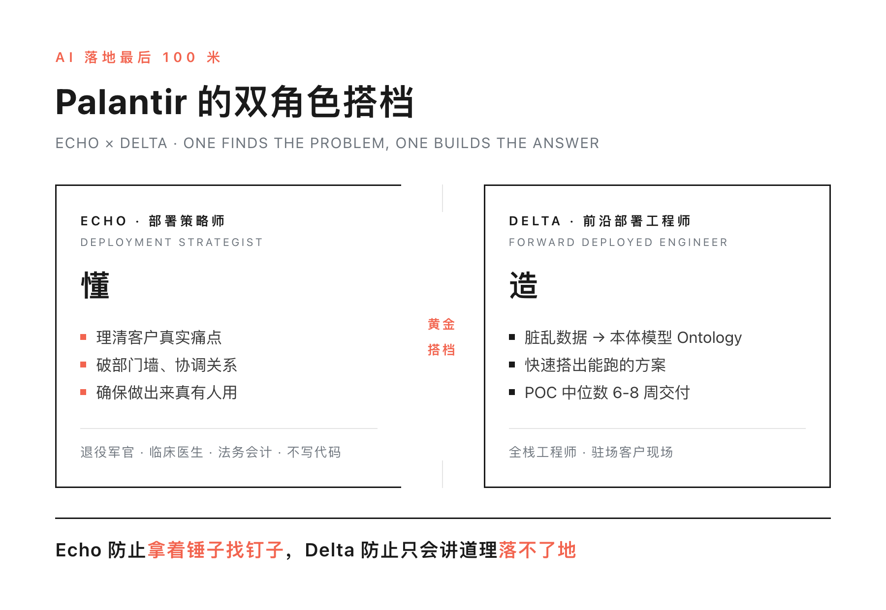
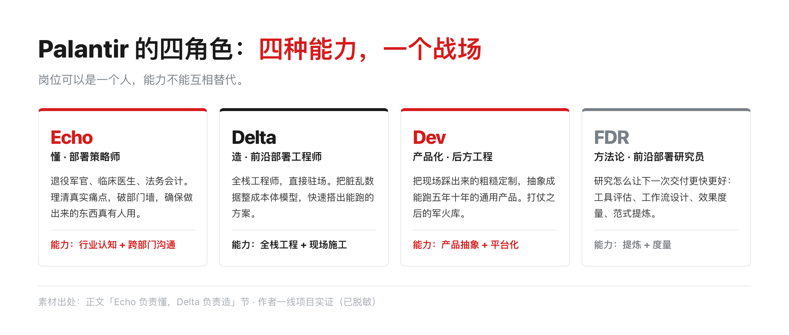
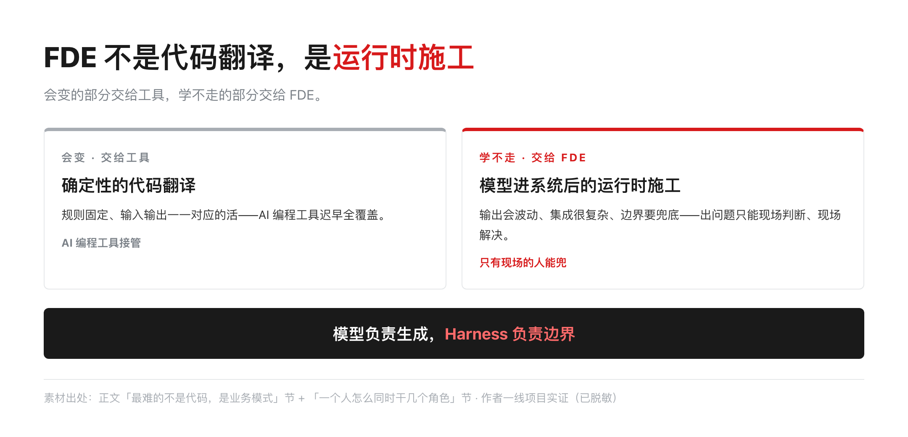
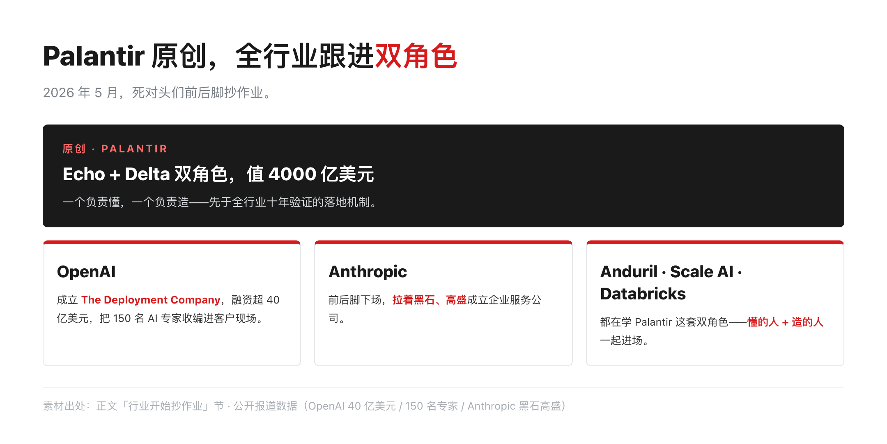
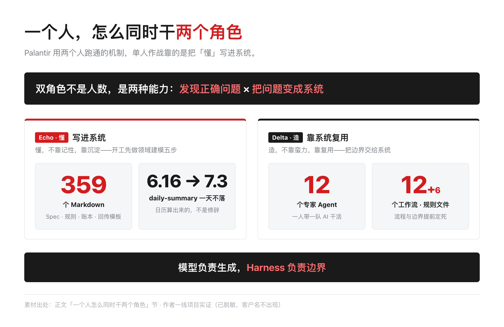

# Palantir 的 FDE 拆成两个人：Echo 懂、Delta 造，AI 落地最后 100 米

> 一句话摘要：Palantir 跑通 AI 落地靠两个人：Echo 负责懂，Delta 负责造。这篇拆机制，对项目，一个人顶两个角色。

Palantir 值近 4000 亿美元。这家公司最值钱的东西不是模型，是两个人：一个负责懂，一个负责造。

这两个人是 Palantir 官方的前线双人组。

行业后来还演绎出两个后方角色：Dev（核心产品工程师）把现场经验变成产品，FDR（前沿部署研究员）研究怎么让下一次交付更快。

注意：后两个不是 Palantir 官方岗位，是行业和一线实践者自己的归纳，下文会讲清。

先把缩写对清楚，不然下面容易混：

| 缩写 | 全称 | 中文一句话 |
|------|------|-----------|
| FDE | Forward Deployed Engineer | 前线部署工程师（官方岗位）：驻扎客户现场、端到端交付。行途也把它展开成「前沿部署 + 全栈」两种理解 |
| Echo | Deployment Strategist | 部署战略师（回声）：Palantir 发明，驻扎客户一线，把模糊需求「回响」成可执行语言 |
| Delta | Forward Deployed Software Engineer（FDSE） | 前线部署软件工程师（增量）：Palantir 官方角色，在客户现场把方案做出来，交付现状到目标状态的增量 |
| FDPM | Frontier Deployment Product Manager | 前沿部署产品经理（行业演绎，非官方）：FDE 的业务搭档（Mini CEO），管客户关系、业务理解、验收标准 |
| FDR | Frontier Deployment Researcher | 前沿部署研究员（行业演绎，非官方）：把交付教训提炼为可复用的规则和方法论 |

一句话记住关系：**Palantir 最早提出 Echo（懂业务）+ Delta（造系统）双人驻场，后来演变成 FDE（Forward Deployed Engineer，前线部署工程师）。**

**AI 时代又衍生出 FDPM（业务搭档）+ FDR（方法论研究员）。** 今天聊的 FDE，是融合了 Echo + Delta 能力的 AI 时代新版本。

2003 年，Palantir 创始人之一 Stephen Cohen 拿着 demo 去见潜在客户，被一句话怼回来："这个产品太糟糕了，和我们的工作完全没关系。"

他没有解释产品有多好，而是追问："那你们希望它有什么不同？"然后把每条反馈记下来，回去改。改完再问，问完再改。

从那天起，这家公司学会了不坐在总部猜客户，而是派人扎进现场。这条路一走二十年，走出了今天被整个行业抄的答案。

先说我是谁：一线做 AI 交付的，下面每个判断都有项目账本背书。

这篇写给三种人——正在做 AI 落地的工程师，想搞懂 Palantir 为什么值钱的观察者，以及一个人带 AI 干项目的小团队。

带走的是一套判断，不是一段科普。

## Echo 负责懂，Delta 负责造，还有两个角色

Palantir 把前线部队拆成角色，中间留着一种刻意的结构性张力。

Echo，部署策略师。通常是退役军官、临床医生、法务会计——在行业里摸爬滚打过的人，不写代码。

他们干的事是理清客户真实痛点、协调部门关系、确保做出来的东西真有人用。用大白话说，Echo 负责"懂"。

Delta，前线部署软件工程师（FDSE，Palantir 内部对 FDE 的称呼）。全栈工程师，直接驻场，把又脏又乱的旧系统数据整理成本体模型（Ontology），快速搭出能跑的方案。

Delta 负责"造"。

Palantir 官方还有第三个称谓，常被忽略：Dev——核心产品工程师，坐镇后方。

前方 Delta 在客户现场踩出来的粗糙定制，由后方 Dev 抽象成能跑五年十年的通用产品。

Echo 和 Delta 负责打仗，Dev 负责把战场的经验变成军火库。注意：Dev 不是前线双人组的第三个人，它是官方体系里坐镇后方的角色——Palantir 的前线，从头到尾就是 Echo + Delta 两个人。

我的交付里还有第四个——FDR，前沿部署研究员：研究怎么让下一次交付更快更好。（FDR 不是 Palantir 官方岗位，是这几年的行业演绎，我也是这么用的。）

工具评估、工作流设计、效果度量、范式提炼，都是 FDR 的活。Echo 懂业务，Delta 造系统，Dev 造产品，FDR 造方法论。

四个角色，四种完全不同的能力模型。

Echo 的能力是行业认知和跨部门沟通，Delta 的能力是全栈工程和现场施工，Dev 的能力是产品抽象和平台化，FDR 的能力是提炼和度量。

**岗位可以是一个人，能力不能互相替代。**

## 最难的不是代码，是业务模式

为什么 Echo 和 Delta 必须同时在场？MIT 有项研究说，企业搞的生成式 AI 项目，95% 没带来投资回报；成功的那 5%，普遍做了深度定制和流程整合。

产品能做什么，和客户要什么，中间隔着一条沟。

这条沟的名字叫业务模式。

我在一场 AI 大会上听到一个判断，越想越对：**Echo 不是岗位，是一个业务模式。**

现场工程师把 Delta 和 Echo 的知识传回总部——为什么需要专人传？因为业务模式不是代码、不是文档，是一套"这个企业/这个业务到底怎么跑"的活知识。

它只能靠人进场去摸，靠人传回组织。模型再强，读不懂业务模式，一切归零。

更直白地说：FDE 不是确定性的代码翻译。代码翻译是规则固定、输入输出一一对应的活，AI 编程工具迟早全覆盖，这是会变的部分。

真正学不走的部分，是模型进到系统之后的运行时施工——输出会波动、集成很复杂、边界要兜底，出问题只能现场判断、现场解决。

**确定性部分交给工具，非确定性部分交给 FDE。**

这也解释了为什么 Echo 必须"前置理解模型"：进场之前先摸透模型的脾气，能力边界、局限、幻觉风险。

文档不会告诉你模型在真实场景会怎么飘，只能靠人提前踩。

## 这套机制正在被整个行业抄

2026 年 5 月，OpenAI 和 Anthropic 两家死对头，前后脚宣布成立企业服务公司。

OpenAI 组了 The Deployment Company，融资超 40 亿美元，把 150 名 AI 专家收编进客户现场；Anthropic 拉着黑石、高盛下场。

再往外看，Anduril、Scale AI、Databricks 都在学 Palantir 这套双角色。

他们抄的不是两个岗位的名字，是"懂的人"和"造的人"必须同时在场这个事实。模型再强，企业客户不知道怎么用，一切归零。

## 一个人怎么同时干两个角色

但我做交付的时候，团队小到只有一个人加一堆 AI Agent。Palantir 用几个人，我怎么顶？

我的答案：把 Echo 的"懂"，写进系统。

那个项目，一个多月交付十多万行代码。

开工前我先干了 Echo 的活——领域建模五步：12 份功能清单拆成编号的 Epic 和 Story，再补角色用例、Backlog 规划、人天评估。

这一步不干扎实，后面全是返工。

"懂"的产出，不是开会纪要，是 359 个 Markdown：Spec、规则、账本、回传模板。

项目仓库里的 daily-summary 从 6 月 16 到 7 月 3 日一天不落，一个多月不是修辞，是日历算出来的。

AI 这边，12 个专家 Agent、12 个工作流、6 个规则文件——把边界交给系统。**模型负责生成，Harness 负责边界。**

Echo 的懂不靠记性，靠沉淀；Delta 的造不靠蛮力，靠复用。

同样的道理，我把它用在所有交付上：coding 项目一套 Harness，售前一套，自媒体一套——每换一个场景，先把"懂"固化成这个场景的规则文件，再让 AI 进场干活。

别人换项目是从零开始，我换项目是换一套模板。这也是我理解的 FDR：把一次交付的经验，蒸馏成下一次的起点。

## 双角色不是人数，是两种能力

拆到最后，Echo 和 Delta 的本质不是两个岗位，是两种能力：发现正确问题的能力，和把问题变成系统的能力。

Echo 的能力是读懂业务模式——知道客户要什么、卡在哪、谁说了算；Delta 的能力是运行时施工——把模型接进系统、兜住边界、保障到结果。

这两种能力模型的训练方式完全不同：一个靠行业浸泡，一个靠工程锤炼。Palantir 用几个人，是因为组织大到需要专人专岗。

小团队和单人作战，一个人同时干两个角色的前提，是把"懂"固化成系统——否则第二轮项目，又得从头"懂"一遍。

**我押一个注：未来 FDE 的竞争，不在谁代码写得快，在谁能把"懂"沉淀成系统，让下一个项目不再从零开始。** 技术细节会过时，这套骨架不会。

后续，我把这套交付框架拆开：从需求到上线，Echo、Delta、FDR 的活各自对应的检查清单长什么样。

---

## 延伸阅读

- [FDE 能力模型：8 个维度拆解，从技术到沟通的完整画像](https://mp.weixin.qq.com/s/SIt_eTAvA6kUGuRUmlneZg)
  — FDE 能力模型的完整画像，本篇的「懂+造」分工建立在其上
- [PEC 2026 AI 创新者大会台下一天：Token 工厂、FDE、AI 出海与 Harness](https://mp.weixin.qq.com/s/UsmdZU_0SEzUwLtdhSylbg)
  — 大会现场观察，「Echo 不是岗位，是业务模式」的判断出处
- [国家点名 FDE：AI 落地缺的不是模型，是现场的人](https://mp.weixin.qq.com/s/Ys2TJql0DeoPWlqjXvHM0w)
  — AI 落地缺的不是模型，是现场的人

## 关于行途

一线 builder，仍在写代码。专注 AI 工具链与工程化落地，分享可抄作业的实战经验。热点只当切口，不做资讯搬运，落点永远是可抄的作业；只讲那些「工具会变，但思想不变」的东西。如果你也在搭自己的 harness，或者对 AI 工程化有疑问，欢迎关注。

顺手点个赞、点个在看，就是对我最大的支持。觉得值得转给朋友，也别客气。想第一时间收到推送，给「行途技术手记」加个星标。谢谢你看我的文章，下篇见。

---

### 信源附录

- 腾讯云开发者社区《FDE（前沿部署工程师）深度解析》：https://cloud.tencent.com/developer/article/2674646
- InfoQ《拆解 Palantir "FDE+Echo" 双引擎如何跨越 AI 落地死亡谷》：https://xie.infoq.cn/article/b1a93b7b0fcf4348c6424e85a
- MIT《The GenAI Divide: State of AI in Business 2025》：https://www.aiwiki.ai/wiki/mit_genai_divide_report
- 其余事实来自 Palantir 官方白皮书与作者参会整理（PEC 2026）
