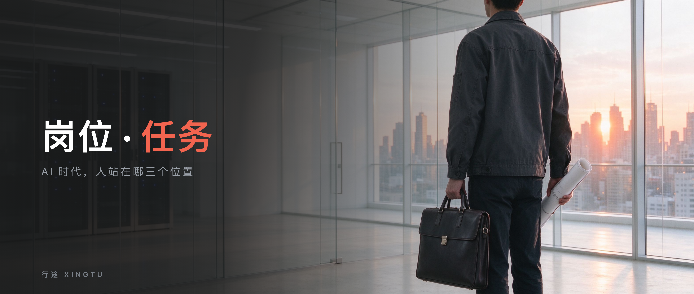
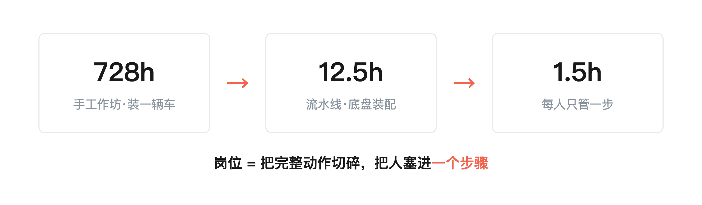
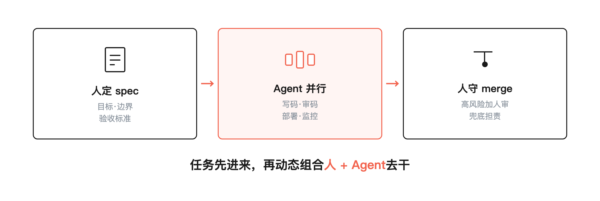
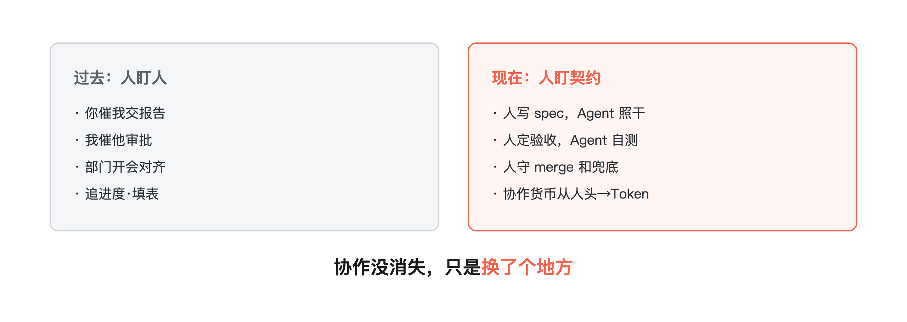
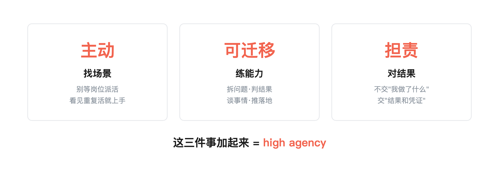

> 行途导读：岗位在消失，但工作没有。组织的基本单元从岗位变成任务，普通人的竞争力也跟着变了。

先说结论：岗位在消失，但工作没有。公司不会再按"岗位"招人，而是按"任务"找人——一个任务过来，你带着你的 Agent 来认领，干完交差。你的竞争力不再是"我在某个岗位上干了几年"，而是 high agency：主动找场景、培养能力、对结果负责。

上个月在客户那边做工作坊，我们一起拉了个腾讯文档，让大家把每天在干的事一条条写下来——不是走形式，是为了盘清楚哪些活真能交给 AI。

写完一看，1400 多条任务流。我翻着那一页页表格，第一反应不是"AI 要抢谁的饭碗"，是另一个发现：

这 1400 条里，没有一条写着"我是产品经理，我的职责是……"。全是具体的事：拉一份数据、对一次需求、写一篇周报、跑一个审批、验一次测试。

公司里真正在发生的事，从来不是"岗位"，是一条一条的任务。"岗位"只是我们后来给这些任务贴的标签——贴多了，我们反过来以为标签才是真的。

这也是为什么我现在不太接"我的岗位会不会被 AI 取代"这种问题。**真正在发生的事是：组织的基本单元，正在从"岗位"变成"任务"。**

目录：

1. 岗位是怎么被设计出来的

2. AI 原生组织长什么样

3. "没有协作"是个半真命题

4. 人的位置搬到哪了

5. 普通人怎么办

6. 一人公司是个阶段现象

7. 我的判断

## 1. 岗位是怎么被设计出来的

要理解这件事，得先搞懂：岗位这个东西，到底是怎么来的。

我们今天习以为常的"岗位"——产品经理、前端开发、测试工程师、运营专员——不是从来就有的。它是被设计出来的，而且是为一个非常具体的约束设计的：**人的能力有限，协作成本很高。**

1913 年，福特在海兰公园工厂建了第一条流水线。在那之前，装一辆 T 型车要 728 个小时。流水线一上，底盘装配时间从 12.5 小时压到 1.5 小时。社科院工经所 · 36氪。怎么压的？把一个完整的造车动作，拆成几百个小步骤，每个人只管一步。

这就是岗位的起源。为什么要拆？因为一个人从头学到尾太慢了，学会了也干不快。把他固定在一个步骤上，练熟，重复，就快了。

岗位、科层、流水线、部门墙——这套东西，全是围绕"人是一个有限的体力单元"这个前提搭起来的。你一个人一天就那么多小时，你学新东西就那么快，你跟人沟通就那么费劲。所以公司把活切碎，把人塞进去，一层一层往上汇报。

这套系统跑了一百年，非常成功。

但它有一个隐含前提：智能是稀缺的，复制一个人的脑子很贵。

现在这个前提塌了。

AI 改变的不是某个具体技能，是获取、复制、调用智能的成本。以前你要一个中级工程师，得招一个人、发工资、等他成长。现在你把他脑子里那套判断、那套流程、那套检查清单，沉淀成一个可调用的东西，随叫随到，不用上下班。

前两次工业革命，蒸汽机和电力替代的是人的肌肉。这一次，AI 替代的是**认知齿轮**——接收信息、转发信息、填表、推审批、汇总结果、写周报。这些过去需要一个"岗位"来干的认知动作，正在被 Agent 接过去。

所以不是"AI 抢了你的岗位"。是"岗位"这个容器，本身就快装不下新东西了。

---

## 2. AI 原生组织长什么样

容器变了，新的长什么样？看三个真实案例。

第一个，OpenAI 的软件工厂。

一个大约 3 个人的小团队（后来扩到 7 人），5 个月产出了约 100 万行代码，跨约 1500 个 PR，几乎零人工手写代码，速度提升约 10 倍。BCG Platinion

怎么做到的？不是 3 个人比 30 个人聪明。是他们换了组织方式：人定 spec（目标和约束），Agent 去改代码，不同专业的 Agent 并行 review（性能 Agent 看延迟、安全 Agent 查数据串读），低风险的直接自动决策，高风险的加人审，Agent 自己部署、自己盯生产监控。

注意这里面没有人"占岗位"。人做的事是：定目标、设边界、验收结果。中间那一大圈写代码、审代码、部署、监控，全是 Agent 在跑。

第二个，一家国内公司用 10 个 FDE 推全员 AI 转型。

他们做了一件很朴素的事：让每个员工在腾讯文档里写下自己每天到底在干什么。全公司写下来，一共 1400 多条任务流。

然后一条一条过：哪些能交给 AI，哪些不能。最后跑出来的结果是：旧工作时间的 77%，转由 AI 承担了。（行途一线实践记录）

但剩下那 23% 是什么？是沟通、是物理接触、是审核校验。尤其是审核——财务自动化之后，校验的投入反而变多了。以前一个人做账，现在 AI 做 100 套账，人要审 100 套。

第三个，Anthropic 的 AI 原生开发流程。

他们有一个动作我觉得特别关键：文档化交接。一个任务进来，先写 intent.md（我要什么、约束是什么），再写 plan.md（改哪些文件、按什么顺序、怎么证明改对了），最后写 spec.md。

为什么要这么麻烦？因为干活的不是人，是 Agent。Agent 不会跟你坐在一个会议室里开会，它需要的是一份写得清清楚楚的交接物。从来没见过这段对话的 Agent，照着这份文档就能独立把活干了。

这三个案例放在一起，你会发现一个共同结构：组织不再是"把人按岗位摆好，等任务流进来"，而是"任务先进来，然后动态组合人加 Agent 去干"。

任务是主角。岗位是过去的主角。

---

## 3. "没有协作"是个半真命题

讲到这里，一定有人接那句群聊里的话：你看，协作都没了，人只要管结果就行了呗。

这就是我今天最想泼冷水的地方。

"能不协作就不协作"——这是个半真命题。它消灭的是**齿轮式协作**，不是协作本身。

什么叫齿轮式协作？就是接收、转发、填表、推审批、追进度。这类信息搬运，确实在消失。有赞的实践很能说明问题：他们把绩效考核系统从一年十几万的外包，压到 AI 一年约 2000 块；采购系统从两三万压到 800 块。白鸦说，Token 消耗从年初的几百亿涨到月几千亿，年底目标单月几万亿——中国经济网"桌椅板凳上精打细算，Token 上绝不吝啬"。

听起来像不像"协作全没了"？

但紧接着有个反直觉的事实：有赞在 2025 年 AI 降本的同时，反而新增了 300 名销售。钛媒体

> 在中国，超过 2 万元的企业采购，仍要依赖线下见面与服务。AI 可以提效，却还无法替代人与人的连接。

你看，他们消灭的是内部齿轮，不是全部协作。大额单子还是要人与人坐下来聊。

更有意思的是，连"AI 之间沟通效率最高"这个说法，都是个只算了吞吐、没算损耗的口号。

有实测数据：一个三 Agent 管线，光协调开销就是单 Agent 方案的 2.9 倍 token。Zylos 的实测：每次交接都把上游全量上下文塞给下一个 Agent，token 成本沿管线深度近似线性涨。更麻烦的是，假事实会通过 Agent 之间的"共识"在整个团队里扩散——你给其中一个 Agent 喂一句错话，其他 Agent 会当真，还会互相印证。规模再往上走，Agent 数到 50 个以上，高难度任务的成功率直接塌到接近零——它们能自发形成沟通网络，但拿到信息之后整合不进去。

还有一个最扎心的实证。OpenAI 全员上 Codex 之后，新的瓶颈不是写代码，是**人审 PR 的速度**。PR 提交量像曲棍球杆一样往上扬，团队的速度只取决于人类审代码能多快。

你看，协作没有消失。它只是换了个地方。

以前是人盯人——你催我交报告，我催他审批，部门之间开会对齐。现在变成人盯契约：人写清楚 spec，Agent 照着干；人定好验收标准，Agent 自己跑测试交结果；人守在 merge 和兜底这两道闸门上。

协作的货币，从人头换成了 Token。但协作这件事本身，减不到零。

---

## 4. 人的位置搬到哪了

那问题来了：既然齿轮式协作被消灭了，人的位置搬到哪去了？

我的观察是三个高位：

目标定义。以前你是被分配任务的人。以后你是定义任务的人。Agent 不会自己知道"这个产品为什么要改""这个指标为什么要盯"。你得把目标说清楚，把边界画清楚，把什么叫"干好了"定义出来。Anthropic 那个 intent.md，其实就是人在写目标定义。

价值判断。Agent 能给你十个方案，但它不知道哪个方案对。这个判断不是技术判断，是价值判断——这个用户该不该留，这个功能该不该砍，这笔钱该不该花。判断错了，后果你扛。

验收兜底。Agent 干完活，得有人看一眼。不是看它写得好不好，是看它有没有跑偏、有没有闯祸。OpenAI 那个人审 PR 的瓶颈，说的就是这件事——人从写代码的，变成了验代码的。

这三个位置有个共同点：它们都没法外包给 Agent。因为最后签字担责的是人，不是模型。

李智勇讲过一句话，我觉得可以放在这里：

> AI 成为认知和执行主体，不等于 AI 成为最终责任主体。钛媒体·李智勇专访

---

## 5. 普通人怎么办

讲了这么多组织变化，落到每个人身上，到底该怎么办？

我不打算给你灌鸡汤说"要持续学习""要拥抱变化"。这些话没用。我给你三个具体的动作，每个都有我自己的实践撑着。

第一，主动找场景，别等岗位给你派活。

岗位消失之后，最危险的不是"你不会 AI"，是"你等着别人告诉你该干什么"。公司不会再设一个岗位叫"AI 工程师"等你来应聘。它会冒出一个任务："这个报表每个月要花 3 个人天，能不能压到 2 小时？"你看见这个任务，主动凑上去，带着你的 Agent 把它干了——这就是新的上岗方式。

我自己就是这么干的。我没有"内容运营"这个岗位，但我搭了一条内容流水线：选题、检索、起草、配图、排版、校对、分发，中间环节全交给不同的 Agent，我只守两头——选题我拍板，终稿我把关。这不是公司给我安排的岗位，是我自己找的场景。

第二，培养可迁移的能力，别死盯某个岗位的技能。

前端怕被 coding agent 吞，后端怕被吞，产品经理也怕。为什么？因为他们练的是"某个岗位的手艺"。岗位一折叠，手艺就没地方使了。

什么是可迁移的能力？就是不管你在什么岗位、用什么工具，都带得走的东西。比如：把一个模糊的业务问题拆成清楚任务的能力；判断一个结果靠不靠谱的能力；跟人谈事情、把事推动落地的能力。这些东西，Agent 替不了你，因为它们长在你身上，不长在某个岗位 JD 上。

我在客户现场跟那些慌了的技术人说过一句话：技术、AI，都是手段。业务 knowhow 才是根本。你越懂这个行业到底在怎么赚钱、客户到底在烦什么，你越不可替代。因为 Agent 能写代码，但它不知道这个客户为什么发火。

第三，对结果负责，别对上级负责。

这一条可能最反直觉。传统岗位上，你对上级负责——他让你干什么你干什么，他满意了你就安全。但在任务制的组织里，上级这个角色本身就在被压缩。你交出去的不是"我做了什么"，是"结果是什么、凭证在哪"。

我自己工作区里有一条铁律：**完成判定查凭证，不问自述。** 一件事说"做完了"不算数，得有落盘的文件、有跑通的脚本、有可回查的记录。这条纪律一开始是管 Agent 的——因为 Agent 会一本正经地骗你说它干了。但后来我发现，它对人也成立：你以后在职场上的信用，不取决于你老板觉得你怎么样，取决于你交出去的结果，能不能被独立验收。

这三件事加起来，就是一个词：high agency。主动找场景，培养可迁移能力，对结果负责。它不是什么新造的概念，就是"别等别人安排，自己把事扛起来"。

---

## 6. 一人公司是个阶段现象

讲到这里，肯定有人要激动了：那是不是人人都该去做一人公司？一个人加一群 Agent，顶过去一个部门？

别着急下这个结论。

AI 确实让单人能承担过去几十人的工作量。我自己那条内容流水线，就是一个人带着一堆 Agent 在跑。但我很清楚这是阶段现象。

为什么？因为复杂业务有个上限。当你要处理的事情涉及多方信任、大额交易、跨团队博弈、出了事要有人背锅——单人扛不住。有赞在 AI 提效之后反而加 300 个销售，就是这个道理。OpenAI 3 个人写 100 万行代码很猛，但他们公司几百人在管数据、管安全、管合规、管客户。

Agent 能复制执行，但复制不了信任，也复制不了责任。

所以一人公司适合什么？适合那些边界清楚、反馈快、出了事能回滚的事——写内容、做小工具、跑分析、接小项目。一旦你进入要对很多人负责、要对钱负责、要对声誉负责的阶段，你还是需要团队。

这个阶段会持续多久？我不知道。但在那之前，别把"一人公司"当成人人都该去的终点。它是一个训练场，不是一座圣殿。

---

## 7. 我的判断

写这篇文章的时候，我翻了一下调研里的一组数字：有数据说，90% 的企业已经在用 AI，但绝大多数管理者并没有感受到收入、利润、组织效率上的根本变化。钛媒体：员工端很热闹，经营端没感觉。

为什么？因为大部分人在用 AI 加固旧组织。旧的岗位、旧的流程、旧的审批链条，原封不动搬过来，只是让 AI 跑快了一点。这就像给马车装了个火箭发动机——跑得确实快了，但它还是马车。

真正会变的不是"用了 AI 的公司"，是"围绕任务重新组织的公司"。

**未来淘汰你的，不是 AI。是占着岗位、等着被安排、把"我在这个岗上干了几年"当护城河的人——会被 high agency 的人取代。**

岗位会变。工具会变。组织形态会变。三年后今天的热门岗位，一半可能不存在了。但 high agency 不变——主动找场景的能力、判断结果的能力、对最终结果负责的能力，不管组织怎么变，它都是硬通货。

如果你现在正在那个群里瑟瑟发抖，我给你一个特别具体的动作：别去报课，别去囤工具。今天上班，找一件你每周都在重复干、干到你烦的事，用你手头任何一个 AI 工具，把它拆成一个能自动跑的任务。

干完这一件事，你就已经从"占岗位的人"，往"扛任务的人"挪了一步。

我押这个注。

---

## 信源清单

数据均来自以下公开信源，无需点击核对，可根据相关信息进行搜索：

- 福特流水线 728h→1.5h：社科院工经所 · 36氪
- OpenAI 3人5个月100万行代码：BCG Platinion
- 有赞 Token 预算曲线/绩效成本：中国经济网
- 有赞 AI 降本反增 300 销售：钛媒体
- 多 Agent 2.9× token 协调税：Zylos
- 90% 企业管理者未感变化/李智勇引语：钛媒体·AI原生组织专访
- Anthropic AI-Native SDLC：Claude Blog

🔗 相关仓库：[xingtu-ai-engineering](https://github.com/xingtu1996/xingtu-ai-engineering)（AI 原生组织方法论旗舰仓）
