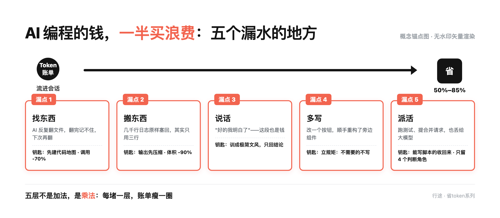
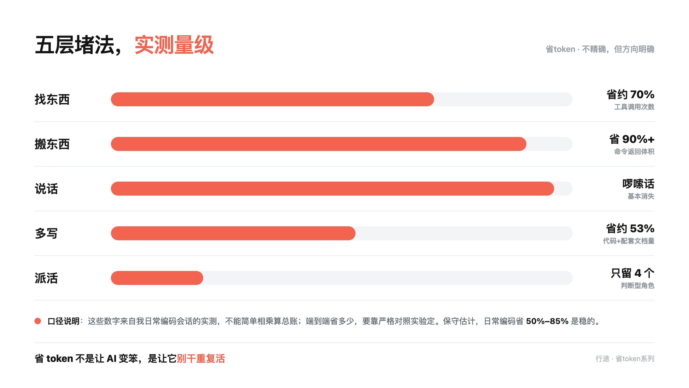

# AI 编程的钱，一半买浪费

前阵子我把一次 AI 编程会话的账单拆开看了一遍。

本来是想找个便宜点的模型换上。

拆完发现，模型真在干活的那部分，只占一半。

另一半花在这些事上：为了找一个函数，把几十个文件翻一遍，翻完下次再翻一遍；一条命令跑出几千行日志，原封不动搬回来；回了一堆"好的我明白了"——那段也是钱。

Token 就是模型计费的单位，你可以粗略理解成"字数"，但输入输出都算。

也就是说，一半的钱，买的是重复劳动。

## 1. 五个漏水的地方

我把一次会话的消耗拆成五层，每层都能单独堵。

**第一层：找东西**

AI 不知道代码在哪，只能一个文件一个文件地翻。翻完还记不住，下次重新翻。

堵法：给代码先建一张地图（行话叫代码图谱），问一次就知道位置，不用翻。

**第二层：搬东西**

一条命令跑完，几千行日志原样塞回给模型。可模型只需要其中三行。

堵法：命令输出先压缩，只回关键几行。

**第三层：说话**

"好的，我理解了您的需求，接下来我将为您……"——这段话一个 token 都不少收。

堵法：把文风训成极简，只说结论，不复述我的问题。

**第四层：多写**

你让它改一个按钮，它顺手把旁边的组件也重构了。写得多，烧得多。

堵法：立一条纪律——不需要的就不写。

**第五层：派活**

跑测试、提合并请求、清缓存，这些是确定性任务，没有判断成分，也丢给大模型。

堵法：能写成脚本的，全部收回脚本。

这五层不是加法，是乘法。

## 2. 我这边跑出来的量级

不精确，但方向是明确的：

- 找东西：换成代码图谱之后，工具调用次数少了约 **70%**。这层是贡献的大头，因为它省的是"反复翻文件"的次数。
- 搬东西：命令返回的体积压掉九成以上。原来动辄几千行，现在只回关键几行。
- 说话：啰嗦话基本消失，纯文字输出大幅压缩。
- 多写：强制"不需要就不写"之后，代码和配套文档量压了约 53%。
- 派活：确定性任务全部脚本化，随后只留 4 个判断型角色——架构决策、代码评审、异常定位这类。

说句实话：这些数字不能简单相乘算总账。端到端到底省多少，得靠严格的对照实验才定得了。

保守估计，日常编码省 **50%–85%** 是稳的。标题里那个 80%，是偏乐观的体感值，不是精确结论。

## 3. 反直觉的一点

省 token 不是让 AI 变笨，是让 AI 别干重复活。

需要它的是判断：架构怎么定、这段代码评审怎么看、这个异常为什么出现。

不需要它的是执行：跑测试、提合并请求、清缓存。这些写成脚本，跑得快，还不花钱。

只留 4 个判断型角色之后，省下来的不只是钱——还有"Agent 又跑偏了，我得一遍遍把它捞回来"的时间。

## 4. 一句话记住

AI 编程的钱，一半买理解，一半买浪费。

买理解的那一半省不了，那是它真在干活。

买浪费的那一半，五层能堵掉大半。

## 5. 今天就能做的四件事

1. 先堵"找东西"——这一层是贡献的大头，工具调用少了 70%。
2. 把确定性任务收回来——能写成脚本跑的，今天就别让 Agent 跑了。
3. 给模型加一句话——"只回结论，不要复述我的问题"。
4. 先别急着换模型——算清楚浪费了多少，再决定要不要换。

🔗 相关仓库：[tokenhub-bench](https://github.com/xingtu1996/tokenhub-bench)（五层 token 优化的可复现实测工具）
