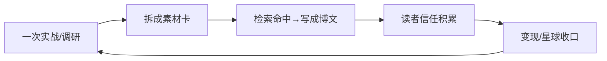

# 技术人的复利：每次沉淀都在给未来加息

> 核心词：技术复利｜长尾词：长期主义 自媒体、知识复利、技术人成长

我做自媒体这件事，心态和很多人不一样。别人问"写这个能涨多少粉"，我更在意另一个问题：**这次实践，能不能变成下次能直接用的资产？**

这背后是一种我越来越笃信的认知——**技术人的复利**。

---

## 一、复利进化的一句话本质

我的定义很简单：**使用 → 问题 → 沉淀 → 反哺 → 下次更好，越用越强。**

听起来像鸡汤？但它有学术底子。组织学习领域早就有"双环学习"理论（Argyris & Schön）：单环学习是"修症状"，双环学习是"改底层假设"。我理解的沉淀，就是**把一次踩坑，变成一条能自动拦截同类错的规则**——这是双环，不是单环。

还有个反模式叫"自指改进无外部落地 → compounding entropy（复利熵）"：如果一个人只是在脑子里复盘，不把经验落进机制里，那它终会腐烂。所以**复利的前提是——必须有人留在环里，把经验落成可复用的东西。**

> 配图建议（复利曲线）：横轴时间、纵轴能力/资产，画一条初期平缓、后期陡峭上扬的曲线，标注"拐点"。

---

## 二、三个最常见的"复利断裂"

我见过太多人（包括过去的自己）把复利搞断，三个反模式：

1. **错了不记**：排查完不落档，同类错重踩。白干。
2. **产出无落点**：功能/调研/复盘不登记，变成黑盒，下次从零来。
3. **只记不改机制**：只写文档不提炼红线/拦截，下次仍靠记忆——而记忆靠不住。

断裂的后果不是"慢一点"，是**同一个坑反复交学费**。

---

## 三、落到自媒体：素材库 = 复利账户

这是我今天最想讲的落点，因为它就在我手边。

我建了一套素材体系：把每一次 AI 编程实战、每一篇调研笔记，拆成**细粒度的可发布素材卡**——带关键词、带图解标记、带脱敏等级。现在有 76 张卡，覆盖 12 个分类。

这套库怎么产生复利？



每一张卡片，都是往"复利账户"里存了一笔。今天写这篇文，不是从零构思，而是**从 76 张卡里挑了"复利进化"这张直接展开**——这就是复利的样子：过去的自己，在替现在的我打工。

> 配图建议（飞轮图）：实战 → 素材卡 → 博文 → 信任 → 更多实战，循环加速。

---

## 四、产出后自查清单（我的 5 问）

每次做完一件事，我过一遍：

```
□ 坑有记录吗？——根因→现象→预防机制
□ 发现反哺工具链了吗？——落到规则/红线，还是留在会话里
□ 单一事实源了吗？——先查后写，知识只记一遍
□ 有地方落实了吗？——零黑盒，非纸面
□ 反哺只做加法了吗？——不覆盖已有规则
```

---

## 五、结语

厚积薄发，不是熬，是让过去的自己替未来的你打工。**技术人的复利，不在某个爆款，在每次沉淀都给未来加了息。**

你现在手里的每一次实践、每一篇笔记，都是一笔定存。别让它躺在聊天记录里发霉——拆成卡片，存进你的复利账户。

> 「金句」：**厚积薄发，不是熬，是让过去的自己替未来的你打工。**

---

### 平台微调（多平台差异化）
- **公众号**：理念向，用"素材库就是复利账户"作钩子，收心。
- **小红书**：成长向，把"5 问自查"做成清单卡。
- **知乎**：问题化《技术人如何构建自己的知识复利？》，欢迎讨论。
